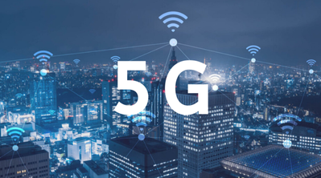

+++
title = "5G"
date = "2020-11-01"
draft = false
pinned = false
image = "5g-5.png"
description = "Ich habe einfach mal über 5G recherchiert und bin auf ganz verschiedene Meinungen gestossen."
+++
# 5G

5G ist immer wieder in den Medien und es gibt immer wieder andere Meinungen. 

Ich finde das Thema sehr schwierig, da es in Diskussionen zu Widersprüchen kommt.

Ich war auf verschiedenen Internetseiten unterwegs und bin überall auf eine andere Meinung gestossen. 

Die Kritiker befürchten, dass 5G schädlich ist und behaupten, dass es bislang noch keine Untersuchungen desgleichen gibt.

Und Befürworter meinen, dass es Fakten und Untersuchungen gibt, die widerlegen, dass es schädlich ist. 

In diesem Text will ich am Anfang einfach ein paar Fakten zusammentragen und dann pro und kontra Meinungen zusammenfassen.

### Die Fakten

Mit 1G der ersten Generation Rundfunk war es bereits möglich ohne Kabel zu Telefonieren.

Mit 2G konnte man bereit SMS und Textnachrichten versenden.

Mit 3G war es möglich Mp3 und Mp4 zu downloaden.

Mit der heute noch am meisten verbreiteten Art 4G ist es möglich Mp3 und Mp4s über das Internet zu streamen.

5G ist die fünfte Generation Rundfunk und verspricht Datenübertragung in Echtzeit.

Mit 5G soll alles noch viel schneller funktionieren.

So soll es möglich sein, dass ein Busfahrer so zu sagen im Homeoffice arbeitet und seinen Bus von überall auf der Welt steuern könnte.

Oder Spezialdoktoren könnten mit Spezialrobotern von ausserhalb Personen operieren.

### Pro Meinungen

Das neue 5G Netz eröffnet neue Grundvoraussetzungen für die Zukunft und die Weiterentwicklung.

### Kontra Meinungen

Es ist nicht restlos geklärt, ob und wie schädlich die Strahlen des 5G Netz tatsächlich sind.

Und die Frage bleibt: Ist es wirklich nötig?

Ich finde es schwierig, sich eine Meinung zu bilden, wenn die Faktenlage so widersprüchlich ist. Ich dencke das man diesen Schrit wagen solte aber troz dem die Kritiker ernst nehmen.