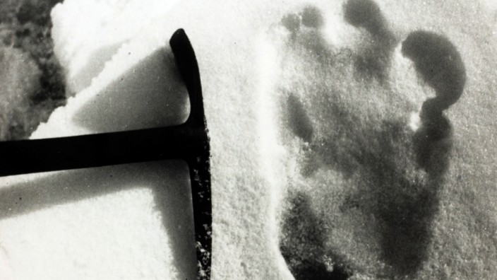
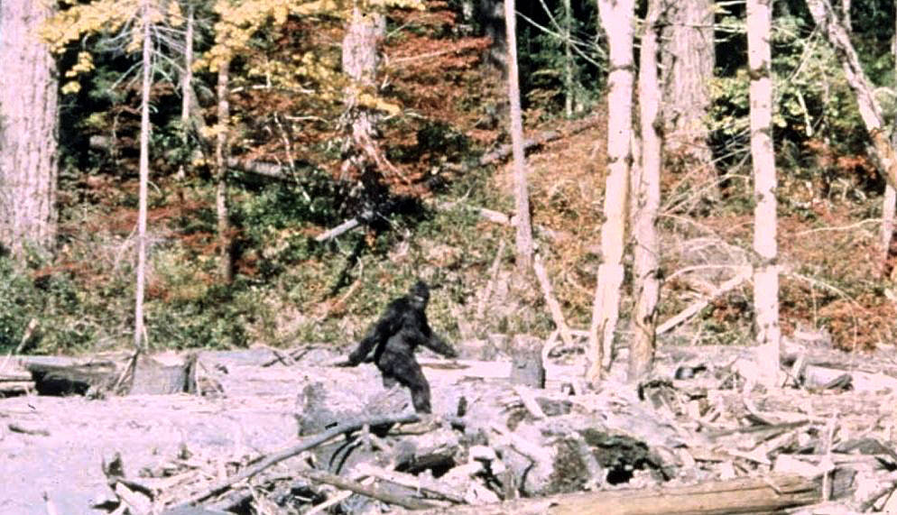
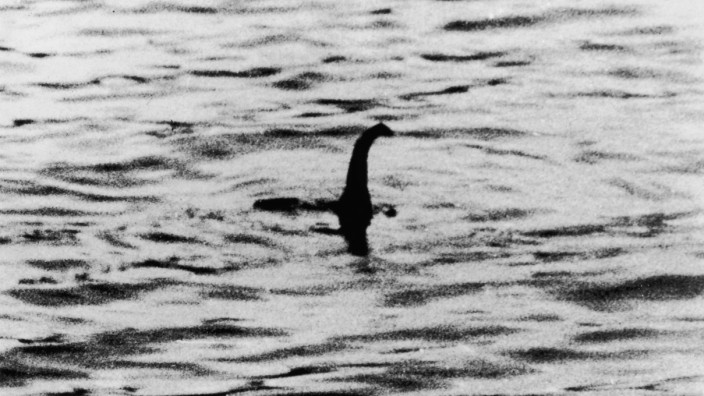

+++
title = "Bigfoot Yeti und co."
date = "2021-01-13"
draft = true
pinned = false
tags = ["Schneemensch", "Yeti", "Nessi"]
image = "arne-schog-hwdvb5obtcg-unsplash-2.jpg"
description = "Jeser von uns hat schon einmahl vom yeti, Bigfoot oder nessi das Ungeheuer von lochness gehört. Was hat es damit aufsich gruseliger Schneemensch oder doch nuhr eine sage?"
+++
Jeder von uns hat einmahl vom Nessi dem Ungeheur aus dem Sotischen See\
Lochness oder vom Bergmonster aus dem Hymajalia dem Yeti oder vom Berenartigen mit fehlbelegten Bigfoot aus Nordamerika gehört. Aber was von alle dem kann man glauben und was ist von den Medien einfach ausgedacht. Es gibt verschidenste Youtbe Videos und Bilder die angeblich ein Yeti oder Bigfoot zeigen. Aber die Qualität dieser Videos ist meistens so schlecht das man Nichts wirklich erkennen kann höchstens ein Schatten der aber genausogut ein verkleideter Mensch sein könnte. Ich will aber troz dem versuchen die Teorien zusamenzufassen und meine Gedanken dazu zu Revlektieren.

Yeti der Schneemensch

DerYeti ist ein Zweibeiniges fabelwessen mit zoteligen weissen Haren. Er geht auf zwei beinen es gibt zahlreiche Bilder von seinen grossen Fußabdrücken im Schnee. Die Beweise: Die Wohl grösten und auch den Bekantesten Beweis sind wohl die spuren im Schnee die immer wider gessehen und Fotografirt werden 2019 wuren Fotos der Indischen Arme auf Twitter gepostet die die vermeimtlichen Fussabtrüke zeigen sollen. Der Deutschen Bergsteiger Reinhold Messner Stellte eine Teorie auf die aus sagt das der Schneemensch eigentlich ein Tibetischer Bär ist. Den in unterschidlichen Sprachen Bedeutet Yeti nichts anderes als Bär. Auch bei Harproben von angeblichen Fell des Zotteltires wurde diese Teorie bestärkt den die harre wurden alls Fell unterschidlcher Bären Nachgewisen.

Bigfoot das gruselwessen von Nordamerika

Bigfoot ist wohl mit dem Jeti zu vergleichen den Laut Augenzeugen und Fargwürdiegen Bilder wirt der Bigfoot alls ungefähr gleich gross beschirben aber er soll kein weisses sondern ein Braunest Fell besizten. Auch bei den sichtungs orten unterscheideter sich vom Yeti. Den er soll angeblich in Nordamerika und auch schon in Kanada gesichtet worden sein. Er wurde aber am häufigsten in den Rocky Montens gesichtet. Die Beweisse: bis Heute gibt es keine Eindeutigen Beweisse Zu Bigfoot den alle Tohnaufnahmen und Videoaufnahmen wurden als Fake bewissen oder sind sehr Umsriten. Darum würde ich dieses wessen einfach als legende abtuhen. 

Nessi das Monster von Lochness

In Schottland gibt es einen See der Loch Ness heist in ihm Lebt ein Monster das ausiet als hätte es die dino zeit überlebt auf jedenfall wirt es so erzählt aber was ist da  dran und warum ist diesens Räzel immer noch nicht rästlos geklärt? Nessi um diesen Monster soll es heute gehen es soll angeblich ausehen wie ein Plesiosaurier das ist ein Wasserlebender dinosaurier der aber schon vor millionen von Jahren ausgestorben ist. Aber wie ist es zu erklähren das es so ein Monster angeblich in einem See in Schottland geben soll. Die erste möglichkeit ist das diese Art von Tier Jarhuntrte lang unendekt in diesem see Lebte. Die zweite und meiner meinung nach die Logerische Möglichkeit ist das das alles eine simple einbildung oder einfach ein grosser Fake ist. Beweise: Das erste mahl soll Nessi im jahr 564 von einem Mann endekt und angegriffen worden sein. jarhunderte speter tauchte ein bild auf auf dem ein langen Halls der aus dem Wasser schaut dieses Bild wurde im Nachhinein aber als Fake entlarft aber troz dem hat der Turismus nicht nachgelassen und es werden immer noch untersuchungen und tests durgeführt. Aber auser Fragwürdigen Bilder und Augenzeugen ausagen wurde bis Jetzt kein eindeutiger beweis festgestellt.

Wen ich eine rangliste dieser drei wessen aufstellen sollte dan wäre Bigfoot wohl auf dem Lezten Platz. Den das ganze kommt mir eher so vor wie ein Modernes Märchen. Aber Bein Nessi ist die möglichkeit wohl immer noch am höchsten. Den es werden immer wider Newe Tiere im Meer und in anderen Gewässern endeck. Bei mir stelt sich aber doch die Frage warum bei all diesen Wissenschaftlichen untersuchungen immer noch kein eindeutiger beweis gefunden wurde.

Mein Fazit: Ich finde solche Geschichte spanend aber würde nicht anfangen das zu glauben die meisten dieser geschichten halte ich für mindestens Fragwürdig.