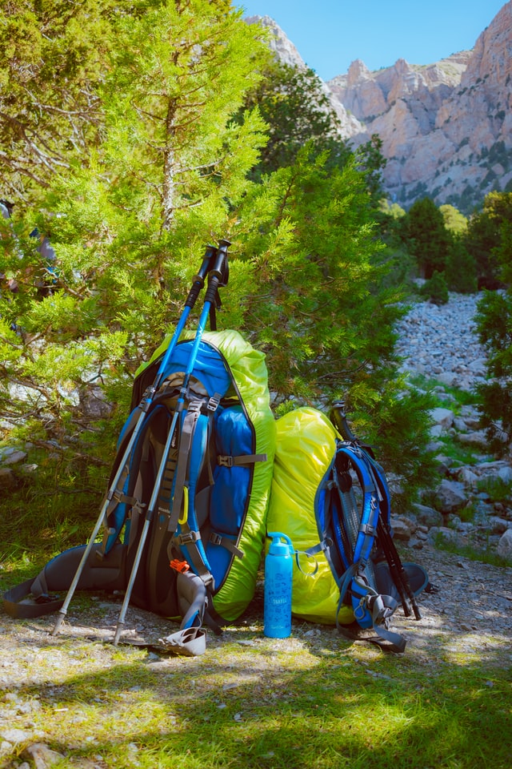
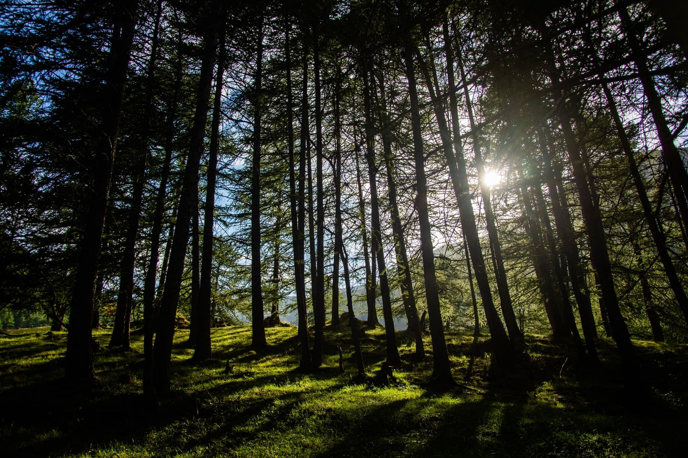
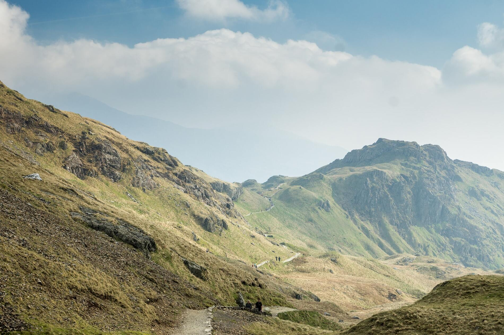
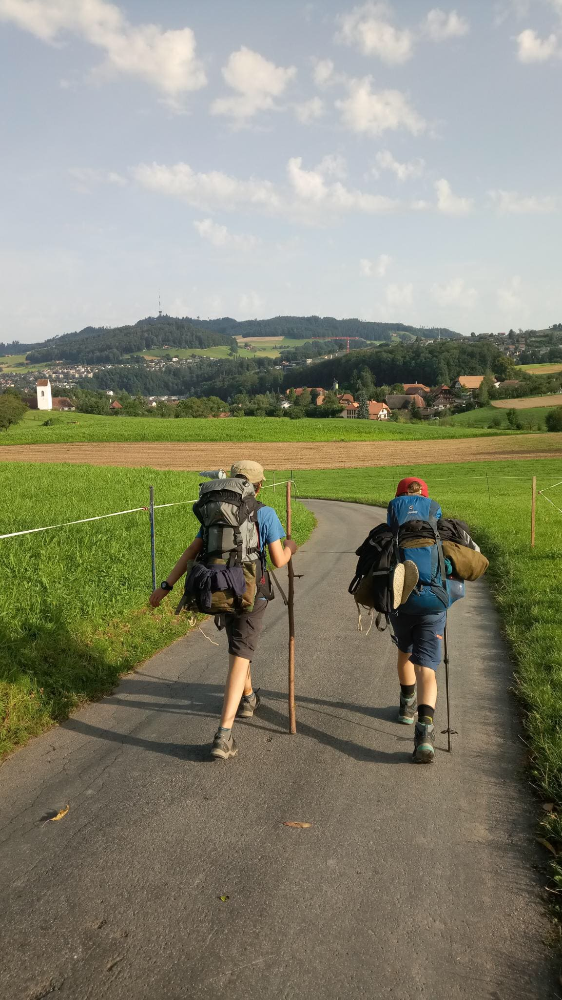

+++
title = "Blog Heiwäg"
date = "2021-06-23"
draft = true
pinned = false
image = "vitolda-klein-wos-auwllhm-unsplash.jpg"
description = "Ich schreibe darüber wie ich in einer Woche von Sarnen nach Stettlen gewandert bin."
+++
Seit einigen Jahren gibt es in Stettlen den "Heiwäg". Das Grundprinzip lautet so: 80 km Luftlinie Strecke, 5 Tage und 30.66 Fr. (Postleitzahl von Stettlen) pro Person.

Jeder packt also für eine Woche: Schlafsack,Matte usw. Das Ganze findet immer in den Sommerferien statt. Man trifft sich also am Bahnhof und es geht los, bis man an dem Platz ist von dem man losläuft. Es weiss nur der Leiter wo es hingeht. Dann bekommt die Gruppe eine Karte der ganzen Schweiz, die einem vielleicht die Richtung, Flüsse und Seen zeigen kann, aber sonst kann man sie nicht wirklich brauchen. Alle Entscheidungen werden in der Gruppe getroffen, wie zum Beispiel die Route, die man nimmt oder ob man Essen zusammen kauft oder ob jeder Einzelne etwas kauft. Ich bin dieses Jahr schon das zweite Mal dabei und freue mich schon darauf, auch wenn ich weiss, dass es sehr anstrengend werden kann. Letztes Jahr sind wir von Le Gruyère gelaufen. Wir haben letztes Jahr die Route nicht so gut eingeteilt und darum wurde der letzte Tag sehr anstrengend. Das will ich oder wollen wir dieses Mal am besten ein wenig anders machen. Ich glaube, wenn die Gruppe immer zusammen bleibt und die, die ein wenig schneller sind vielleicht hinten laufen und die Gruppe so vorantreiben, kann man schneller und kräftesparender vorankommen. Eine Entscheidung die wir bei der Besprechung auch getroffen haben, ist dass wir so oft es geht unter freiem Himmel schlafen. Am Montag der letzten Ferienwoche ging es dann os. Wir haben uns getroffen und sind dann alle mit unseren vollgepackten Rucksäcken zum Bahnhof gelaufen. Nach ungefähr 60 min sind wir mit dem Zug angekommen. Wir waren in Sarnen. 

Da wir nur eine Schweizerkarte mit einem roten Punkt, unserem Standort, hatten, haben wir uns in einem Touristen Shop eine genauere der Region besorgt, natürlich gratis. Nach zwei Stunden hatten wir endlich eine Route geplant und das Abendessen gekauft. Wir wollten über den Glaubenbergpass. Nach vielleicht zwei Stunden, in denen wir zwar nicht weit gekommen sind, aber ordentlich Höhe gemacht haben, knickte jemand aus unserer Gruppe mit seinem Fuss um. Da es mit einer Pause nicht besser wurde, blieb uns nichts anderes übrig als unser Lager in einem schönen Waldstück zu errichten. Es wurde in der Nacht sehr kalt aber ich habe eigentlich sehr gut geschlafen, da ich mit meinem Schlafsack und meinem Mätteli in eine kleines Loch im Boden gelegen bin und darüber eine Militärblache gespannt habe. Die anderen Teilnehmer nannten meine kleine Behausung spasshaft Hundehütte. Mein Tarp habe ich übrigens auch aufgestellt und es haben einige andere darin geschlafen, ich hatte aber mehr Lust etwas zu basteln. 

Am nächsten Morgen entschied sich Ganluca, der Verunfallte nach Hause zu gehen, also mit dem Zug. Genau gesehen gingen wir alle nach Hause auch wenn sich das ehrlich gesagt noch nicht so angefühlt hat. Denn wir haben am ersten Tag, abgesehen von den Höhenmetern, nur drei Kilometer geschafft. Wir liefen also mit einem weniger weiter. Aber leider hat sich zwei Stunden später wieder einer verabschieden müssen, da er auch Probleme mit seinem Fuss gekriegt hat. Wir entschieden uns dazu, nicht ganz über den Pass zu laufen, sondern einen Wanderweg zu nehmen, der uns über die Berge auf Flüeli bringen soll. Ein extrem schöner Weg aber vor allem wenn es runter geht auch ein anstrengender Weg. In Flüeli schliefen wir auf einer Wiese, ich und Joris, der auch ein Tarp hat, konnten es aufbauen. 

Am Morgen weckte uns ein Donner und kurz darauf wurden wir mit einem Platzregen überrascht. Einige Dinge konnten wir unter den Taps sichern und wurden nicht nass. Wir konnten uns unter einem Vordach einer Autogarage in Sicherheit bringen, unsere Rucksäcke packen und dann unserer geplanten Route folgen. Unser Ziel war zu dem Zeitpunkt Langnau, was wir aber nicht ganz geschafft haben. Wir haben kurz davor bei einem Bauern gefragt und konnten im Garten schlafen. Da es die ganze Woche sehr kalt war, haben wir uns mit den Militärblachen und den Taps einen Windschutz gebaut. 

In Langnau haben wir uns ein Zmorgen gemacht und sind dann einfach weitergelaufen. Wir wollten am Abend in Worb übernachten, denn wir mussten am Freitag um zehn Uhr in Stettlen sein. In Biglen haben wir eingekauft und auf der Karte eine Brätlistelle gefunden, zu der wir dann auch gelaufen sind. Wir konnten dann bei dieser Brätlistelle übernachten. Es zog ein ordentliches Gewitter auf. Auch da kamen die Tarps zum Einsatz. Denn bei der Brätlistelle gab es zwei Tische, die wir mit den Taps überspannt haben. Wir haben die Nacht also trocken überstanden. 

Am nächsten Tag ging es also nach Stettlen. 

Es war auch dieses Mal eine tolle Erfahrung und ich würde es sofort wieder machen.