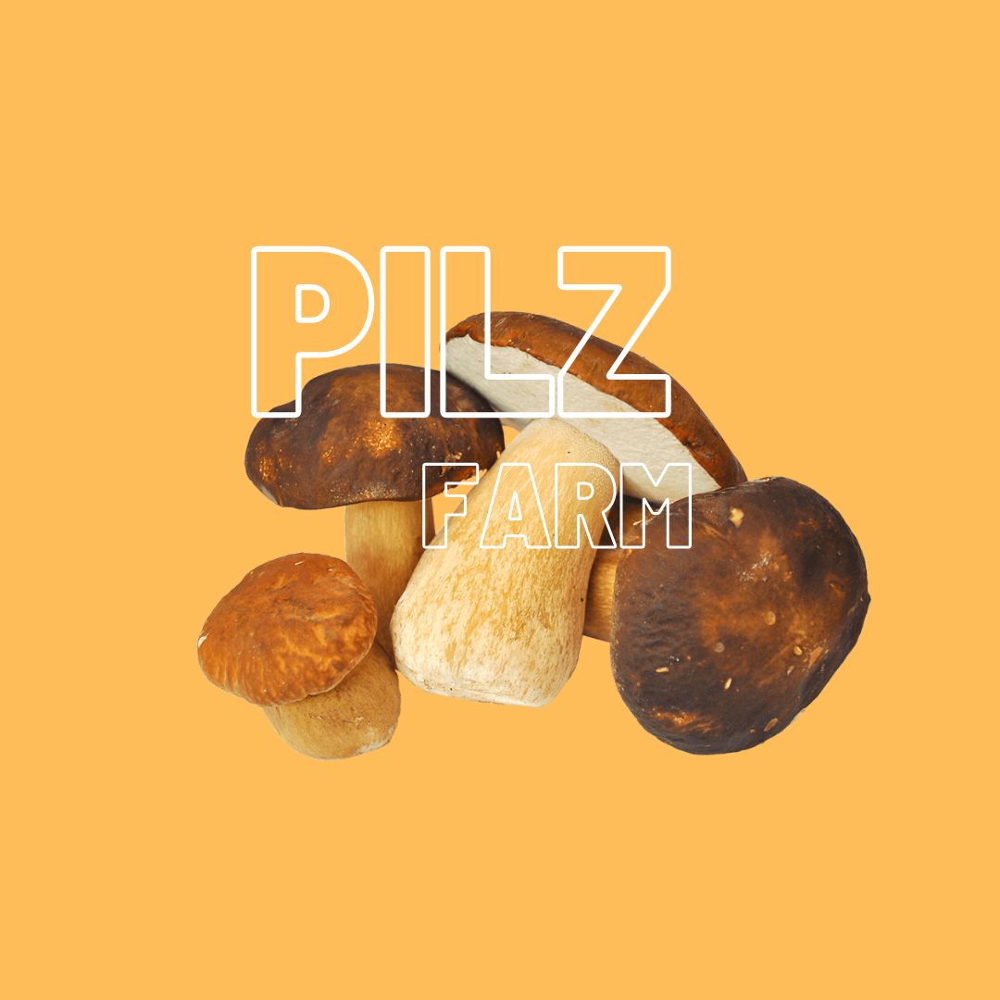

+++
title = "Blog Pilzfarm"
date = "2022-01-01"
draft = false
pinned = false
image = "pilz.jpg"
description = "Im Effinger, genau genommen im Colearning, entsteht eine Pilzfarm, an der auch ich mich beteilige."
+++
Im Effinger, genau genommen im Colearning, entsteht eine Pilzfarm, an der auch ich mich beteilige.  Wir haben abgemacht, dass alle einen Blog schreiben, in dem wir festhalten was wir gelernt haben. Wie man es sich denken kann, ist dieser einer davon.\
\
Ich dokumentiere das Projekt und probiere mich in dieser Richtung aus. Zudem habe ich natürlich auch schlicht und einfach Dinge über Pilze gelernt.

\
\
**Instagram/Dokumentation**

Ich habe mir überlegt, wie ich das Projekt am besten Dokumentieren kann. Ich bin schnell darauf gekommen, dass es wahrscheinlich mit Video und Foto sein wird, da ich mich in diesem Bereich am bestem auskenne. Also das war geklärt, aber auf welcher Plattform soll das geschehen? YouTube, Internetseite oder Instagram. Mit all den Plattformen kenne ich mich nur wenig oder gar nicht aus. Aber das ist ja kein Problem, es ist ja schließlich ein Lernunteremen. 

Ich habe mich dann schließlich für Instagram entschieden und habe ein Profil erstellt. Ich habe drei kurze Videos gedreht, in dem ich einen kurzen Zeitraffer gemacht habe. Man kann ihn auf dem Instagram Account sehen.

**Pilzfarm/Pilze**\
Natürlich habe ich auch einiges über Pilze gelernt. Mit einer Pilzbox aus dem Coop haben wir unsere erste Ernte erzielt, die dann auf einem Crêpe verspeist wurde.