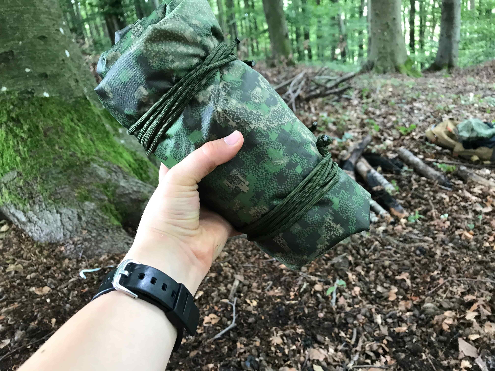
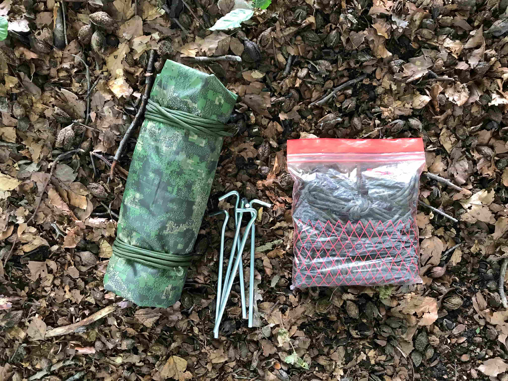
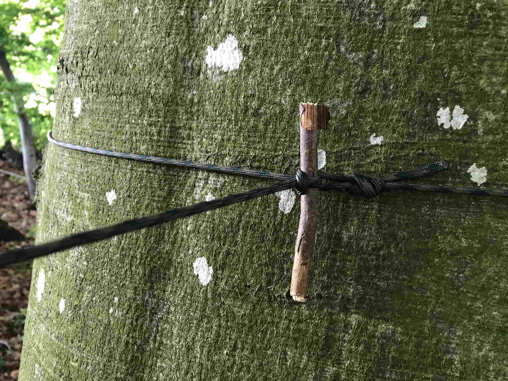
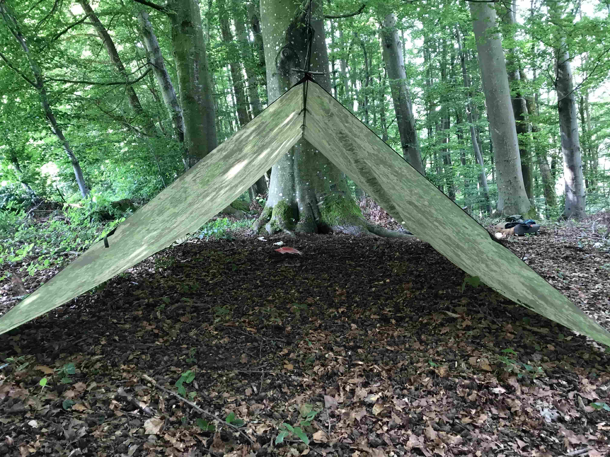
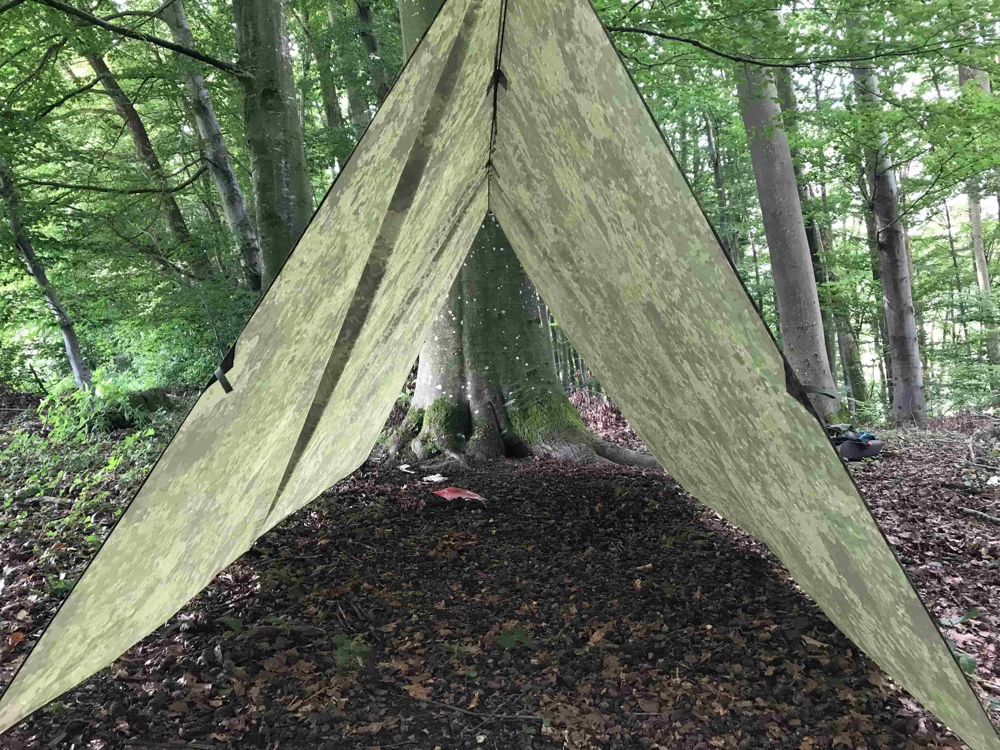
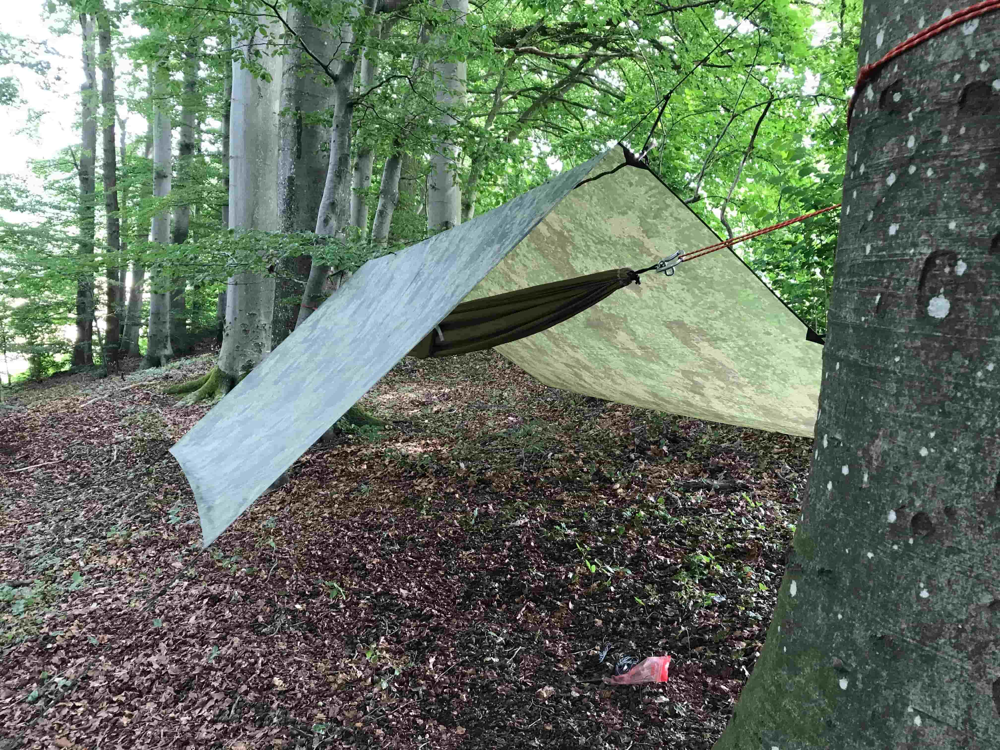
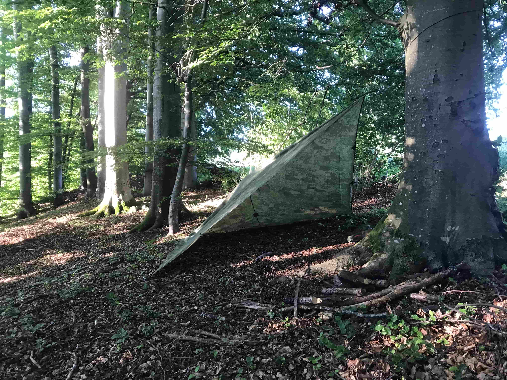

+++
title = "Blog Tarp"
date = "2021-06-23"
draft = true
pinned = false
image = "tarp.jpeg"
description = "Ich habe mir ein Tarp gekauft was das ist und wie ich es verwende erkläre ich in diesem Blog."
+++
Ich habe mir vor einigen Tagen ein Tarp bestellt. Das ist eigentlich eine Zeltplane die in meinem Fall 3x3 Meter gross ist. Ich habe sie in einem Tarnlook gekauft, da mir das gefallen hat und man so natürlich auch weniger auffällt, dass ist natürlich auch einfach eine Spielerei und macht auch nicht wirklich Sinn aber nun gut. Der Vorteil gegenüber einem Zelt ist ganz klar das Packmass und die Flexibilität. Denn durch die verschiedenen Schlaufen, die sich rundherum und oben am Tarp befinden, kann man sehr viele verschiedene Aufbauvarianten benutzen. 

Das Grundgerüst besteht meistens aus zwei Bäumen zwischen denen man eine Schnur spannen kann. So kann man also das Tarp rüberschmeissen und es an den Seiten mit Heringen fixieren. Man kann auch so mit der Höhe variieren. Wenn man die Schnur tief spannt, hat man mehr Platz und kann zu zweit oder sogar knapp zu dritt drin schlafen. Wenn man die Schnur aber höher spannt, hat man mehr Platz nach oben aber man kann nur alleine drin schlafen. Das Ganze ist natürlich auch über einer Hängematte möglich oder wenn man keine Bäume hat mit zwei Stöcken. 

Einer meiner Lieblings Aufbauvarianten ist aber noch etwas anders. Man braucht dafür nur ein Baum oder Stock, drei Heringe und sehr wenig Schnur. Man macht also eine Ecke des Tarps an einem Baum fest(auch da kann man mit der Höhe spielen). Dann spannt man den gegenüber liegenden Ecken mit einem Hering an den Boden. Die anderen zwei Ecken spannt man dann einfach auch an den Boden. Um mehr Volumen ins Tarp zu bekommen, kann man die Schlaufen in der Mitte nach hinten abspannen. Der Vorteil dieses Aufbaus ist, dass er schnell aufgebaut ist, von drei Seiten geschlossen und somit windgeschützt ist und das man viel Platz hat.

