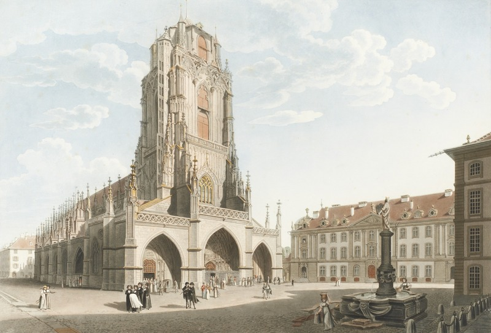

+++
title = "Das Berner Münster"
date = "2021-03-17"
draft = true
pinned = false
+++
Das Berner Münster ist Wohl eines der Bekantesten Gebäude in Bern und Etwas wie ein Warzeichen. Das Gebäude ist sogar die wichtigste und gröste Kirche der Welt. Aber wan wurde das Münster gebaut, wie sah es früher aus und für was wird es heute gebraucht.

Geschichte

Mit dem Bau des Berner Münster began man schon 1421 befohr man mit den Bau gestartet hat sand an dem Platz eine kleine Kapelle mit dem Namen Leutkirche gestanden. Die grundmauer des Münsters wurde im Urzeigersin um die alte Kappele herumgebaut. Das ganze münster bis auf den oberen teill des Turm wurde aus Berner Sandstei Gebaut Der erste Werkmeister beim Bau des neuen Münsters war Matthäus Ensinger. Er began mit dem bau des Schiffs (ein Schiff ist der Hauptteil einer Kirche). Das Münster ist heut zu Tage genau 100,6 Meter hoch, dass war aber nicht immer so. 1521 wurde der Turmbau wegen zu schwachen Fundament unterbrochen und ereichte somit erst 1893 Höhe von 100,6 Meter.

Das Münster Heute

Wie gesagt