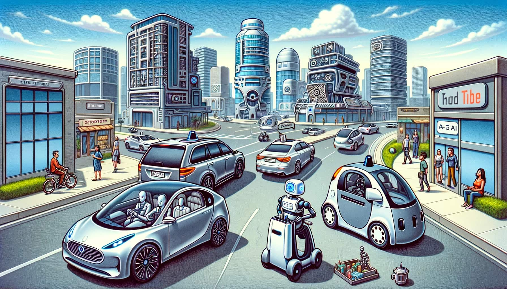

+++
title = "das denkt ChatGPT über Selbstfahrende Autos"
date = "2023-12-13"
draft = false
pinned = false
image = "dall-e-2023-12-13-10.49.57-a-satirical-and-slightly-ironic-depiction-of-a-futuristic-city-with-self-driving-cars-embodying-the-theme-of-ai-in-transportation.-the-image-should-h.jpg"
description = "Ich habe vor ein paar Tagen einen Philosophie-Podcast gehört,..."
+++
Ich habe vor ein paar Tagen einen Philosophie-Podcast gehört, in dem es um das [Trolley-Problem](https://de.wikipedia.org/wiki/Trolley-Problem) ging. Zu diesem Problem gibt es zwei Antworten aus zwei verschiedenen Lagern. Ich habe mich gefragt, was diese beiden Gruppen über selbstfahrende Autos denken. Ab hier übernimmt ChatGPT, ich übernehme also keine Verantwortung. (;

**Ethische Fragestellung:**
Stell dir vor, durch den Einsatz von künstlicher Intelligenz (KI) in selbstfahrenden Autos könnten wir die Zahl der Verkehrsunfälle drastisch senken. Klingt super, oder? Aber hier kommt die knifflige Frage: Ist es ethisch vertretbar, dass wir Menschen diese Kontrolle an Maschinen abgeben, selbst wenn dadurch weniger Menschen sterben? Das ist eine heiße Debatte in der Ethik, und es gibt zwei Hauptlager, die sich dazu Gedanken machen: die Deontologen und die Utilitaristen.

**Deontologen – Die Prinzipientreuen:**
Die Deontologen sind sozusagen die Prinzipienfreaks. Sie sagen: "Es gibt bestimmte Regeln, die wir nicht brechen dürfen, egal was passiert." Für sie zählt nicht nur das Ergebnis, sondern vor allem, wie wir dorthin kommen. In unserem Beispiel würden sie vielleicht argumentieren, dass es nicht richtig ist, das Steuer komplett den Maschinen zu überlassen. Für sie ist es wichtig, dass Menschen die Kontrolle behalten und moralisch verantwortlich bleiben.

**Utilitaristen – Die Ergebnisorientierten:**
Die Utilitaristen sind die Typen, die aufs große Ganze schauen. Sie fragen: "Was bringt am Ende das beste Ergebnis für die meisten Leute?" Wenn also durch KI in Autos weniger Menschen sterben, dann sagen die Utilitaristen: "Top, machen wir das!" Für sie zählt das Endresultat: weniger Unfälle und Todesfälle sind ein klarer Gewinn.

**Argumente beider Lager:**
Die Deontologen würden also sagen: "Hey, es geht hier nicht nur um Zahlen. Es geht darum, wer die Entscheidungen trifft und wie wir dabei unsere menschlichen Werte bewahren." Die Utilitaristen hingegen würden entgegnen: "Klar, Prinzipien sind wichtig, aber was nützen die besten Prinzipien, wenn am Ende mehr Menschen leiden oder sterben? Wir sollten die Technologie nutzen, um Leben zu retten!"
Und da hast du es – zwei völlig unterschiedliche Sichtweisen auf ein und dasselbe Problem. Einfach ist anders, oder? 

