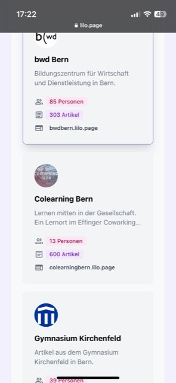

+++
title = "das ist der 600. Artikel 🎉"
date = "2023-04-12"
draft = false
pinned = false
description = "das ist der 600. Artikel 🎉"
+++

\
https://www.lilo.page/

Hurra, geschafft, der 600. Artikel ist vollbracht, Im Lernblog haben wir viel Wissen angehäuft, Tag für Tag, Nacht für Nacht. Von Mathe bis Geschichte, von Sprachen bis Kunst, Wir haben viel gelernt und unsere Fähigkeiten vergrößert mit Lust.

Von der ersten Zeile bis zur letzten Phrase, Haben wir getippt, recherchiert, mit Begeisterung und Hingabe, ganz in unserer Art und Weise. Von einfachen Themen bis zu komplexen Sachverhalten, Haben wir uns durchgebissen, mit Eifer und vollen Taten.

Manchmal war es einfach, manchmal war es schwer, Doch wir haben uns nicht gescheut, uns immer weiter zu verbessern, mehr und mehr. Durch Höhen und Tiefen, durch Freude und Frust, Haben wir uns durchgeschlagen, immer mit dem Blick nach vorn, voller Lust.

Doch es hat sich gelohnt, wir haben viel erreicht, Mit 600 Artikeln haben wir unser Wissen bereichert und viel gelernt, so leicht. Die Community wächst, die Leser sind begeistert, Von unserem Lernblog, der Wissen und Lernen stets vereint.

Und so feiern wir den 600. Artikel mit Stolz, Mit einem Lächeln im Gesicht, lautem Jubel und Applaus. Auf zu neuen Abenteuern, zu neuen Themen, die uns reizen, In unserem Lernblog, wo Wissen und Leidenschaft immer kreisen.

Danke an alle, die uns begleiten und unterstützen, Die mit uns lernen, forschen und diskutieren, ohne uns auszurutschen. Auf weitere 600 Artikel und noch viel mehr, In unserem Lernblog, dem Ort des Wissens, immer wiederher!