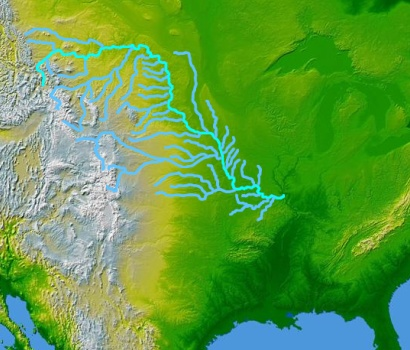
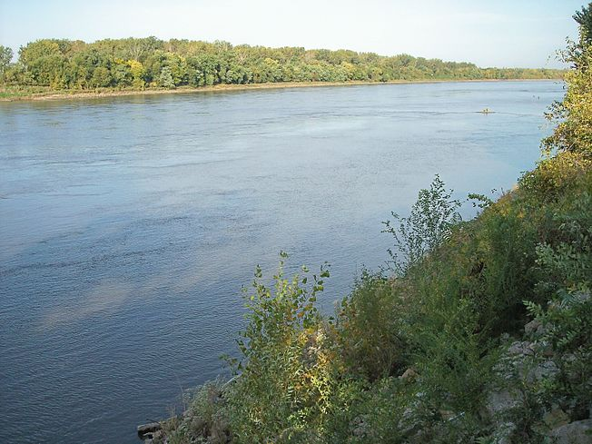
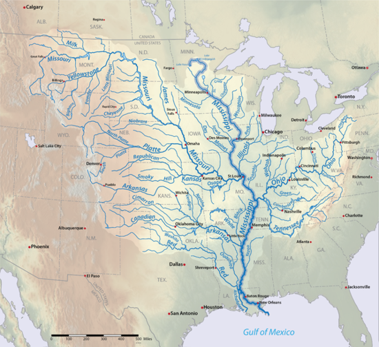
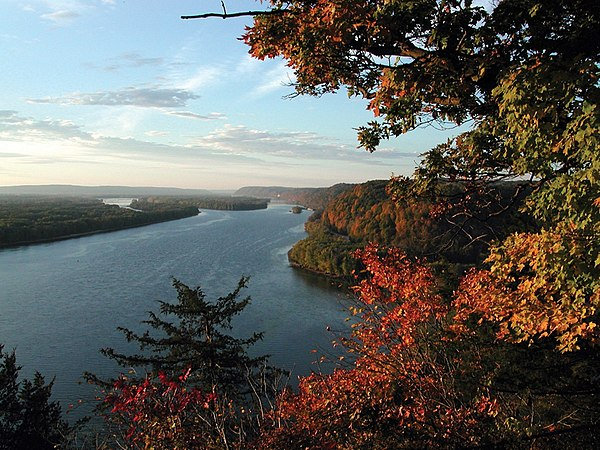
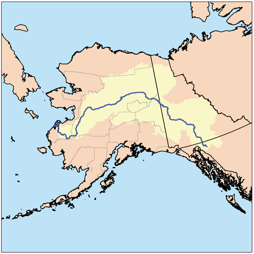
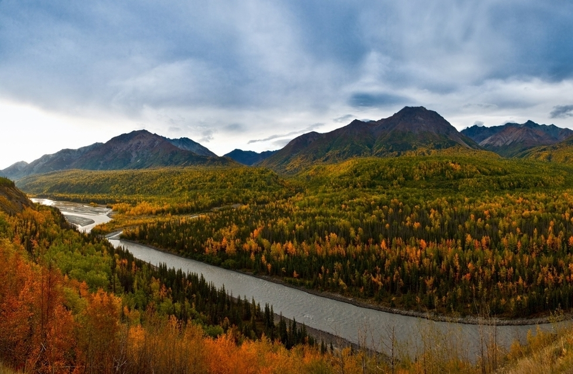

+++
title = "Die drei grössen Flüsse Nordamerikas "
date = "2021-09-07"
draft = true
pinned = false
description = "Die drei grössen Flüsse Nordamerikas heute in meinem Blog."
+++
Missouri River

Der Missouri River ist einer der größten und längsten Flüsse aus Nordamerika. Wie alle die ich in dem Blog zusammen trage ist der 3120 Kilometer lange Fluss einer der grössten. Er fliest in der USA aber auch durch Kanada.

Mississippi River

Mississippi River ist wahrscheinlich der Fluss der ich als erstes genant hätte wen mir jemand die Frage nach einem Fluss der durch Nordamerika fliest. Er ist mit 3778 Kilometer auch einer der grössten die man auf dem Kontinent finden kann. Er fliest von Minesota bis zum Golf von Mexiko.

Yukon River 

Yukon ist ein Wort das ich sicher auch schon mahl gehört habe, er ist ja nicht ohne Grund in dieser Lieste der Grössten Flüsse Nordamerikas. Um genau zu sein ist er 3’190 km lang. Er fliesst von British Columbia bis in den Alaska.

