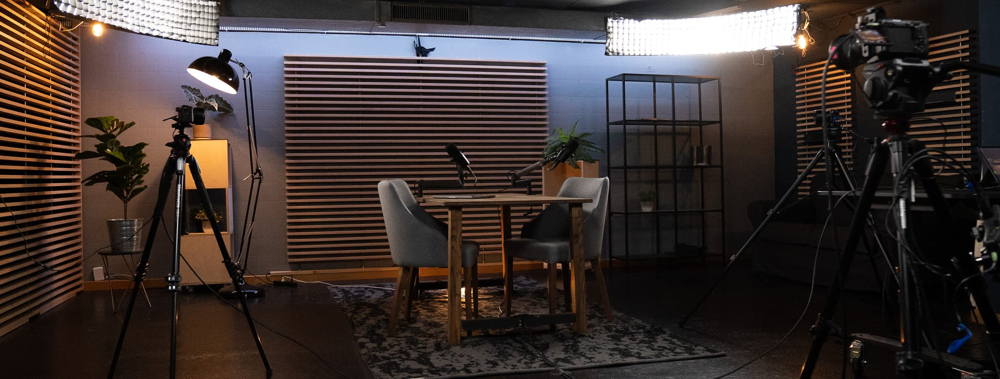

+++
title = "Direct Outreach Marketing für's Podcasstudio"
date = "2025-01-13"
draft = false
pinned = false
tags = ["podcasstudio"]
image = "podcast-set.jpg"
description = "In den letzten Monaten hat sich bei unserem Podcaststudio im Effinger einiges getan. Wie wir unser Studio an Kunden bringen und das Thema Marketing angehen, habe ich hier zusammengefasst."
+++
In den letzten Monaten hat sich bei unserem Podcaststudio im Effinger einiges getan. Wie wir unser Studio an Kunden bringen und das Thema Marketing angehen, habe ich hier zusammengefasst.

Unsere Podcastreise begann mit einer Anfrage von Simona. Sie wollte ein Video-Podcastformat starten, und wir haben direkt mit der Produktion der ersten Folgen losgelegt. Zu der Zeit hatten wir einen Teil des Effinger-Studios provisorisch für die Aufnahmen umfunktioniert. Mit jeder Folge haben wir das Setup verbessert, und inzwischen ist daraus ein richtig professionelles und einladendes Video-Podcaststudio geworden.

Auf Simonas Kanal kann man diesen Prozess sehr gut nachverfolgen: [Bindungsbasiert](https://www.youtube.com/@bindungsbasiert)

Das Studio ist fertig, und es ist wirklich cool geworden! Leider hat das allein nicht dazu geführt, dass das 3. OG von zukünftigen Podcastproduzent:innen gestürmt wurde. Die Herausforderung war also, unser Angebot bekannt zu machen.

Dafür haben wir:

* Bilder gemacht.
* Ein einfaches Video produziert.
* Ein Preismodell ausgearbeitet.
* Das alles auf einer Website präsentiert.

Was wir uns dabei allerdings gar nicht gefragt haben, war: **Wer braucht eigentlich ein Podcaststudio?** \
Um das herauszufinden, haben wir eine Marktanalyse gemacht. Schnell war klar: Unsere Zielgruppe sind Unternehmen, Teams, Vereine und Selbstständige, die Podcasts für Marketing- und Kommunikationszwecke nutzen wollen.

Mit diesem Fokus haben wir losgelegt:\
Also haben wir neue Bilder gemacht, ein neues Video gedreht, die Website weggeworfen und eine komplett neue, für die neue Zielgruppe optimierte Website erstellt. Naja, fast.  – ehrlich gesagt ist mir dabei aufgefallen, dass das Erstellen von Websites, Bildern und Marketingprodukten oft auch einfach eine Form von Prokrastination sein kann. Es ist halt schon gemütlich, in der Loft zu sitzen und an einem Figma-Board ein Design zu basteln.

Nach einigen Gesprächen mit YOLU haben wir eine effektivere Strategie entwickelt:

* Slack-Gruppen anschreiben.
* Alte Kunden aktivieren und kontaktieren.
* Potenzielle Kunden direkt anschreiben.

Eine spannende Herausforderung war dabei: Wie formulieren wir solche Mails? Wie stellen wir uns vor? Wie präsentieren wir unser Produkt?

**Was ich gelernt habe:**

1. **Der Kunde kommt immer zuerst.** Wörtlich genommen. Das bedeutet: Die ersten Worte in einer Mail sollten, wenn möglich, direkt an den Kunden gerichtet sein.
2. **Wir sind keine Mediamatiker.** Maël und ich haben uns entschieden, uns nicht als Mediamatiker vorzustellen, sondern als Jungunternehmer bei YOLU oder als Podcast- und Videoproduzenten.

Ein Stichwort, das ich für diese Form von Marketing gefunden habe, ist: **Direct Outreach Marketing.**

Kunden- und auslastungsmässig stehen wir noch am Anfang stehen wir noch am Anfang, und ich bin gespannt, wo uns die Podcast-Reise hinführt. 

Ach ja, falls du mal ein Podcaststudio brauchst, melde dich gerne! 😉

