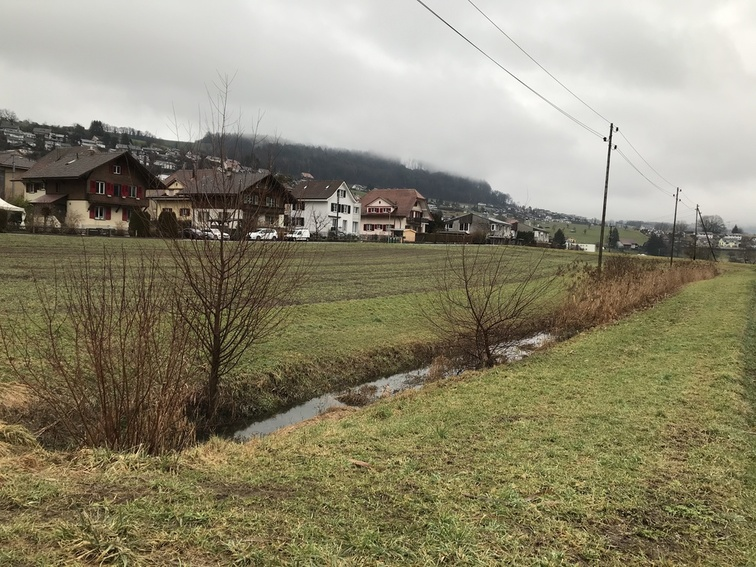

+++
title = "Ein See in Stettlen "
date = "2021-02-01"
draft = false
pinned = false
image = "tempimagegao53k.jpg"
description = "In Stettlen sah die Landschaft für einmal anders aus."
+++
Am Freitag ging ich in den Effinger. Das Wetter war regnerisch und der Schnee, den es über die lezten Tage hingeschneit hat, war verschwunden. Als ich mit dem Zug nach Hause fuhr sah ich auf einem Feld in Stettlen den See. Er war recht gross und es schwammen Enten drauf rum. Durch den Wind gab es kleine Wellen. So sah er eigentlich wirklich ein wengig so aus wie ein See.

Am Nachmittag ging ich noch ein wenig schauen und machte Fotos. Ich war nicht alleine. As waren auch noch andere Intressierte da und bestaunten den ungewöndlichen Anblick.

Nicht nur durch den See, der warscheinlich eher eine grosse Pfütze war, zeigte sich das Hochwasser. Auch der kleine Bach, die Worble, zeigte wie schnell sie zu einem Fluss werden kann. An der Brücke bei der normalerweise das Wasser noch einen Meter Platz hat, kam das Wasser bis an den Rand.

In Richtung Worb hatte sich auch ein See gebildet. In der Mitte stand ein Schuppen der einen Meter im Wasser stand.

Ich ging nach Hause und wusch meine dreckigen Turnschuhe aus, die mehrmals Bekanntschaft mit nassem Schlamm gemacht haben. In den nächsten Tagen wurde er immer kleiner bis man heute gar nichts mehr sehen kann.