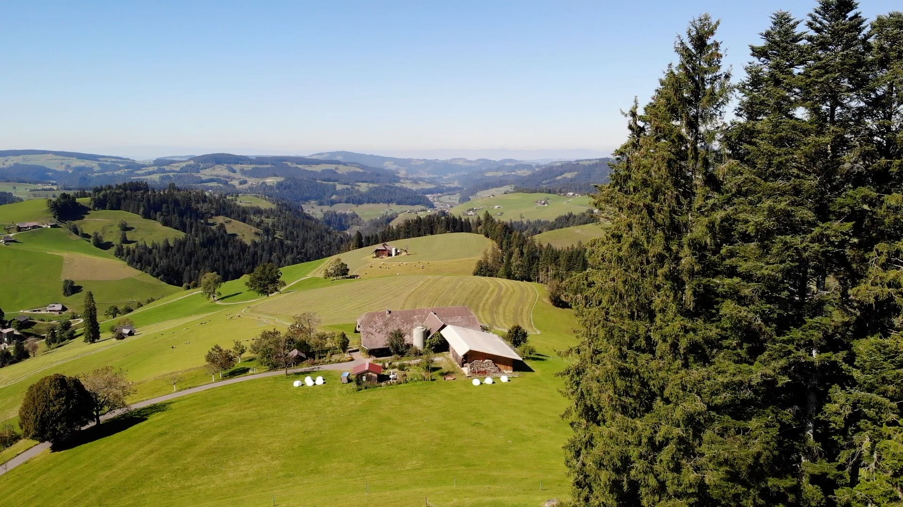
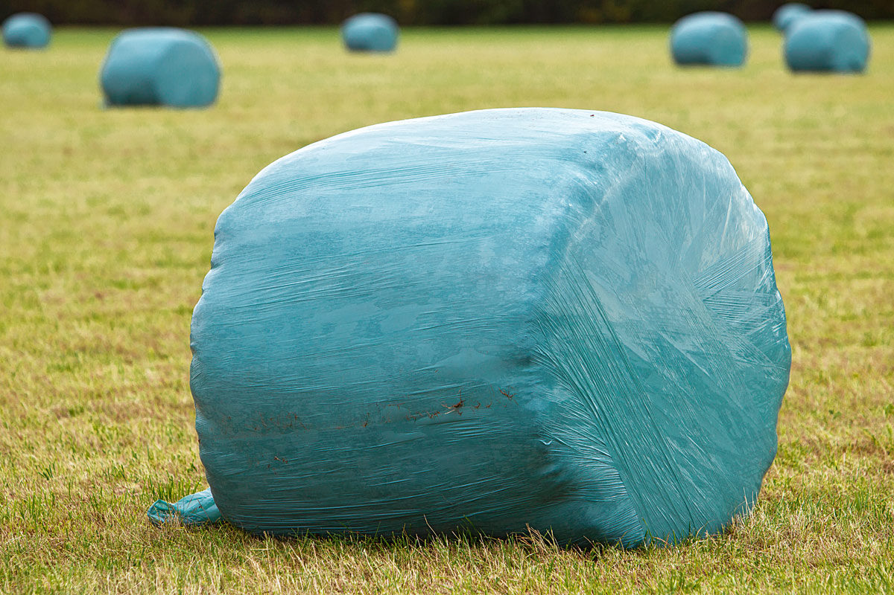
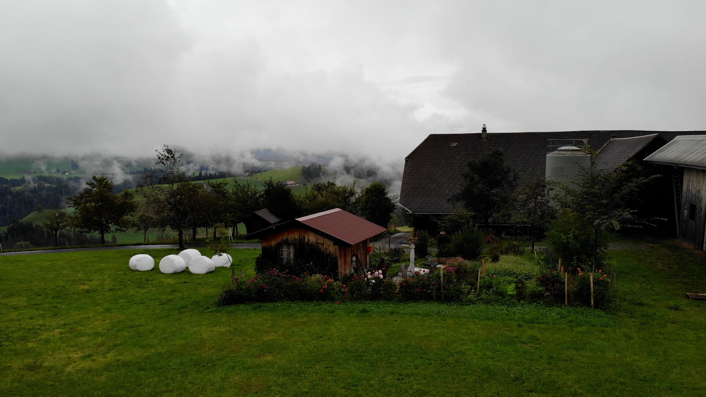

+++
title = "Eine Woche auf dem Bauernhof"
date = "2021-10-18"
draft = false
pinned = false
tags = []
image = "titelbild-2-1-.jpg"
description = "Ich schreibe darüber was ich in einer Woche auf dem Bauerhof gelernt, erlebt und gemacht habe."
+++
Ich habe mich über [Agriviva](https://www.agriviva.ch/de/) bei einem Bauernhof im Emmental angemeldet um dort eine Woche zu helfen.

Die Fahrt ins Schangnau, was wie es die Ähnlichkeit der Namen sagt in der Nähe von Langnau liegt, dauerte ungefähr 40 Minuten. Der Bauernhof liegt ein wenig abgelegen auf einem Emmentaler Hügel. Das Grundstück nennt man Bauernschopf. Wie ich gelernt habe, kommt der Name daher, dass Schopf früher Hügel bedeutete. Die Aussicht dort oben ist wunderschön und wenn sich der Nebel durchs Tal schleicht, ist man auf den 1120 Metern über Meer immer noch in der Sonne.

Auf dem Hof Bauernschopf gibt es neben einem Hund namens Luna und Katzen, auch junge, die es mir besonders angetan haben, auch Ziegen, Hasen, Hühner und über 100 Schafe. Um diese Tiere geht es auch in einer der Arbeiten die natürlich nicht unwichtig ist. Man lernt die Tiere dabei aber leider nicht von ihrer schönsten Seite kennen, es geht ums Misten.

So oft muss das aber gar nicht sein. Bei den Schafen, Hühnern und Ziegen ist es nur alle 3 Wochen nötig. Bei den Hasen aber wöchentlich. 

Am Morgen klingelte bei mir der Wecker so, dass ich um 7 am Zmorgentisch sitzen konnte. Danach wurden die Schafe auf die Weide gelassen und die Eier der Hühner eingesammelt. Danach wurden die Hasen und die Ziegen versorgt. Sie müssen jeden Tag Wasser und Futter erhalten. Manchmal waren wir frisches Gras für die Hasen oder Haselnuss für die Ziegen holen.

Später am Tag fiel die Arbeit immer unterschiedlich aus. Manchmal ging es darum etwas aus dem Garten zu ernten. Wir haben auch einmal Bäume mit einer speziellen Farbe bemalt, die sie vor Kälte, Wärme und vor allem vor Tieren die Rinde abnagen wollen schützen. Denn die Farbe beinhaltet Kalk, das die Eigenschaft hat bitter zu schmecken und die Tiere so vor dem Abnagen abhaltet. Gegen Ende Woche ging es darum, denn Futtervorrat für die Tiere im Winter zu erweitern. Eine Wiese wurde gemäht, alles von Hand und mit dem Traktor zusammen gewischt und später dann die sogenannten Siloballen gewickelt. Da konnte ich leider nicht mehr dabei sein. Ich habe immer gedacht, dass man das Heu, wenn es getrocknet ist, in die Siloballen legt. Aber dem ist nicht so. Das Heu muss sogar etwas nass sein. Denn die Ballen konservieren sich, in dem sich in den Ballen eine Art Alkohol entwickelt, der das Gras haltbar macht. Der Alkohol ist nur so leicht vorhanden, dass man es den Tiere ohne Probleme zum Fressen geben kann.

Zweimal sind wir auf einen Hof gegangen der Kühe hat. Dort konnte ich zusehen, wie gemolken wird und dabei helfen. Aus der frischen Milch entstand später eine leckere Vanille Sauce, die mit Dampfnudeln unser Abendessen wurde.

Am Abend müssen die Tiere herein genommen werden. Die Schafe kriegen als Belohnung Maisstücke, die ich verteilen durfte. Das war immer eine lustige Angelegenheit, da die Schafe regelrecht durchdrehen und sich alle auf den Abend Snack stürzen.

Schlafen konnte ich in einem kleinen Gartenhäuschen. Ich habe immer gut geschlafen

Am Samstag gingen meine Tage auf dem Hof zu Ende.

Es war eine tolle neue Erfahrung und ich habe gelernt.