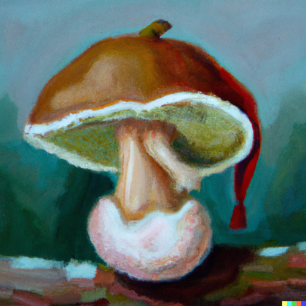
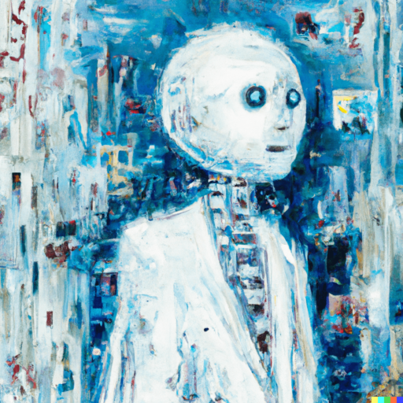

+++
title = "Erfahrungsbericht: KI Chat "
date = "2022-12-19"
draft = true
pinned = false
image = "ki-bild-kleiner-kopie.png"
description = "Die Chancen, dass ihr schon mal von der Chat KI gehört habt, stehen sehr gut. Ich schreibe hier meine Erfahrungen und Gedanken auf."
+++
Die Chancen, dass ihr schon mal von der Chat KI gehört habt, stehen sehr gut. Ich schreibe hier meine Erfahrungen und Gedanken auf.

**Um was geht es?**

OpenAI hat 2019 eine KI erstellt, die durch Benutzung und Training immer besser wird. OpenAI hat mehrere Tools herausgebracht, unter denen sich zum Beispiel Dalli 2, eine KI, die Bilder nach deinen Sätzen generieren kann, oder eben diese Chat KI befinden. Dieses gratis Tool kann dir Fragen beantworten, Blogs schreiben, Mails schreiben, beim Programmieren helfen, Shotlists für Videos erstellen... Und all das mit einfachen Sätzen wie: "Schreibe mir einen Blog zum Thema Colearning und dessen Vorteile." In kürzester Zeit erhältst du dein Text.

**Wie geht dieses Prinzip überhaupt auf?**

Die KI ist, zumindest heute noch, vollkommen gratis, doch warum kann sich OpenAI das leisten? Auf der einen Seite lernt die KI immer mehr und mehr dazu, je mehr man sie verwendet. Über soziale Medien ist dieser Chat immer wieder Thema, was natürlich eine unglaublich gute Werbung ist, die zudem auch gratis von InfluencerInnen produziert wird. Win-Win.

**Wie wird KI die Zukunft verändern?**

KI entwickelt sich unglaublich schnell weiter. Heute sind Dinge möglich, die man sich vor einigen Jahren noch nicht vorstellen konnte. Ein richtiger Umgang zu finden und Grenzen zu setzen ist sicher sehr wichtig. Aber wenn wir dies schaffen, sehe ich eine große Chance in künstlicher Intelligenz. Vielleicht entwickelt sich diese Sache auch eher in Richtung Hilfsmittel/Tool und wir verwenden es, um unsere Projekte, Texte, Bildung... besser zu machen und zu ergänzen.

**Contras**

Erstaunlicherweise finde ich es recht schwierig, über die Contras zu schreiben, nicht weil es keine gibt - im Gegenteil, es gibt sehr viele -, sondern viel mehr, weil ich Angst habe, welche zu vergessen. Aus diesem Grund schreibe ich einfach meine Gedanken dazu auf. \
\
Ein grosses Ding, das oft in die Schlagzeilen kommt, ist natürlich der Fakt, das KI s Jops weg nemen können. Jetzt haben sogar noch mehr Menschen angst um ihre Arbeit, da mit neuen KI s sogar Kreative Arbeiten ausgeführt werden können.  Diese Angst ist volkommen berechtigt und die Discusion auch und wie bei (fast) jedem Thema gibt es auch hier nicht, eine richtige Antwort. Wen weniger Jops, von Menschen gemacht werden müssen, gibt es vielleicht auch mehr Menschen, die Probleme, wie der Klimawandel oder Hungersnot etc. in angriff nehmen können. Das ich vielleicht Naiv aber das ist mir schei* egal xD.

**Fazit, wie werde ich dieses Tool verwenden?**

Ich finde das Thema und die Discusionen darum sehr spannend und ich glaube auch, das dies in Zukunft noch sehr viel mehr zur Verwendung kommt. Wie schon zuvor erwähnt ist es aber sehr wichtig, dass man wir einein richtigen Umgang finden und auch wissen wo wir die Grenzen setzen müssen.\
\
Das Tool wird bei mir sicherlich noch oft zur Verwendung kommen. Wie oft und für was genau wird sich noch zeigen. In diesem Blog habe ich viele interesante inspirationen aus der KI erhalten und mit dieser KI konnte ich auch die Rechtschreibung korrigieren. Aber auch da kommt die Frage auch, ist es sinvol die Rechtschreibung von einer solchen KI zu korigeieren oder wird dadurch