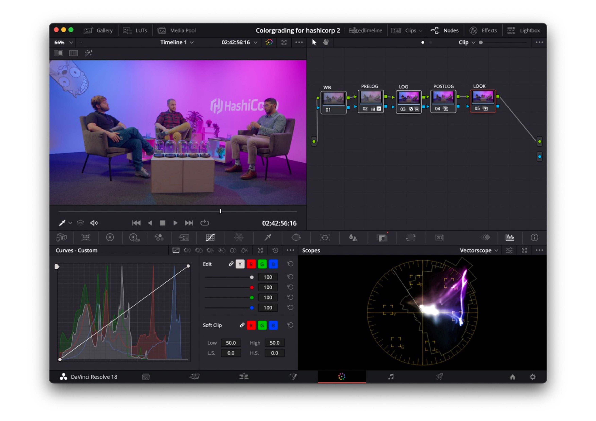

+++
title = "erster Kontakt mit Color Grading"
date = "2023-10-09"
draft = false
pinned = false
tags = ["notiz"]
image = "_ssp9450-1-.jpg"
description = "Ich lerne Color Grading...\n"
+++
Professionelle Kameras filmen oft in einem flachen Bildprofil. Das bedeutet, dass die Kamera einen breiten Farbumfang aufnimmt. Das Bild ist flach, da die vielen Farben am Ende flach dargestellt werden. Nach dem Aufnehmen habe ich den Auftrag, dem noch unschönen Bild durch Color Grading schöne Farben und einen neuen Look zu verleihen. Dafür verwende ich ein für mich neues Programm, DaVinci Resolve.\
\
Hier ist ein Bild meiner Notizen nach einigen Tutorials.... (: 

