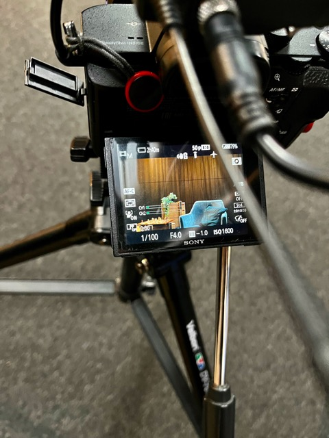
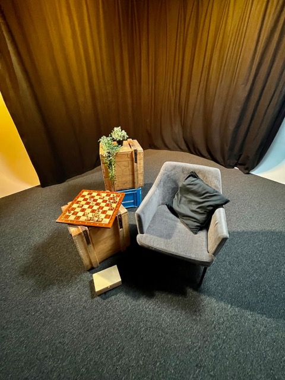
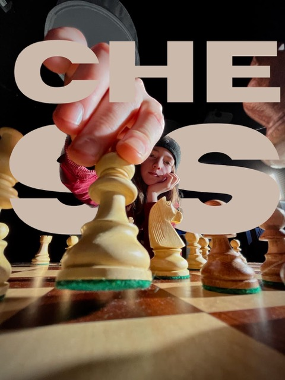

+++
title = "Erstes YOLU Projekt und was ich gelernt habe"
date = "2023-03-02"
draft = false
pinned = false
tags = ["YOLU", "Colearning", ""]
image = "mittel-klein-bild-dings-.jpeg"
description = "Das habe ich bei meinem Ersten \"richtigen\" Filmauftrag gelernt."
+++
Über YOLU habe ich einen Videoauftrag von Tom und Dominic erhalten. Dominic spielt Schach und um dieses Hobby zu finanzieren, starten sie eine Crowdfunding-Kampagne, für die sie ein Video benötigen. Wir haben besprochen, wie wir das Ganze gestalten wollen und uns für ein Interview mit B-Roll-Aufnahmen entschieden. Ich durfte die Aufnahmen dann im Studio aufnehmen und später schneiden.

\
**Was habe ich gelernt?** \
Dies ist der erste wirklich offiziell bezahlte Auftrag und dazu gehören natürlich auch Dinge wie Angebote und Rechnungen schreiben. Das kann ich jetzt einigermaßen und werde das nächste Mal sicher etwas schneller sein.

Um den Preis zu erarbeiten, habe ich eine Aufwandsschätzung gemacht. Ich rechnete mit 20 Stunden, aber der tatsächliche Aufwand war alles in allem etwas mehr. Ich hoffe, ich kann das nächste Mal besser einschätzen.

Beim Dreh habe ich natürlich auch viel gelernt. Zum Beispiel, dass man möglichst viel im Voraus planen sollte. Wenn man nämlich zu wenig plant, kann das Stress auslösen.

\
**Fazit:** \
Ich bin mit dem finalen Ergebnis zufrieden und habe auch viel gelernt. Zudem habe ich die Miete für den Laptop bezahlen können und auch noch etwas dazuverdient. Für das nächste Mal werde ich besser planen und auch meine Zeit besser einschätzen können.