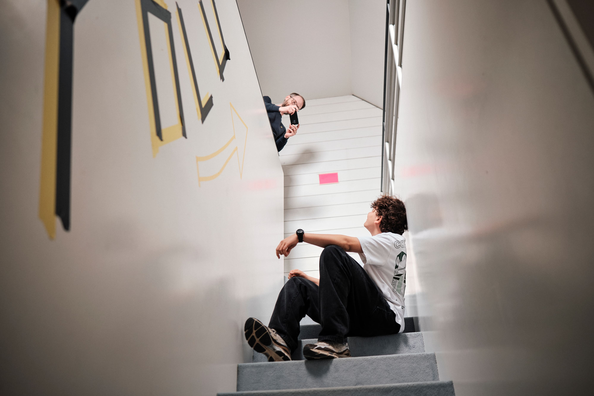

+++
title = "Fast mein erstes Zeitungsinterview"
date = "2024-11-25"
draft = false
pinned = false
image = "yolu_hauptstadt_hub-16-1-.jpg"
description = "Ich schreibe über mein (fast) erstes Zeitungsinterview."
footnotes = "Bilder von Dres Hubacher"
+++
**Gerade läuft wieder so einiges bei mir.**\
Ich erlebe mal wieder eine Phase, in der echt viel los ist. Eigentlich hätte ich einiges zu erzählen, aber kaum Zeit zum Bloggen. Heute habe ich mir jedoch vorgenommen, einen Beitrag zu schreiben. Themen gibt’s genug:

* Das Podcast-Projekt, bei dem wir endlich unsere Website gelauncht haben.
* Der fünftägige ÜK zur Fotografie.
* Die Planung eines Videoprojekts, das diese Woche ansteht.
* Und noch einiges mehr.

Aber heute geht es um etwas anderes. Etwas, das ich so noch nie erlebt habe. Oder dachte ich zumindest, bis Marco mich darauf hingewiesen hat, dass das nicht stimmt. Egal. Auf jeden Fall wurde ich vor zwei Wochen von einer Journalistin interviewt. Passend zum Zukunftstag möchte sie einen Artikel über YOLU schreiben und: meinen schulischen Weg (oder eher den nicht so schulischen), meine Lernzeit bei YOLU und die Hürden mit der Berufsschule.

Das Interview war eine perfekte Gelegenheit, mal zurückzuschauen. Was habe ich alles erlebt? Mir wurde wieder einmal klar, wie viel Glück ich mit YOLU habe. Wie besonders das ist, was wir hier machen, und wie gut dieser Weg zu mir passt. Aber auch, welche Herausforderungen die Berufsschule manchmal mit sich bringt.

**Mega spannend war aber auch,** Karin (die Journalistin) und Dres (der Fotograf) bei der Arbeit zu beobachten und Fragen zu stellen. Es war total inspirierend, zu sehen, wie Karin aus so vielen Infos einen runden und spannenden Artikel geschrieben hat. Und wie wenig Zeit Dres für so viele coole Fotos brauchte!

Mit dem Artikel bin ich mega zufrieden. Es ist spannend, einen Text über sich selbst zu lesen und den eigenen Weg aus einer anderen Perspektive zu lesen. Lustigerweise hat Marco dann noch einen alten Artikel von 2020 ausgegraben, [ein SRF-Beitrag über das Co-Learning](https://www.srf.ch/news/schweiz/co-working-space-fuer-kinder-wo-jugendliche-in-einem-buero-zur-schule-gehen). Schon lustig, wie anders die Stimmen damals klangen. (;

So, ich habe es tatsächlich geschafft mal wieder einen Blog zu schreiben. Also muss der Schluss auch nicht perfekt sein. Ende.\
\
Hier der Artikel ➡️ [Wo die lehre eine lerne ist](www.hauptstadt.be/a/wo-die-lehre-eine-lerne-ist)

