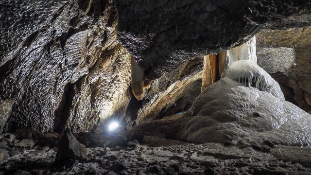

+++
title = "Faszination Höhlen"
date = "2020-10-14"
draft = false
pinned = false
tags = ["Höhlen", "Verborgen"]
image = "ja.jpg"
description = "Höhlen sind faszinierende und auch gefährliche Orte. Zusammen werden wir in eine dieser Höhlen eintauchen."
+++
**Erlebnisbericht**

Höhlen: Eine interessante, unbekannte, aber auch gefährlichen Welt.
Eine werden wir erforschen. Ssie heist Grotte de la Malatière und liegt im französischen Jura.
Da ich schon im voraus Bilder gesehen hab und mich ein wenig versucht habe im Internet schlau zu machen,  war ich besonders gespannt und auch ein wenig aufgeregt was mich wohl erwartet.
Der Eingang liegt gut versteckt in einem kleinen Wäldchen.
Unsere Führer, wenn man das so sagen kann, waren zu diesem Zeitpungt damit beschäftigt, zuerst mal Seile zu installieren. Dann ging es los. Um hinein zu gelangen muss man sich zuerst 10 m abseilen.
Weiter geht es dann durch grosse Gänge bis wir in einen Raum gelangen in dem zwei grosse Kalkgebilde stehen. Sie sehen fast aus wie eine Orgel.
Deshalb auch der Name Catedral.
Das war der erste grössere Raum in den man gekommen war. Es war viel grösser als ich mir das vorgestellt habe.
Durch einen kleinen Gang, der man fast nicht erkennen kann, kommt man in die Palmenhalle. Der Name hat dieser Raum wahrscheinlich durch die Palmen ähnlichen Kalkgebilde, die aus dem Boden ragen.
Durch Gänge und dünne Schächte dann die wahrscheinlich kleinste Stelle der Höhle: Das Schlüsselloch oder das Katzentürchen.
Bei diesem kleinen Durchgang war es sehr schwierig nicht nas zu werden da sich am Boden eine kleine Pfüze befand. Doch ich gelang durch irgendwelche komischen Bewegungen gesund und trocken wieder auf der anderen Seite raus.
Wen man das aber geschafft hat wird man mit einem hohen Höhlengang belohnt, in dem kleine Wasser Tümpel sind, die man erklettern muss. Am Ende dieses Höllensystems kommt man in den Tropfsteinraum, in dem sich unterschiedliche Tropfsteine befinden. Grosse, kleine, ganz unterschiedliche. Es gab Stalaktiten Stalakmiten und auch solche die ich noch nie zuvor gesehen habe. Natürlich mussten wir irgendeinmal auch wieder zurück. Das war dann hier der Fall. Also kehrten wir um. Dieser Weg waren wir um einiges schneller und sahen eine halbe Stunde später wieder nach fünfstunden Höhle und Taschenlampenlicht die Sonne.

Dieses Erlebnis werde ich wahrscheinlich nie mehr vergessen und es hat mich auch motiviert ein Film daraus zu gestalten und ich habe mir auch die Fragen gestellt, wie eine Höhle entsteht oder warum man so lange dieses Hobby verfolgt. Also habe ich mich darangemacht und habe recherchiert und habe sogar ein paar Fragen an Simon und Geri gestellt, unsere Höhlenführer.