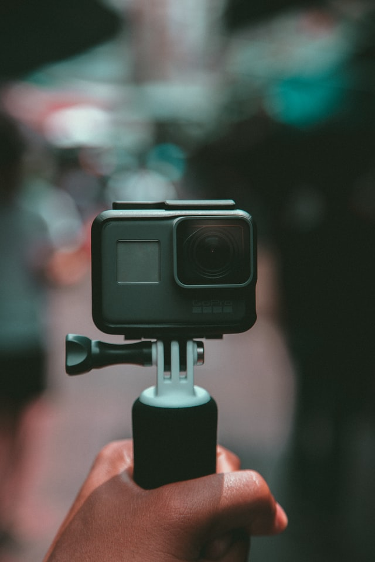

+++
title = "Filmen"
date = "2020-12-16"
draft = true
pinned = false
image = "final-cut.jpg"
description = "So bin ich beim erstellen meines Filmes vorgegangen."
+++
Um mein Projekt in die Tat umzusetzen, muss ich einen Film schneiden. In diesem Blog will ich aufschreiben, wie ich vorgehe.

## Das Filmen

Am Anfang mus man natürlich Aufnahmen haben und zusammen tragen. Die Vorgehensweise ist natürlich unterschiedlich. Da ich in der Höhle mit einer GoPro gearbeitet habe, habe ich einfach versucht alles was irgendwie spannend sein kann aufzunehmen. Ich stelle die Kamera immer so ein, dass ich im Schnitt die Aufnahmen halb so schnell laufen lassen kann. So wirkt das Bild ruhiger und man hat dopelt so viel Aufnahmezeit. Es ist wichtig, ein gut ausgeleuchtetes Bild zu haben, was in einer Höhle wie in meinem Fall manchmal ein wenig schwierig sein kann.

## Die Postproduktion 

Im Schnitt geht es darum die Aufnahmen einfach zusammen zu führen. Ich suche am Anfang eigentlich einfach eine Musik. Ich suche sie meistens auf der Youtube Studio Mediathek. Da die Musik in allen Filmen ein sehr wichtiges Kriterium ist, ist es wichtig sich Zeit zu nehmen. Dann geht es um den Schnitt. Das erste Bild ist eigentlich eines der wichtigsten. Darum habe ich eines genommen, was ich sellber sehr spannend finde. Dann schneide ich meistens auf den Takt und probiere auf die Musik zu hören. Am Ende kann man den Film exportieren und er ist fertig.