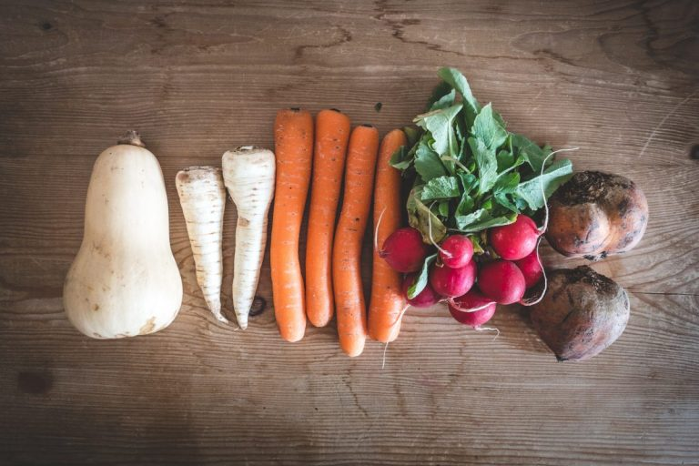

+++
title = "Food waste "
date = "2020-11-12"
draft = true
pinned = false
image = "organic-root-crops-and-other-vegetables-768x512.jpg"
description = "Food waste ist ein wichtiges Thema der Zukunft.\n"
+++
## Food waste

### Was ist Food waste?

Food waste sind Esswaren die auf dem Weg von Feld bis aufs Teller verloren oder weggeworfen werden. Manchmal aus unverständlichen Gründen wie zum Beispiel Ausehen oder Form von Obst oder Gemüsse.

### Wo endsteht Food waste?

Food wast entsteht eigentlich in fast allen Prozessen der Lebensmittel Produktion.In der Landwirtschaft entsteht der Food waste durch aussortierte unförmige Früchte. In der Verarbeitung durch ungenutzte Nebenprodukte. Im Grosshandel durch Lager Verluste. An dieser Stelle teilt sich der Strang, entweder werden die Produckte durch Detailhandel an Haushalte geliefert oder es geht direkt an die Gastronomie dort werden durch zu grosse Portionen und Buffetüberschüsse Food waste gemacht. In Detailhandel durch abgelaufene Produkte und in Haushalten durch Essens Reste. 

 

### Was kann man dagegen tun?

Food waste ist ein gesellschaftliches Problem. Das heisst, dass man als erstes was bei sich ändern muss. Da helfen Orgsanisationen, die sich mit diesem Thema befassen natürlich sehr. Zum Beispiel [Madame frigo ](https://www.madamefrigo.ch/de/).Das ist eine Organisation die sich zum Ziel gesetzt hat, den haushaltlichen Food waste zu bekämpfen. Die Idee ist, wenn man zu viel eigekauft hat kann man an bestimmten Orten an denen sich ein Kühlschrank befindet ein oder mehrere Produkte lagern. Auch ist es möglich, eines dieser Produckte wieder herauszunehmen und für den Eigenverbrauch zu nutzen. Ich finde, das ist ein wenig das Prinzip wie bei einer Brockenstube. 

Natürlich gibt es noch andere Organisationen, die sich mit Food waste auseinander- setzen, die ich jetz aber nicht erwähne.

Madam Frigo: https://www.madamefrigo.ch/de/