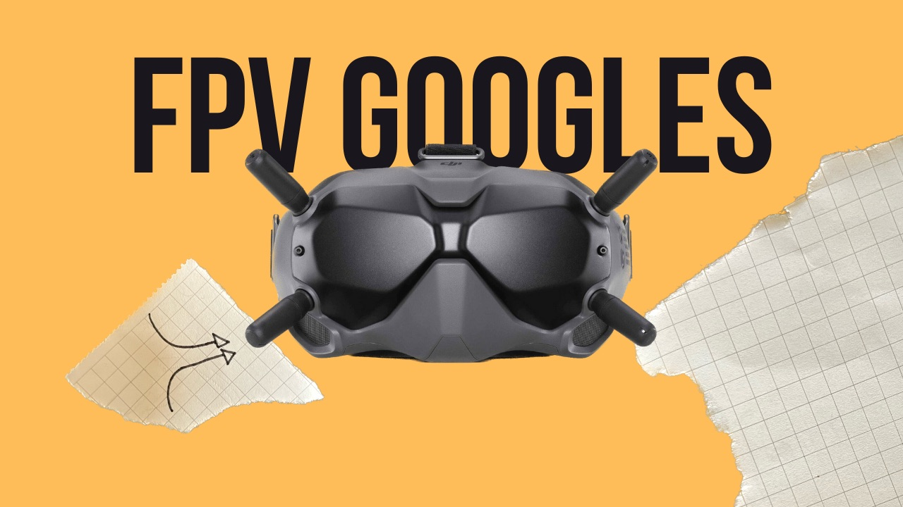
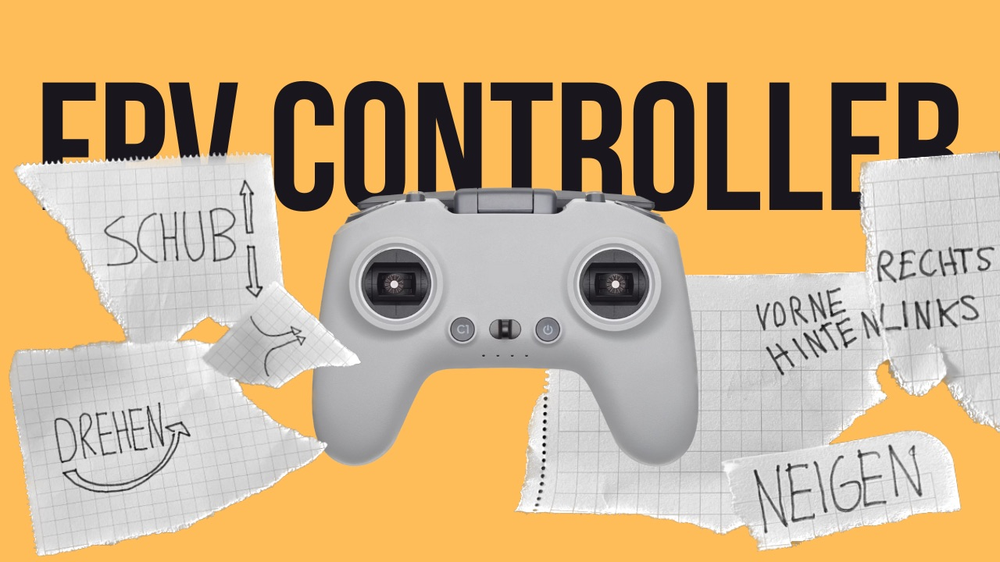

+++
title = "FPV 2.0"
date = "2023-05-16"
draft = false
pinned = false
tags = ["FPV"]
image = "fpv.jpeg"
description = "Nach fast 2 Jahren der zweite Blog zum Thema FPV..."
+++
Vor fast 2 Jahren habe ich einen Blog zum Thema FPV hochgeladen. Seit diesem Zeitpunkt interessiere ich mich für dieses Thema.

**Kurze Zusammenfassung: Was sind FPV-Drohnen?**\
FPV-Drohnen sind im Vergleich zu normalen Drohnen meist schneller und wendiger. Loopings, steile Kurven und Dives sind mit solchen Drohnen und mit Profis am Controller kein Problem. Durch diese Möglichkeiten kommt jedoch auch ein erschwerter Einstieg ins Hobby. DJI-Drohnen besitzen Sensoren, die verhindern, dass sie in Objekte fliegen, und wenn man die Steuerknüppel loslässt, bleiben sie an Ort und Stelle. Dies hat eine normale FPV-Drohne nicht. Übrigens steht FPV für First-Person View, was daher kommt, dass man die Drohne durch das Live-Bild einer kleinen Kamera an der Drohne steuert und dieses Bild durch eine Art Brille empfangen wird.

**Wofür FPV?**\
**Pro:**

* Höhere Geschwindigkeit
* Neue Perspektiven
* Bewegungsfreiheit

**Contra:**

* Kostenintensiv
* Schwieriger Einstieg
* Crashes sind normal.

**Wie fängt man nun damit an?**\
Crashes sind bei solchen Drohnen normal. Daher macht es Sinn, sich einen Controller und einen Simulator zu kaufen und damit zu üben. Der Preis für einen Controller liegt zwischen 90-250 Fr. dies hängt von der Qualität ab. Ich konnte einen für 40 Fr. bei Tutti bestellen. \
Früher musste man sich seine Drohnen selbst aus Einzelteilen zusammenlöten, was einige immer noch empfehlen, da man so ein besseres Verständnis für die Sache hat und den Copter auch selbst reparieren kann. Da diese Art von Drohnen seit einigen Jahren mehr in den Fokus grosser Firmen gerückt wird, gibt es auch Ready-to-Fly-Sets, bei denen das nicht nötig ist.

**Meine Erfahrungen im Simulator**\
Der echte Controller ist noch nicht mit der Post angekommen, aber mit einem ausgeliehenen PS3-Controller konnte ich trotzdem ein Gefühl fürs Fliegen entwickeln. Nach etwa 3 Stunden im Simulator fühle ich mich etwas sicherer, stürze jedoch immer noch oft ab. 

Die Steuerung ist komplett anders als bei einer DJI Mavic, die ich auch schon geflogen bin. Die Umgewöhnung ist etwas schwierig. Trotzdem macht es wirklich Spass.\
\
<iframe width="560" height="315" src="https://www.youtube.com/embed/COwoQGFdEOk" title="YouTube video player" frameborder="0" allow="accelerometer; autoplay; clipboard-write; encrypted-media; gyroscope; picture-in-picture; web-share" allowfullscreen></iframe>

**Nächste Schritte**\
Ich bin gespannt, wie gross der Unterschied zwischen einem richtigen FPV und dem PS-Controller ist und ob ich mich im Laufe der Zeit verbessere. Vom praktischen Fliegen bin ich jedoch noch weit entfernt, aber vielleicht bekomme ich irgendwann die Chance dazu.