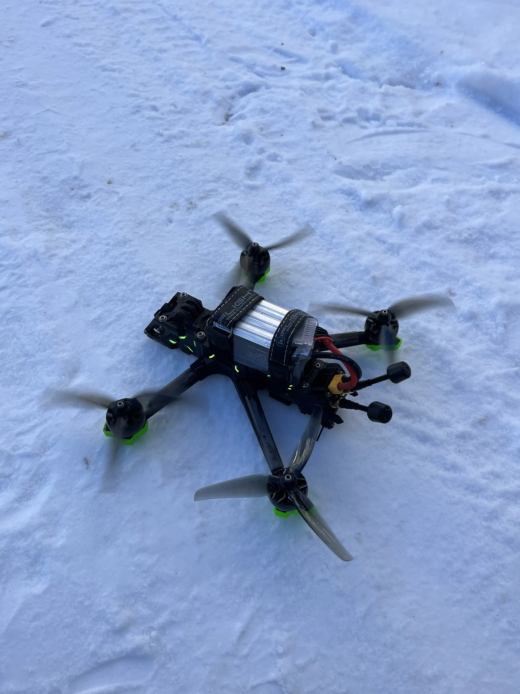

+++
title = "FPV 3.0"
date = "2024-02-06"
draft = false
pinned = false
tags = ["fpv"]
image = "dall-e-2024-02-06-21.49.07-a-simplified-color-scheme-sketchnotes-style-illustration-for-an-fpv-drone-blog-in-a-16_9-format.-this-image-should-streamline-the-essence-of-fpv-drone.webp"
description = "Mein erster Blog zum Thema FPV liegt jetzt schon etwas zurück jetzt konnte ich mir aber meine erste FPV Drohne finanzieren. "
+++
Mein erster Blog zum Thema FPV liegt jetzt schon 2,5 Jahre zurück. Das zeigt, wie lange ich mich bereits für dieses Thema interessiere. Die hohen Kosten für das Equipment, das Risiko, es zu verlieren, und die Zeit, die man in das Erlernen dieses Hobbys investieren muss, haben mich damals abgeschreckt. Seitdem hat sich viel verändert, und ich konnte mir endlich meine erste FPV-Drohne leisten.

### **Wie?**

* Ich bekomme einen Lehrlingslohn.
* Ein Freund hat sich von der Idee anstecken lassen, und wir haben die Kosten geteilt.
* Meine Begeisterung dafür ist immer noch gross.

### **Das sind FPV-Drohnen:**

ChatGPT: Das Fliegen einer FPV-Drohne ist vergleichbar mit dem Fahren eines Autos mit Schaltgetriebe – im Gegensatz zu den „automatischen“ DJI-Drohnen mit ihren vielen Assistenzsystemen. Hier gibt es keine Sensoren, die einem helfen; man steuert jede Bewegung selbst. Es ist herausfordernder, bietet aber auch die Freiheit zu beeindruckenden Flügen. 

### **Wie lernt man das?**

##### **So machen es die meisten:**

* Kauf eines Controllers
* Üben im Simulator (mindestens 10 Stunden)
* Kauf des weiteren benötigten Equipments - Drohne RTF oder Selbstbau - Akkus und Ladegerät - FPV-Brille
* Erster Flug
* Stetige Verbesserung

##### **Unser Weg:**

* Kauf eines günstigen Controllers
* Üben im Simulator 
* Kauf eines günstigen FPV-Kits
* Training damit
* Kauf eines Professionellen [RTF-Kits](https://shop.iflight.com/Nazgul-Evoque-F5-V2-6S-HD-RTF-DJI-Goggles-Integra-Pro1997?search=Nazgul%20Evoque%20F5%20V2%206S) (ready to flight)
* Offizieller Online-Lernkurs für das Fliegen von Drohnen in höheren Gewichtsklassen abgeschlossen.
* Weitere Übungen
* Kontinuierliche Verbesserung

  

### **Die ersten Flüge:**

RTF-Kits (Ready To Fly) waren nicht so „Ready To Fly“, wie wir dachten. Einiges musste eingestellt und angepasst werden, bevor es endlich flog. Die Freude war umso grösser, als alles funktionierte. Das Fliegen fühlte sich nach der Auswahl des richtigen Flugmodus sehr ähnlich wie im Simulator an und machte extrem viel Spass. In den ersten drei Flugtagen hatten wir einige Abstürze, aber nie mussten wir mehr als einen Propeller ersetzen. Wir haben viel gelernt und fühlen uns mit jedem Flug sicherer.

<iframe width="560" height="315" src="https://www.youtube.com/embed/j-_DbzltqC4?si=bTP48dibvtBJM-Ls" title="YouTube video player" frameborder="0" allow="accelerometer; autoplay; clipboard-write; encrypted-media; gyroscope; picture-in-picture; web-share" allowfullscreen></iframe>

### **FPV-Highlight:**

Wir beschlossen, am Wochenende früh aufzustehen und auf dem Bantiger, dem Hausberg von Stettlen, den Sonnenaufgang zu filmen. An diesem Tag passte alles perfekt zusammen, und es entstanden die bisher schönsten Aufnahmen. 

<iframe width="560" height="315" src="https://www.youtube.com/embed/mVXF1d8OFRo?si=OfawrI0j9D91mbOr" title="YouTube video player" frameborder="0" allow="accelerometer; autoplay; clipboard-write; encrypted-media; gyroscope; picture-in-picture; web-share" allowfullscreen></iframe>

### **Was habe ich gelernt?**

Ich habe viel über FPV-Drohnen, ihre Typen und den richtigen Einsatz gelernt. Jetzt verstehe ich, wie LiPos funktionieren – sie sind ganz anders als normale Batterien. Ich habe mich auch mit dem Equipment vertraut gemacht und Open-Source-Programme wie Betaflight und Gyroflow ausprobiert. Mittlerweile kann ich gute Aufnahmen machen und fühle mich bald auch für das kommerzielle Fliegen bereit.