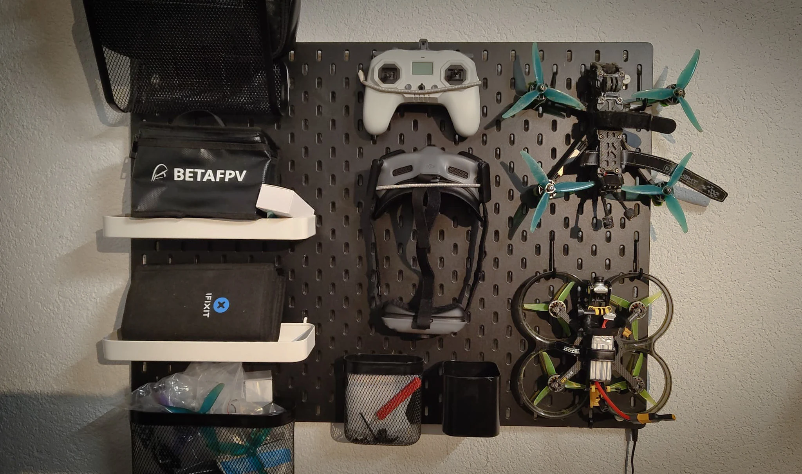

+++
title = "FPV 4.0"
date = "2024-10-30"
draft = false
pinned = false
tags = ["fpv"]
image = "photo-2024-10-21-19-27-19-2.webp"
description = "Seit dem letzten FPV-Blog ist einige Zeit vergangen, in der ich einiges erlebt und gelernt habe. Das schreibe ich hier auf. "
+++
Der erste Blog zum Thema FPV-Drohnen liegt jetzt etwas mehr als drei Jahre zurück. Wie ich damals auf das Thema FPV-Drohnen kam, weiss ich nicht mehr genau. Wahrscheinlich irgendein beeindruckender Clip, der mich neugierig gemacht hat. Auf jeden Fall hatte ich schon damals den Traum, mal eine FPV-Drohne zu fliegen. Als ich dann meine Lehre gestartet habe, konnte ich mit einem Freund tatsächlich meine erste richtige FPV-Drohne kaufen. Bis jetzt hat mich die Faszination nicht losgelassen. Seitdem haben wir mit und an unserer Drohne viel erlebt, ausprobiert, zerstört, wieder repariert und natürlich viel gelernt.

**Repetition: Was sind FPV-Drohnen?**

**Was wir in den letzten acht Monaten mit unserer Drohne erlebt haben. ⤵️**

Natürlich sind wir viel geflogen und dabei auch besser geworden. Wir haben uns mehr getraut, haben Autos verfolgt, sind durch enge Gaps geflogen und den Bantiger heruntergedived. Das führte aber auch dazu, dass wir einige Crashes hinter uns hatten – von kleinen Crashes in einem Wald, bei denen nur ein Propeller kaputtging, bis zu Full-Speed in eine Metallstange, bei der ein wichtiges Metallteil des Kameramoduls so stark verbogen wurde, dass wir es ersetzen mussten.

Dass wir die Drohnen aber immer noch haben, ist ein echtes Wunder. Einmal haben wir plötzlich das Signal verloren und sind so unglücklich abgestürzt, dass wir ein riesiges Gebiet durchsuchen und sie mit einigen kaputten Teilen wiederfinden mussten. Für solche Fälle hätten wir eigentlich einen Pieper, den wir mit dem Controller einschalten können und der uns mit einem lauten Signal hilft, die Drohne zu finden. Wenn jetzt aber der LiPo beim Crash herausfällt, wie es da passiert ist, geht der Pieper nicht.

Dasselbe Problem hatten wir auch, als ich plötzlich das Signal verloren habe und in ein grosses Feld mit hohem Gras gestürzt bin. Darin hätten wir sie ohne Pieper nicht gefunden, aber glücklicherweise ist sie noch etwas weiter geflogen als gedacht und auf einem Feld gelandet, auf dem man sie gut sehen konnte.

- - -

**Hier eine Liste mit Teilen, die wir schon ersetzen mussten:**

* 16x Propeller (durchgedreht, zerfetzt oder verloren)
* 1x Kameragehäuse (nach einem Crash stark verbogen)
* 2x Motoren (keine Ahnung, was uns da passiert ist)
* 1x Drohnenarm (nach Crash zerbrochen)
* 2x GoPro-Mount (beim Flug verloren und zerbrochen)
* 2x Kabel (hat sich plötzlich gelöst)
* 4x LiPo (nach Crash zerfetzt, plötzlich aufgebläht oder in Flammen aufgegangen)

Jetzt hatten wir richtig Lust, mal unsere komplett eigene Drohne zu bauen. Dazu gehört einiges.

Mit der Hilfe eines Kollegen, der neuerdings auch FPV fliegt und wesentlich begabter im Löten und Bauen ist, haben wir uns also drangesetzt und uns für einen Cinewhoop entschieden. Diese Drohne ist etwas kleiner und langsamer als unsere bisherige. Sie hat Prop Guards, die sowohl die Propeller vor Crashes schützen als auch alles in der Umgebung vor Verletzungen und Kratzern. Damit können wir Dinge machen, die mit unserer bisherigen Drohne nicht möglich waren. Mit den richtigen Skills könnte man damit auch indoor oder in der Nähe von Menschen fliegen.

**...Also haben wir die Teile bestellt. 🛒**

Eine FPV-Drohne ist ungefähr so aufgebaut: Das Gehirn einer FPV-Drohne ist der Flight Controller, der zusammen mit den Electronic Speed Controllers (ESCs) die über eine Antenne empfangenen Signale des Controllers verarbeitet und die Motoren steuert. Diese Motoren treiben die Propeller an, die die Drohne abheben und manövrieren lassen. Eine FPV-Kamera überträgt live das Bild an die Brille am Boden. Angetrieben wird das Ding dann von einem LiPo, der schnell viel Spannung abgeben kann. All das ist auf einem leichten Rahmen montiert und durch Lötverbindungen und Kabel miteinander verbunden. Es gibt noch einiges mehr, das sich da anbauen lässt: ein GPS-Modul zum Beispiel – damit kann man eine Drohne, die abgestürzt ist, wiederfinden, und sie könnte bei Signalverlust von selbst zurückfliegen. Oder ein vom LiPo getrennter Pieper mit einer eigenen Knopfzelle, der zu piepen beginnt, wenn der LiPo ausfällt. Damit kann man die Drohne auch finden, wenn der LiPo ausgesteckt wird, wie es uns auch schon passiert ist.

Nach ein paar Wochen war dann alles da und wir standen vor einem Haufen von Kartons mit den unterschiedlichsten Logos drauf. Dieser Mix aus Hardwareteilen, die aus den verschiedensten Teilen der Welt zu uns an den Tisch geliefert wurden, muss jetzt von uns richtig zusammengebaut und verlötet werden. Das hat dann auch irgendwie geklappt.

Nächster Schritt ist, die Software auf den Flight Controller zu flashen. Dann muss das Kameramodul aktiviert werden. Auch ein Punkt, bei dem wir uns lange nicht sicher waren, ob wir das hinkriegen, da die Software, die wir verwenden wollten, nicht die richtige war und man für unsere Kamera eine spezielle alte Version des Programms verwenden musste.

Der erste Testflug hat nicht geklappt, der zweite und dritte auch nicht. Irgendwas stimmte noch nicht mit den Motoren. Nach Herumpröbeln in Betaflight, der Open-Source-Software, mit der man alle Einstellungen machen kann, konnten wir dann die Motoren richtig konfigurieren und das erste Mal abheben. Jetzt mussten wir aber noch ein paar Einstellungen an den Rates machen. Rates bestimmen, wie schnell und empfindlich die Drohne auf deine Steuerbefehle reagiert – also wie flink sie sich dreht oder neigt, wenn du den Controller bewegst. Das machte einen riesigen Unterschied.

**FPV-Drohne selber bauen ✅**

- - -

Alle anderen FPV-Blogs:

* [FPV Blog 1](https://www.joschatschanz.ch/fpv/)
* [FPV Blog 2.0](https://www.joschatschanz.ch/fpv-2-0/)
* [FPV Blog 3.0](https://www.joschatschanz.ch/fpv-3-0/)