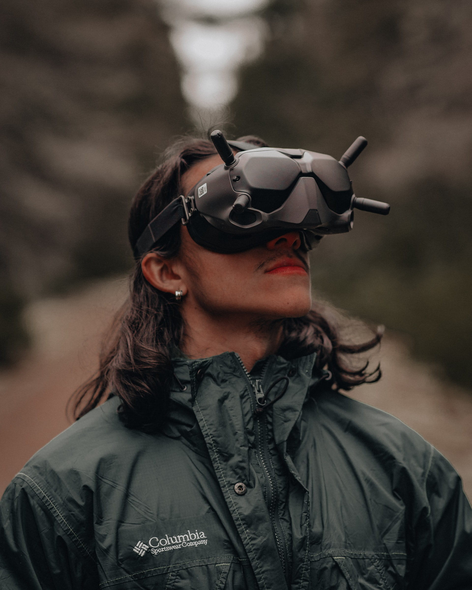
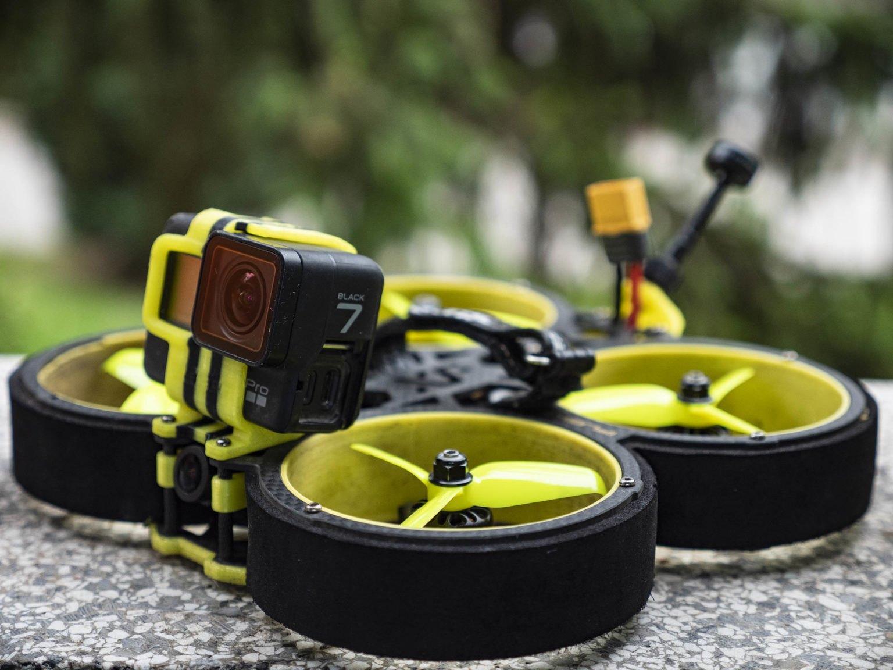
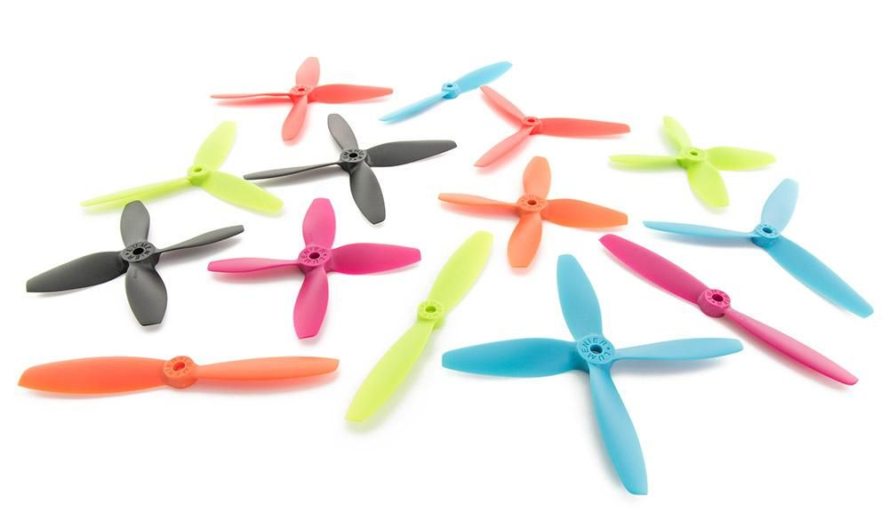
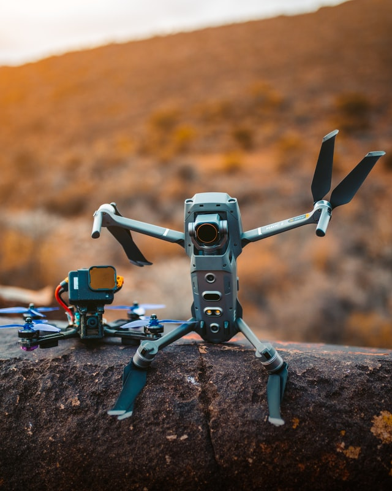

+++
title = "FPV Drohnen"
date = "2021-09-03"
draft = false
pinned = false
tags = ["FPV", "Drohnen"]
image = "felix-berger-90tbihe2tdo-unsplash.jpg"
description = "In diesem Blog schreibe ich über FPV Drohnen."
+++
Drohnen geben einem Film oder einem Foto eine ganz andere Perspektive und erlauben spannende Kamerawinkel. Der Marktführer auf diesem Gebiet ist eindeutig Dij. Die von ihnen hergestellten Drohnen zeichnen sich durch eine einfache Handhabung aus, trotzdem liefern sie tolles Bildmaterial. Technologien machen es möglich, dass mit Hilfe von Sensoren Hindernisse erkennt werden und GPS Daten werden verwendet um die Drohne an Ort und stelle stehen bleiben zu lassen, wenn man die Fernsteuerung los lässt. Das macht es auch für Anfänger sehr leicht, coole Luftaufnahmen zu machen. Aber Technik kann auch einschränken: sie verbietet Dinge wie Loopings oder das Fliegen durch Lücken und Löcher wird durch die Sensoren fast unmöglich. 

<iframe width="560" height="315" src="https://www.youtube.com/embed/1R7P7gsaXik" title="YouTube video player" frameborder="0" allow="accelerometer; autoplay; clipboard-write; encrypted-media; gyroscope; picture-in-picture" allowfullscreen></iframe>

Aufnahmen wie diese sind mit einer einfachen Dji Drohne nicht möglich, aber mit einer FPV Drohne.\
Um Aufnahmen wie die oben gezeigte zu erhalten, ist wahrscheinlich Monate, wenn nicht Jahre lange Erfahrung nötig. Denn eine FPV Drohne hat keine Sensoren oder dergleichen und ist somit enorm viel schwerer zu steuern. Wenn einen Windstoß die Drohen erfasst, muss man den Widerstand selbst ausgleichen.  Mit einer solchen Drohne sind dafür Saltos, steile Kurven und unglaubliche Geschwindigkeiten möglich, die solche Aufnahmen spektakulär machen. So eine FPV Drohne steuert man zu dem mit einer Brille, in die das Live Bild der Kamera übertragen wird. 

Um das FPV Fliegen zu erlernen, gibt es Simulatoren, in denen man mit dem Controller ein Gefühl für das Fliegen bekommt. Das Lernen im Simulator beansprucht natürlich viel zeit und Geduld, aber das ist nicht das Einzige, was viele Leute davon abhaltet mit dem Hobby anzufangen. Denn die meisten Drohnen müssen selbst aus Einzelteilen zusammen geschraubt und gelötet werden. Cinewhoops, zu denen ich gleich noch einmal komme, werden zum Beispiel zusammen gebaut geliefert, aber auch da muss man Zeit investieren, um sie mit der Fernsteuerung und der Brille zu verbinden. Aber auch da hat Dji eine Lösung, denn auch die haben eine FPV Drohne die sie verkaufen. Sie ist wie man es von Dji gewöhnt ist, redy to fliy das heisst, dass man alles in einem Set hat und keine Zeit mit verbinden und zusammenbauen verschwendet. Aber das Paket ist mit 1340 Fr. nicht gerade billig und bringt trotzdem nicht die gleichen Möglichkeiten wie eine die man selber baut.

<iframe width="560" height="315" src="https://www.youtube.com/embed/VgS54fqKxf0" title="YouTube video player" frameborder="0" allow="accelerometer; autoplay; clipboard-write; encrypted-media; gyroscope; picture-in-picture" allowfullscreen></iframe>

Es gibt verschiedene FPV Drohnen für verschiedene Situationen. Die Größe der Propeller ist das, was eigentlich den Unterschied bringt. Die Aufnahmen aus Basel wurden mit einer Freestyle Drohne erstellt, die fast immer 5 Zoll Propeller haben. Die Aufnahmen aus dem ersten Video wahrscheinlich mit einem Cinewhoop.

Ein Cinewhoop hat nur 3 Zoll Propeller. Man erkennt ihn an seinen Propellerschützer, die ein Cinewhoop fast immer eingebaut hat. Damit kann man problemlos mit Menschen interagieren, da es schlicht unmöglich ist, sich zu verletzten. Da die Propeller kleiner sind, ist der Cinewhoop anfälliger auf Wind und ist langsamer als ein Freestyle FPV Drohne. Das kann Indoor aber auch ein Vorteil bringen. Er ist präziser zum Steuern und somit perfekt um Indoor zu fliegen. 

Ich habe mich ein wenig damit beschäftigt und würde diesen Skill gerne erlernen. Vielleicht wird das mein neues Projekt.

