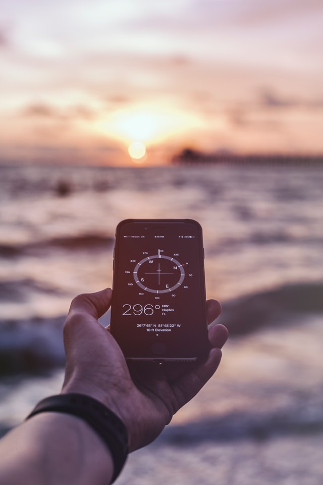

+++
title = "Geocaching"
date = "2021-09-18"
draft = true
pinned = false
image = "martin-lostak-xxk5li0mrb4-unsplash-1-.jpg"
+++
Geocaching wird meistens als moderne Schatzsuche beschrieben. Im gewissen Sinne ist es das ja auch. Mit Hilfe eine Geocachingapp kann jeder der sie besitz versteckte Dosen finden der ein anderer Geocacher versteckt hat diese Personen nennt man Owner sie verstecken und warten selbst gebaute Geocaches. Es gibt aufwendigere die zumbespiel verschiedene Standorte haben und man den Finalen Geocach erst herausfindet wen man die anderen Caches gefunden hat. 

Ich habe mir die App heruntergeladen und habe das ganze einfach mal selber ausprobiert. Etwas was mich sofort gewundert hat ist das ich an Orten an denen ich schon oft wahr plötzlich ein Geocach gefunden habe. Auch in Bern und Umgebung gibt es solche Geocaches. Einen Geocach kann man wen man ihn gefunden hat Logen das bedeutet das man sich in das Logbuch vor Ort einschreibt aber auch auf dem Handy den Geocach als gefunden markiert. Der Owner vergleicht die Liste Vorort mit den Online Logs aber eingentlich basiert das ganze auf vertrauen.

In der App kann man zu einem Geocach navigieren oder kann sich Informationen zum Geocach besorgen zumbespiel die Grösse die immer anders sein kann. Es gibt natürlich die Geocaches die einfach aus eine Znünibox bestehen oft gibt es da auch die Möglichkeit Dinge zu Tauschen das ist aber, wie ich früher nicht wusste, eher eine Nebensache. Es gibt zumbespiel Cachs die nicht grösser als ein Korken sind die mit hilfe eines Magneten unter einer Parkbank versteckt wurden.

Etwas wovon ich früher noch nie gehört habe sind die so genanten Travelbugs, abgekürzt Tb. Das ist nocheinmahl ein Spiel im Spiel. Die Idee dahinter ist eingentlich das man so ein Travelbug selber in einem Geocach legt und andere Spieler können mit hilfe des Codes der sich darauf befindet herausfinden was sein Ziel ist. Da steth zumbeispiel das der Tb möglichst fielle Länder bereisen will oder in ein bestimmtes Land gebracht werden soll. Wen man allso so ein Tb in einem Geocaching findet kann man es wie ein Geocach aus der Box vor Ort nehmen aber ihn auch auf dem Handy aus dem Cach nehmen. Im besten fall legt man ihn später einmahl in einen Chach der den Tb neher zu seinem Ziel bringt.

Etwas was mir sicher schnell aufgefallen ist ist das man mehr draussen ist und so natürlich auch ein Ziel hat. Aber auch wen man einfach mahl so unterwegs ist kann man das App benüzen. So habe ich zumbeispiel auf dem Weg zum Effinger auch kurz ein Geocach gelogt.