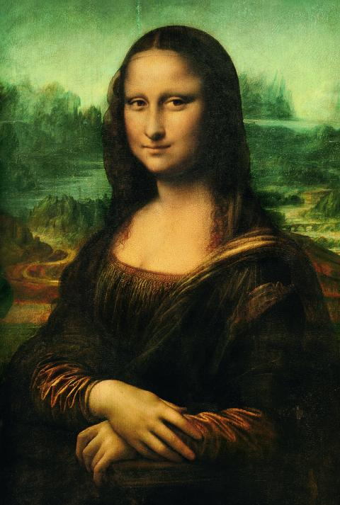
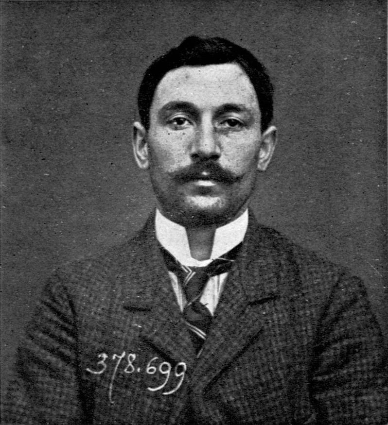
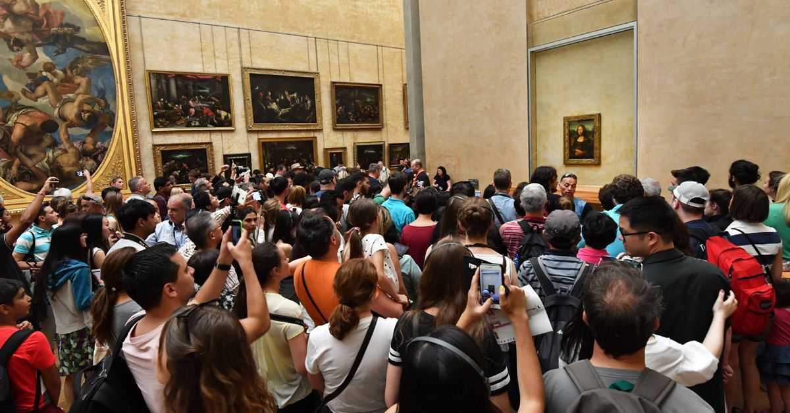

+++
title = "Geschichte: Der Raub der Monalisa"
date = "2020-12-11"
draft = true
pinned = false
image = "mona-lisa-690203_1920.jpg"
description = "Laut dem Eines Buch der Rekorde ist die Mona Lisa das Gemälde mit dem teuersten Versteigerungs wert wie so ein Gemälde Gestohlen worden konnte will ich in diesem Blog erläutert."
+++
Der Raub der Mona Lisa

Die Mona Lisa ist 1962 auf 100 MIionen geschätz worden was heute unter Berücksichtigung der Inflation etwa 843 Millionen Dollar wäre. Aber wie konnte so ein wertvolles Gemälde gestohlen werden.

Aber zuerst zu den Fakten, die Mona Lisa ist ein anfangs des 16. Jarhunderts von Leonardo da Vinci gemaltes Gemälde einer Jungen Frau. Heute hängt es in einem Museum in Paris dem Louvre es wurde 1797 zu der Austelung hunzugefügt und zieht Jeden Tag 20 000 Besucher an. 

Der Raub 

Ein Italiener namens Vincenzo Peruuggatia hat die Mona lisa 1911 gestohlen. Er wolte die Mona lisa zurück in seine Heimat bringen. Also ging er am Sonntag als normahler Besucher Ins Louvre und versteckte sich in einem Wandschrank. Am nächsten Morgen ist Ruhetag und und ehr hängt das Bild ab und läuft mit dem Gemälde nach drausen was kein Problem war da ehr mit einen Langen weissen Kittel getarnt wahr, und so aussah wie ein Mitarbeiter. Ein Bild hat ja einen Ramen den man endfernen kann so die Leinwand zusammen rollen kann. Vincenzo versteckte die Leinwand so bei sich zu hause in einem Spalt in der Wand. Verkaufen konnte er es natürlich nicht den jeder kennt ja das Gemälde und weis das es eigentlich im Louvre hängen sollte. Die Polizei verhört wenige zeit später alle Mitarbeiter. Der Klempner der dem Dieb die Türe geöffnet hat gestand der Polizei das er einem unbekanten die Türe geöffnet hatte.

Die Erpressung

Ein Kunsthändler aus Italien kriegte einen Brief in dem ein umbekanter behaubtete das er das Gemälde besitzen würde. Es war natürlich der Italiener. Er verlangte \
500 000 Liren was umgerechnet 1,5 Millionen Euro wären. Der Händler wollte das Gemälde sehen und Lockte den Dieb so in eine Falle.

Die Mona Lisa ist zurück

1914 hängt die Mona Lisa wider an ihrem Platz. In den nächten Tagen strömten \
100 000 Besucher ins Museum um die Mona Lisa zu sehen ein Neuer Rekord. Der die Mona Lisa Endgültig zum Superstar machte.

