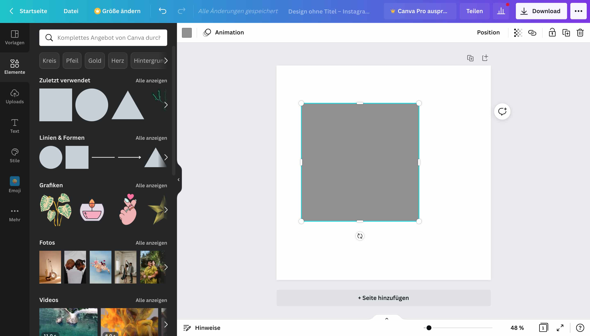
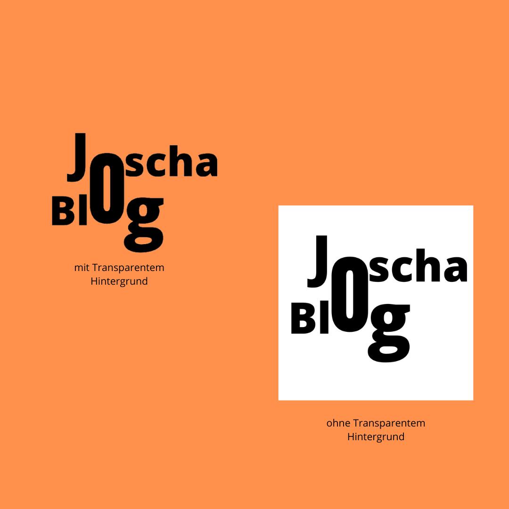
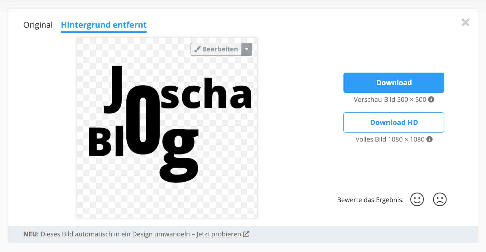

+++
title = "Gratis Icon (Anleitung)"
date = "2022-02-02"
draft = false
pinned = false
tags = ["shortblog"]
image = "bildschirmfoto-2022-02-03-um-10.00.41.png"
description = "Wie macht man ein Gratis-Icon oder Logo?"
+++
Das ist eine Anleitung wie man gratis und schnell ein eigenes Icon oder Logo erstellen kann.

Ich arbeite manchmal mit einem [Online Programm](https://www.canva.com/) mit dem man Pdf und solche Dinge erstellen kann.\
Man arbeitet dabei mit Formen und Text und kann so natürlich auch Logos erstellen. 

Das Problem dabei ist einfach, dass man das dann leider nicht transparent (also ohne Hintergrund) exportieren kann.

Aber dafür habe ich eine einfache Lösung gefunden. Die Lösung ist eine weitere [Internetseite](https://www.remove.bg/de), mit der man den Hintergrund entfernen kann. Diese Internetseite ist auch gratis, aber man kann leider nicht in so einer grossen Auflösung exportieren. für ein Logo oder ein Icon ist das meiner Meinung auch nicht so ein Problem.

