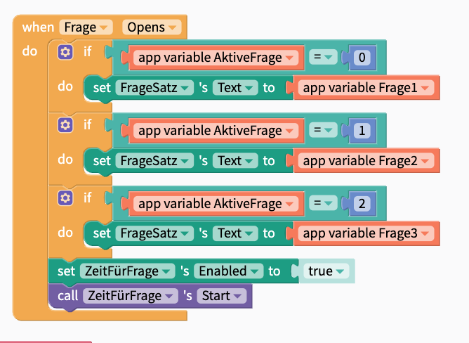

+++
title = "Hack an App"
date = "2021-08-04"
draft = true
pinned = false
description = "Ich habe Zwei Tage an einem App Programmier Kurs Teil genommen in dem Blog erzähle beziehungsweise Schreibe ich über das was ich gelernt habe und was für Erfahrungen mit Online Schuhle gemacht habe."
+++
Meine Gotte arbeitet im BIT bei dem ich auch schon mahl an einem Zukunftstag war. Ich konnte durch sie an diesem Kurs teilnehmen. In dem Kurs, der eigentlich für Familien Mitglieder bestimmt war, geht es um die Grundlagen eines Apps. Das Design zum Beispiel hat immer wider eine zentrale Rolle eingenommen. Nicht nur das was man sieht ist das Design sondern auch die Bedienung. Umso schneller man zu den gewünschten Funktionen kommt umso besser ist das Design. Man rechnet auch in Klicks. Das Ziel des Zweitage lang dauernde Workshop ist ein kleines Quitzapp zu erstellen. Das ganze haben wir in [Thunkable](https://thunkable.com/#/) erstellt. Das ist eine Blockprogramier Umgebung auf der man sehr einfach ein App nach dem Erstellen auf dem Handy über die Thunkable App aufrufen kann. Ich gebe zu ich habe gedacht das ich ein wenig schneller voran komme als ich es dann Tazächlich geschaft habe. Natürlich basiert die Blockprogramierung auf einem Logischen System, es ist ja nicht ohne Grund ein Teil in der Mathematik, aber trotzdem muss man wissen welcher Block, Welches Wort oder welches Zeichen für was steht. Aber ich denke wen man das System durchblickt hat und eine Grundkenntnis hat gibt es nahezu endlose Möglichkeiten. Schon aleine was andere Teilnehmer die sich offensichtlich schon einmal mit Programmieren auseinandergesetzt haben gemacht habe hat mich erstaunt. Man kann Menüs erstellen in denen man die Anzahl fragen einstellen kann oder die Lautstärke der Hintergrund Musik verändern kann. Für einen der sich mit der Materie schon oft befasst hat klingt das höchstwahrscheinlich lächerlich. Aber ich hätte nicht die geringste Idee wie man das umsetzen könnte. Ich hatte eine Idee, für meine App, für die ich einen Countdown benötigte. Am ende sah das ganze so aus:

Ich habe für das auch ein wenig Hilfe in Anspruch genommen, was aber garnicht so einfach wahr oder fileicht doch?

Das ganze fand wegen Corona über Microsoft Teams statt. Und ich war überast wie gut das wirklich funktioniert hat. Um in ein neues Thema spannend einzusteigen haben wir in der Gruppe ein [Kahoot](https://kahoot.com/) gespielt. nach Teorie die wir mit Hilfe von PowerPoint erfahren haben gieng es zu aktiven teil und zu Programmieren. Bei fragen konnte man in einen Privaten call gehen und den Bildschirm Teilen und so war das ganze eigentlich kein problem