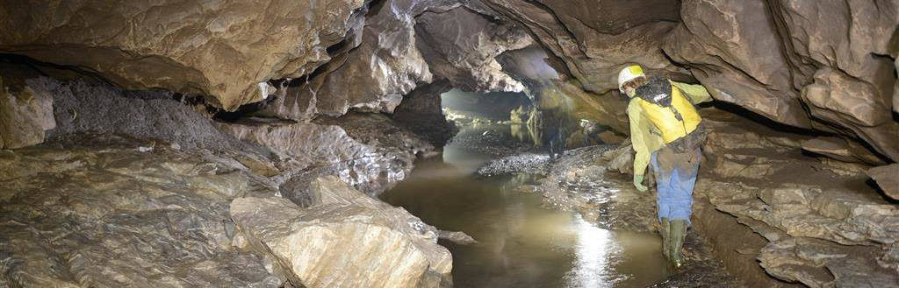

+++
title = "Interview mit Simon und Geri"
date = "2020-10-14"
draft = false
pinned = false
description = "Ich war bis jetzt in zwei grösseren Höhlen. In beiden begleitete ich zwei Hobby Höhlenforscher."
footnotes = "https://incave.ch"
+++
Für meinen Film habe ich mir überlegt, was ich machen könnte um ihn einwenig interessanter zu gestalten. Ich bin auf die Idee gekommen, Simon und Geri, das sind Hobby Höhlenforscher, ein paar Fragen zu Ihrem Hobby zu stellen. In diesem Blog will ich einfach die spannendsten Fragen und Antworten zusammenfassen.

# Interview mit: Geri und Simone

**Wie seid ihr auf dieses Hobby gekommen?**

Geri: An einem Freitag hat mich ein Freund angerufen und gefragt, ob ich Lust hätte, am Samstag mit in die Beatushöhle zu kommen. Ich habe einfach mal ja gesagt und bin mitgegangen. Da ich extrem begeistert war, bin ich danach gleich Mitglied im Höhlenclub geworden und seither aktiv in Höhlen unterwegs.

**Was war bis jetzt das schönste Erlebnis in einer Höhle?**

Simone: Der Besuch einer Höhle auf Mallorca. Nach einem abenteuerlichen Anmarsch erreicht man den kleinen unscheinbaren Eingang, seilt sich ein paar Meter ab und gelangt in eine wunderschöne, riesige Halle.

**Welches war bis jetzt die gefährlichste Situation?**

Geri: Vor langer Zeit habe ich mich durch eine senkrechte Spalte nach unten gequetscht, da darunter ein noch unerforschter Höhlenteil lag. Als ich nach der Vorstosstour wieder versuchte, die Spalte hochzukommen, merkte ich, dass ich das alleine nicht mehr schaffe. Meine zwei dünneren Kollegen stiegen durch die Spalte hoch und haben mich dann mit dem Seil hochgezogen, was für mich sehr schmerzhaft war, da es mir die Rippen massiv zusammengedrückt hat.

**Was ist eure Begeisterung an Höhlen?**

Simone: Für mich Höhlen ganz klar ein Ort, an dem ich Energie tanken kann.

**Warum sollte man ihn Höhlen gehen?**

Geri: Entweder, um als Mensch erleben zu können, an einem Ort dieser Erde der erste Mensch zu sein -> Abenteuer, Expedition, Pionier. Oder, um in unserer heutigen Welt mit permanenter Erreichbarkeit einmal eine Auszeit zu geniessen.