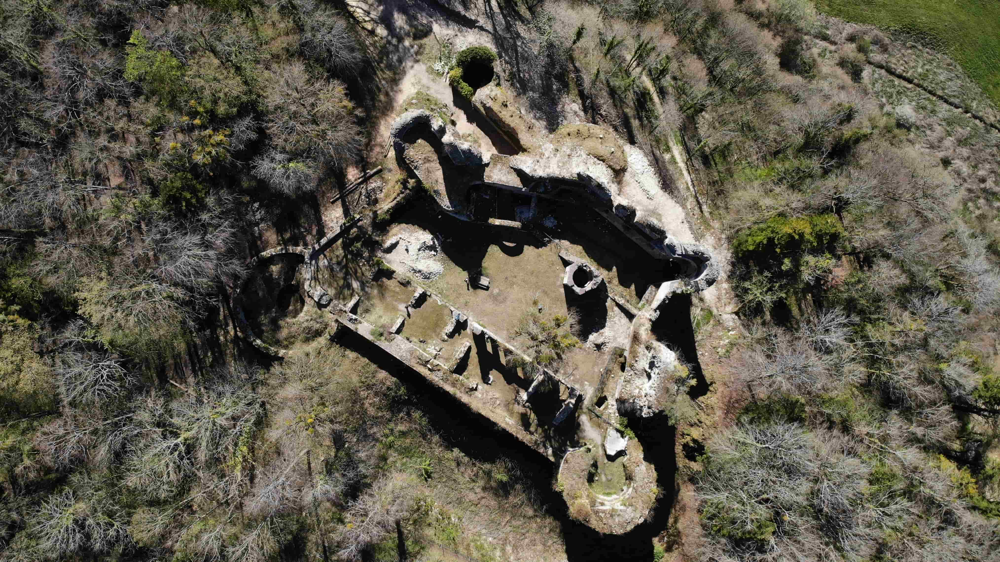
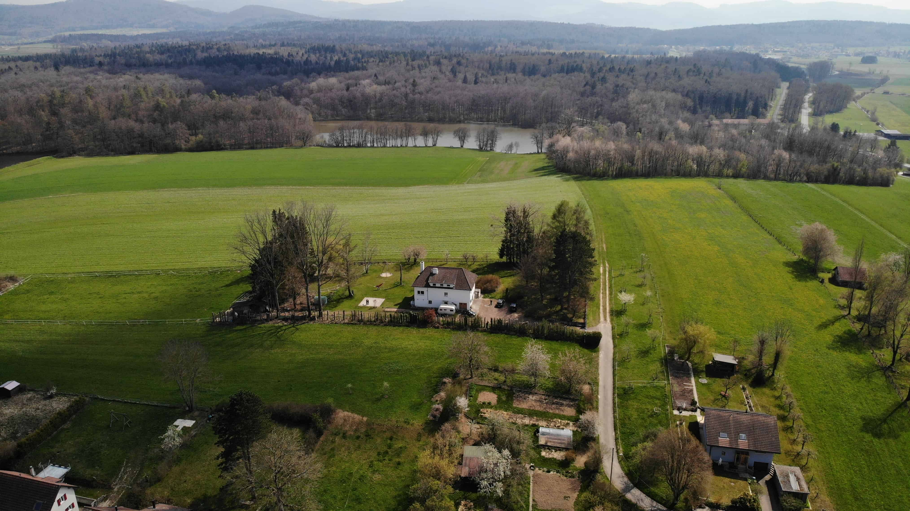

+++
title = "Drohne Fliegen"
date = "2021-05-26"
draft = true
pinned = false
image = "dji_0376.jpg"
description = "In den Ferien waren wir ein par Tage im Jura ich schreibe darüber was ich für Drohnenbilder gemacht habe."
+++
**Drohne Fliegen**\
\
Heute gehören Drohnen einfach dazu. Ich finde, dass man so einen anderen Blick auf eine Sache kriegen kann, wenn man sie aus der Luft betrachtet. Wir haben vielleicht seit einem Jahr auch eine Drohne, die immer wieder schöne Luftbilder macht. Ein Kollege von mir hat jetzt auch eine Drohne gekauft, seitdem packt mich dieses Thema.  Ich habe auch mehrere Videos gemacht, in denen zum grössten Teil Drohnenaufnahmen stecken. Zum Beispiel Industrieflug: In Stettlen, genauer gesagt in Deisswil, wird eine alte Kartonfabrik zu einer Wohnsiedlung umgebaut.Das grosse Areal eignet sich natürlich für ein paar coole Drohnenaufnahmen. Daraus habe ich ein kurzes Video geschnitten.

```
<iframe width="560" height="315" src="https://www.youtube.com/embed/whEM9TzxaIo" title="YouTube video player" frameborder="0" allow="accelerometer; autoplay; clipboard-write; encrypted-media; gyroscope; picture-in-picture" allowfullscreen></iframe>](<<iframe width="560" height="315" src="https://www.youtube.com/embed/whEM9TzxaIo" title="YouTube video player" frameborder="0" allow="accelerometer; autoplay; clipboard-write; encrypted-media; gyroscope; picture-in-picture" allowfullscreen></iframe>>
```

In den Ferien waren wir ein paar Tage im Jura. Die Drohne kam natürlich mit. Das erste Motiv war Saint-Ursanne. Das ist ein kleines Dorf, das grösstenteils aus einer Altstadt besteht. Es gibt eine alte Kirche mit einem Klostergarten und eine Brücke, die über einen Fluss, der direkt vor der Häuserfront steht, führt. Ein, meiner Meinung nach, perfekter Ort für schöne Aufnahmen.\
Ein weiteres Motiv war eine alte Burg in Frankreich. Da sind wahrscheinlich fast meine Lieblingsaufnahmen endstanden. Ein Foto, das ich von oben nach unten gemacht habe, gefällt mir da besonders. Denn man sieht darauf die Burg aus ungefähr 120m. Aus dieser Höhe kann man richtig erkennen, wie die Burg auf einem bewaldeten Hügel erbaut wurde und wie die Burg damals ausgesehen hat.



Geschlafen haben wir in einem RB&B das in der Nähe von einem See lag. Ein wirklich grosses Anwesen, das mitten auf einem Feld stand. Wie es sich für diese Gegend gehört, gab es immer wieder grössere Seen und Tümpel in der Umgebung. Auch in dieser Umgebung habe ich Aufnahmen gemacht. Eine Erfahrung, die ich gemacht habe: Wenn die Drohne nahe über dem Wasser fliegt, kann es vorkommen, dass sie nicht mehr weiss, wie hoch sie ist und sie darum langsam nach unten fliegt, was bei Wasser natürlich schon ein wenig beängstigend ist. Beruht wahrscheinlich darauf, dass die Drohne mit kleinen Kameras, die nach unten zeigen, Orientierung sucht. Aber Wasser bewegt sich bekanntlich und darum sinkt sie langsam.



\
\
Aus den Aufnahmen will ich jetzt auch noch ein kurzes Video schneiden. Ich bin selber gespannt was daraus wird.