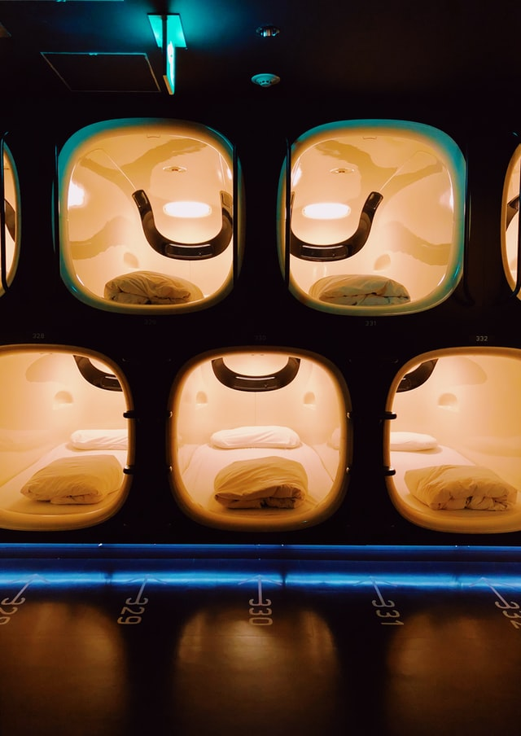

+++
title = "Kapselhotel"
date = "2022-02-24"
draft = false
pinned = false
tags = ["shortblog"]
image = "alec-favale-rdia_qfpwhc-unsplash.jpg"
description = "Ich habe eine Nacht in einem Kapselhotel verbracht. Das sind meine Erfahrungen..."
+++
Kapselhotels kommen ursprünglich aus Japan. Die Idee dabei ist, eine platz- und geldsparende Möglichkeit zum Übernachten zu schaffen. Warum sollte dieses Prinzip nicht auch in der Schweiz funktionieren?\
Das haben sich wahrscheinlich auch die Gründer von [capsulehotel](https://capsulehotel.ch/) gedacht.

In der Schweiz gibt es bis jetzt, wie man es sich denken kann, nicht so viele. [capsulehotel](https://capsulehotel.ch/) hat bis jetzt drei eröffnet. Es gibt eines in Luzern, Basel und neu auch eines im Flughafen Zürich. Dieses ist sogar das grösste in ganz Europa. 

Ich durfte Marco, Joris und Levin zur Eröffnungsfeier begleiten und anschließend sogar eine Nacht in einer Kapsel verbringen...

Etwas, was mir an dem Ausflug wirklich sehr gefallen hat, ist, dass das Hotel an einem Flughafen liegt. Es war wirklich spannend in dem Flughafen so spät herumzulaufen. Das ist etwas, was man mit der Gewissheit dort schlafen zu können, geniessen kann.

Zur Nacht: Man stellt sich so eine Nacht in einer kleinen Kapsel vielleicht nicht so gemütlich vor. Aber ich fand, dass genau dieser kleine Raum etwas sehr gemütliches hatte.