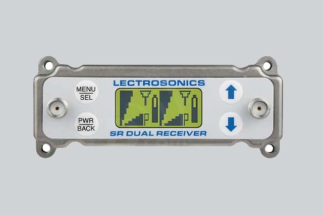
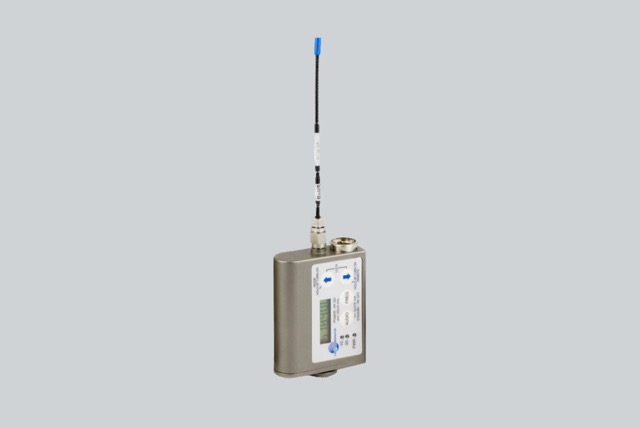

+++
title = "Von XLR zu Klinke: Wie ich mein altes Mikrofon mit Adaptern fit für die moderne Welt machte"
date = "2023-03-09"
draft = true
pinned = false
tags = ["ChatGBT"]
image = "xdr-zu-klinke.jpg"
description = "In unserem Keller habe ich ein Mikrofon gefunden. Mein Vater hat es früher genutzt, aber mit dem Equipment, das er verwendet hat, ist es nicht mehr kompatibel.\n\nUm es jetzt aber wieder verwenden zu können, brauche ich ein paar Adapter..."
+++
Titel stammt von ChatGBT :)\
\
In unserem Keller habe ich ein Mikrofon gefunden. Mein Vater hat es früher genutzt, aber mit dem Equipment, das er verwendet hat, ist es nicht mehr kompatibel.

Um es jetzt aber wieder verwenden zu können, brauche ich ein paar Adapter...\
\
Im Set vorhanden:\
**SRB/E01 Dual Receiver (empfängt das Audio)** \
2’450.- 

\
**drei Antennen**\
*keine Angaben gefunden*\
**SMB/E01 (Da kommt das mic rein)**\
1’875.-

\
**Kompatibles Lavalier-Mikrofon**\
*keine Angaben gefunden* 

**Was brauche ich?**

Um dieses Mikrofon jetzt zu benutzen, brauche ich einen Akku für den Empfänger sowie einen für den Sender. Das konnte ich ohne Probleme organisieren. Doch das größere Problem ist, dass der Empfänger nur ein Kabel auf XLR hat. Das ist mit keinem meiner Geräte kompatibel.

Also brauche ich einige Kabel und Adapter, die dann von XLR auf Klinke 3,5 mm führen. Dabei habe ich einen kleinen Laden in Bern entdeckt, der alles hatte, was ich brauche. Also das dachte ich, aber leider funktioniert es immer noch nicht richtig. Warum? Ich frage ChatGPT. Die Antwort auf diese sehr spezifische Frage ist zwar sehr beeindruckend aber hilft mir nicht weiter.

Ich gehe noch einmal in den Laden in Bern und zeige mein Mikrofon dort. Ein weiterer Adapter hat das Problem gelöst, und ich kann das Mikrofon jetzt am Laptop, an einer Kamera sowie an meinem Handy benutzen.\
\
Ich könnte mir aber auch vorstellen das Set zu verkaufen...