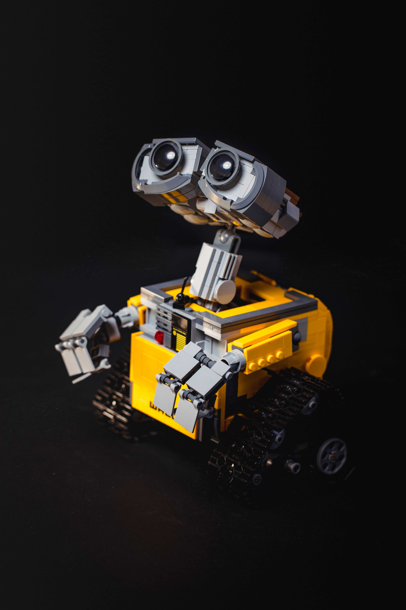

+++
title = "Praktische Anwendung von KI"
date = "2022-09-14"
draft = true
pinned = false
image = "bild-zu-blog-ki.jpg"
description = "An der eduJAM 3 durfte ich ein intressantes Tool kennen lehren, es handelt sich um eine künstliche Intelligenz die anhand von Stichwörtern oder einer Beschreibung Textinhalt erstellen kann."
+++
*Künstliche Intelligenz ist die Zukunft oder vielleicht auch nicht. Wie auch immer, sie ist ziemlich interessant. Also lass uns ein wenig darüber reden.*

Diese zwei Sätze sind das Ergebnis wen man [OpenAI](https://beta.openai.com/playground) die Beschreibung: *Intro zu Künstlicher Intelligenz mit Humor, eintippt.*

OpenAI, ist eine Platform die aus einfachen Eingaben wie: Was ist eine KI? Wissenschaftlicher Text, Texte erstellen kann. Dadurch kann man sich natürlich einiges an Zeit sparen. Wie das schreiben eines Intros für diesen Blog.

In dem Workshop von eduJAM ging es darum, mit experimentieren, dieses Tool kennen zu lehren. Für diesen Blog mache ich das auch.

\
Frage an die KI: *Wie funktioniert ein Computer?*\
Antwort:\
*Ein Computer ist ein Gerät, das Informationen verarbeiten kann. Die Informationen werden in digitalen Codes umgewandelt, die vom Computer verarbeitet werden. Der Computer kann Informationen speichern und wiedergeben.*

dieses Bild würde übrigens mit der künstlichen Intelligenz DALL-E Erstellt.

Beschreibung an die KI: Traurige Geschichte über eine Fledermaus die auf dem Mars, in einem alten Piano lebt\
Antwort: 

*Eine Fledermaus lebte einmal auf dem Mars. In einem alten Piano. Sie war sehr einsam und traurig. Niemand kam je zu ihr und sie hatte niemanden zum Reden. Eines Tages sah sie einen Menschen auf dem Mars wandern. Sie wollte ihn ansprechen, aber sie hatte keine Stimme. Also flog sie zu ihm und landete auf seiner Schulter. Der Mensch erschrak, aber die Fledermaus konnte ihm nichts tun. Sie sahen sich an und in diesem Moment wussten sie, dass sie Freunde werden würden.*

dieses Bild würde übrigens mit der künstlichen Intelligenz DALL-E Erstellt

Von vielen Menschen wird das Thema Künstliche Intelligetz, zurecht, kritisch gesehen. Für was braucht es uns Menschen dan eigentlich noch? dass ist etwas was im Beug aufs Thema zuhören ist. 

Ich bin mir aber sicher das Dinge wie Kreativität oder Humor nie wirklich ersetzt werden können. 

Beim Thema Humor wäre es doch wieder Zeit für ein KI Bestpiel.\
\
Frage an die AI: *Witz über eine Fledermaus die auf dem Mars, in einem alten Piano lebt:*\
Antwort: 

*Eine Fledermaus die auf dem Mars, in einem alten Piano lebt, ist nicht wirklich ein Witz. Es ist eher eine kleine Anekdote oder ein Kuriosum.*

Ich habe beim herum versuchen wirklich erstaunlich viele lustige Antworten erhalten. Warscheindlich ist Humor, bis zu einem gewissen Teil zumindest, doch berechenbar.