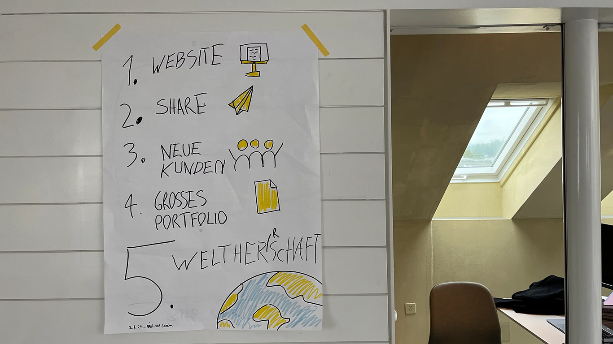
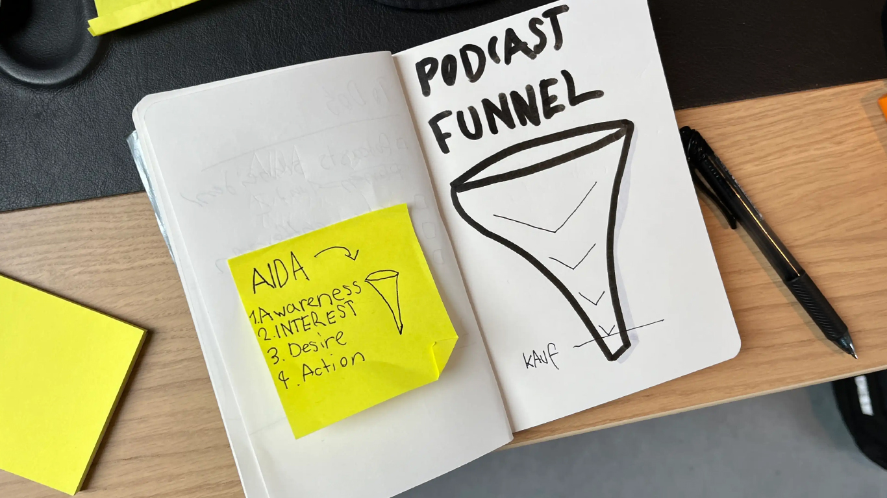

+++
title = "Marketing für das Podcast-Studio"
date = "2024-09-23"
draft = false
pinned = false
tags = ["podcaststudio"]
image = "img_1568.webp"
description = "Was ich über Marketing gelernt habe...\n"
+++
Gerade dürfen wir im Effinger an einem Podcast-Studio arbeiten. Die Idee dafür kam ursprünglich durch eine Anfrage zur Produktion von Podcasts. Da wir die Idee gut fanden und überzeugt waren, dass es noch andere geben würde, die davon profitieren könnten, haben wir das Projekt gestartet. Das Studio wuchs mit den Podcasts, die wir filmten, mit. Nach dem Kauf von Equipment, neuen Lampen und einem Umbau haben wir jetzt ein wirklich cooles Produkt, das wir anbieten können. ***Und Jetzt?***

Maël und ich haben uns zusammengesetzt und überlegt, wie wir weiter vorgehen. Wir haben eine Art Roadmap erstellt: Wir möchten eine Website fürs Studio erstellen, die wir dann durch Marketing verbreiten und Kunden gewinnen – so der Plan. 

Wie das konkret aussieht, ist gar nicht so einfach. Website erstellen kriegen wir hin. Beim nächsten Schritt wussten wir jedoch nicht weiter. Im Effinger haben wir Unterstützung gefunden und konnten mit Manu/Herr Bürli einen Deal aushandeln und in ein par Coatchings über unser Projekt sprechen. Letzte Woche hatten wir bereits das erste Treffen. 

Hier sind meine Takeaways:

**Kundenreise verstehen:**
Wenn wir genau wissen, was jemand, der einen Podcast produzieren möchte, durchmacht, können wir unsere Marketingmassnahmen gezielt dort einsetzen, wo unsere Zielgruppe ist. Beispielsweise könnten wir YouTube-Videos zum Thema "Wie produziert man einen Podcast?" erstellen, weil Leute, die Podcasts produzieren möchten, genau danach suchen.

**Marketing Funnel:**
Der Marketing Funnel ist ein Tool, mit dem wir potenzielle Kunden gezielt ansprechen und Schritt für Schritt zu unserem Angebot führen können. Konkret könnte das für unser Marketing bedeuten, dass wir zuerst durch Social-Media-Posts Aufmerksamkeit erzeugen und dadurch das Interesse auf unsere Landingpage lenken. Durch Testimonials oder Beispielen bauen wir Vertrauen auf. Wenn das Interesse geweckt ist, führen wir persönliche Gespräche, die möglicherweise zur Produktion führen. Abschliessend bieten wir Extras wie Social-Media-Reels aus dem Podcast an. Bei jedem Schritt wird der Funnel schmaler und wir verlieren einige Interessierte. Am Ende haben wir eine Handvoll Kunden, die genau unser Produkt wollen.

**Projekt ganzheitlich betrachten:**
Ich bin immer davon ausgegangen: Wir produzieren Videopodcasts. Eigentlich ist es aber spannender, sich zu überlegen, was bei einer Podcast-Produktion sonst noch so alles anfällt: Idee, Vorbereitung, Produktion, Schnitt, Veröffentlichung, Verteilung auf Plattformen, Titel, Zusammenfassungen, Marketing und vieles mehr. Was können wir davon übernehmen, um unsere Kunden zu entlasten und das Podcast-Produzieren ganzheitlicher zu betrachten.

**Pakete entwickeln:**
Jetzt geht es darum, die oben genannten Dienstleistungen in Pakete zu unterteilen, die übersichtlich zeigen, was wir übernehmen. Da habe ich gelernt, dass es sinnvoll ist, drei Varianten anzubieten – von günstig bis teuer.