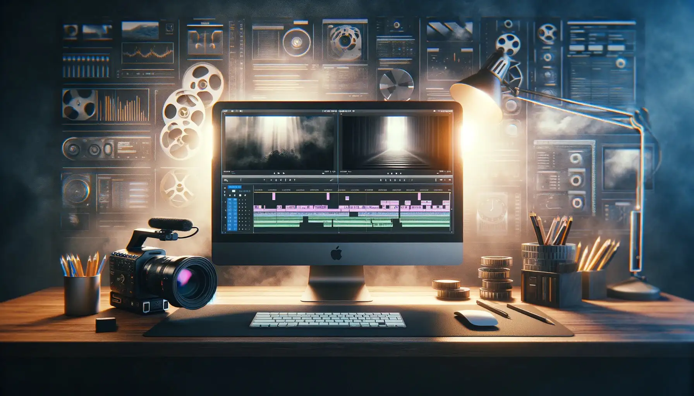

+++
title = "Mein Einstieg in DaVinci "
date = "2024-02-29"
draft = false
pinned = false
image = "dall-e-2024-02-29-15.39.57-visualize-a-compelling-title-image-for-a-blog-post-or-video-about-a-young-filmmaker-s-journey-exploring-different-video-editing-software.-the-image-fe.webp"
+++
Meine ersten kleinen Filmprojekte entstanden auf meinem iPod touch, den ich zu Weihnachten bekommen habe. Das Arbeiten in Programmen wie iMovie und Stop Motion war zwar etwas limitiert, aber es sind trotzdem einige lustige Projekte entstanden. Für etwas grössere Projekte konnte ich den Mac meiner Eltern mitbenutzen. iMovie auf dem Mac zu nutzen, war schon ein gutes Upgrade. Ich konnte mit einer Timeline arbeiten und hatte Zugriff auf nützliche Tools. Aber mit Final Cut Pro, das ich jetzt schon über 5 Jahre benutze, bin ich richtig in die Profiliga der Programme aufgestiegen. Final Cut ist die professionelle Version von iMovie. Ich mag das Programm sehr und da ich in den letzten Jahren meine Erfahrungen sammeln konnte, fühle ich mich damit auch sehr wohl.

Die Meinungen zu diesem Programm sind gespalten, doch ich mag den logischen und einfachen Aufbau. Anderen fehlen dafür einige Tools, die komplexere Programme bieten. In meinem ersten halben Jahr in der Lehre durfte ich mich ins Thema Filmemachen vertiefen. Ich konnte viel von Joni und Fäbu lernen, vieles Neues über Final Cut, aber ich konnte auch ein komplett neues Programm kennenlernen.

DaVinci Resolve war zu Beginn vor allem für seine Farbbearbeitungstools bekannt. Doch heutzutage wechseln immer mehr zu diesem Programm. Animationen, Soundbearbeitung und Color Grading sind einfach umfangreicher möglich als in Final Cut.

Da Joni mit Blackmagic-Kameras filmt, ist der Workflow mit einem Programm dieser Firma (DaVinci ist von Blackmagic) einfacher, als ständig komprimieren zu müssen, um die Dateien auch in Final Cut nutzen zu können. Also hatte ich im letzten halben Jahr einige Möglichkeiten, mich in diesem mir neuen Programm zurechtzufinden.

Ein neues Programm zu lernen, war eine spannende Erfahrung mit vielen neuen Möglichkeiten, aber auch Dingen, die in Final Cut meiner Meinung nach einfach besser gelöst sind. Da ich ungefähr weiss, was ich brauche, fällt mir die spezifische Suche nach bestimmten Tools auch in DaVinci einfacher. Eine weitere Bestätigung, dass ich durch Ausprobieren und direktes Einsteigen viel schneller und nachhaltiger lernen kann als nur durch Theorie. Das ist eigentlich logisch ;)

Was ist mir direkt aufgefallen? Final Cut verwendet etwas, das sich Magnetic Timeline nennt. Footage, das man in die Timeline einfügt, sucht sich selbst seinen Platz und verschiebt die anderen Clips so, dass dieser Clip einen perfekten Platz hat. Da ich mich daran gewöhnt habe, kann ich dadurch sehr schnell meine Clips anordnen und mag dieses System. DaVinci jedoch hat das nicht. Wenn ich einen Clip einfüge, überschreibt er die Clips darunter. Wenn ich einen Teil eines Clips lösche, bleibt eine unbenötigte Lücke in der Timeline stehen, die ich dann manuell löschen muss. Nach einigen Projekten sehe ich jedoch auch hier Vorteile.

Das Color Grading in DaVinci ist tatsächlich viel ausgeprägter möglich als in Final Cut. Ich mag die Nodes und kann auch schon von einigen Tools profitieren. Als Anfänger bleiben noch viele Tools ungenutzt, ich bin gespannt, was ich noch entdecken kann.

Wovon ich jedoch auch schon jetzt profitieren kann, ist die riesige Community auf YouTube. Man findet immer ein gutes Tutorial für jegliche Details des Programms.

Fazit: Ich habe sehr Lust, meine Fähigkeiten im Umgang mit diesem Programm zu erweitern. Ich versuche, neue Projekte jetzt auch damit umzusetzen. Einige Aufgaben sind mit Final Cut doch effizienter möglich.

Funfact: Weil Blackmagic vor allem ein Hardwareproduzent ist, ist ihre DaVinci Resolve Software grösstenteils kostenlos.

