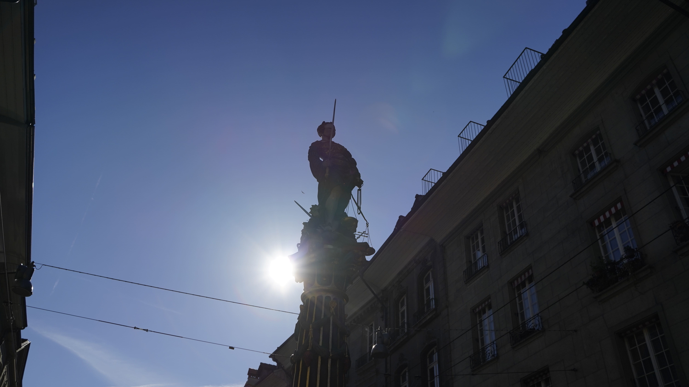
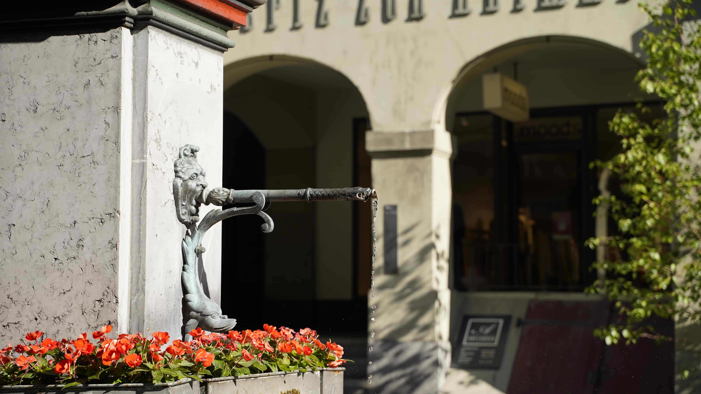
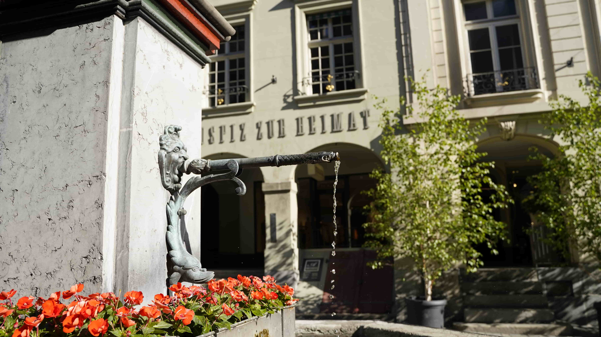
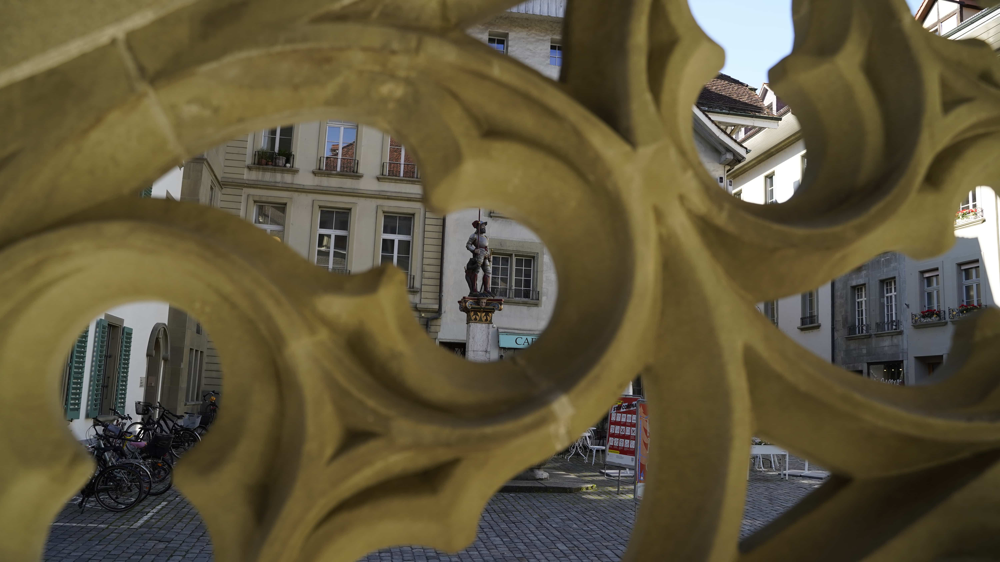
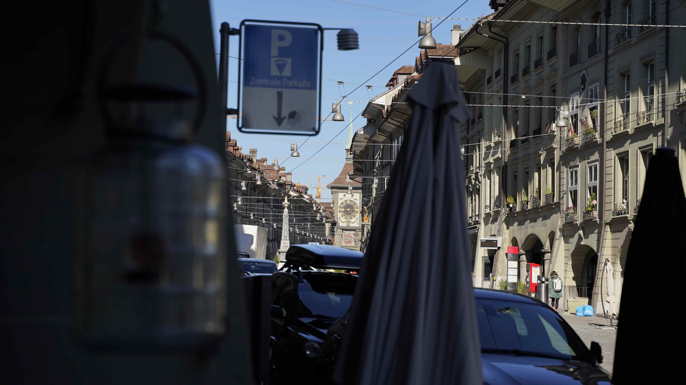
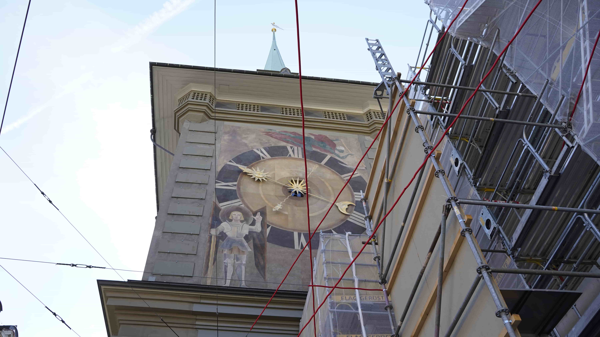
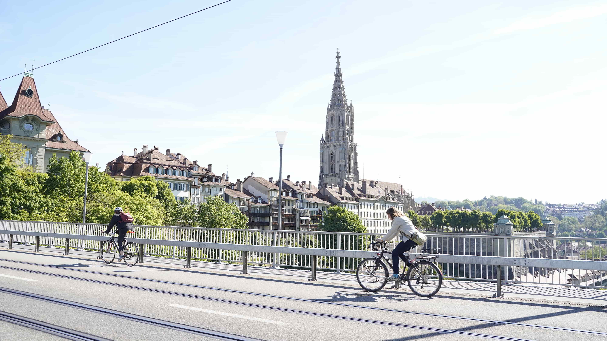
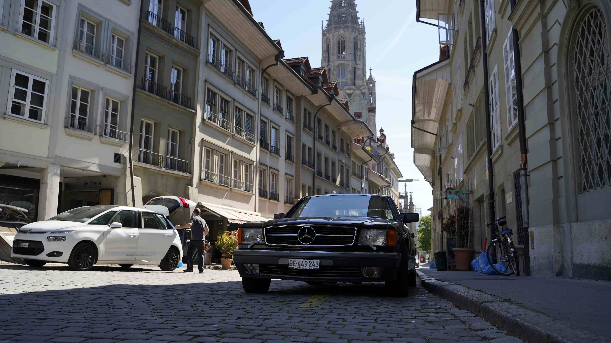
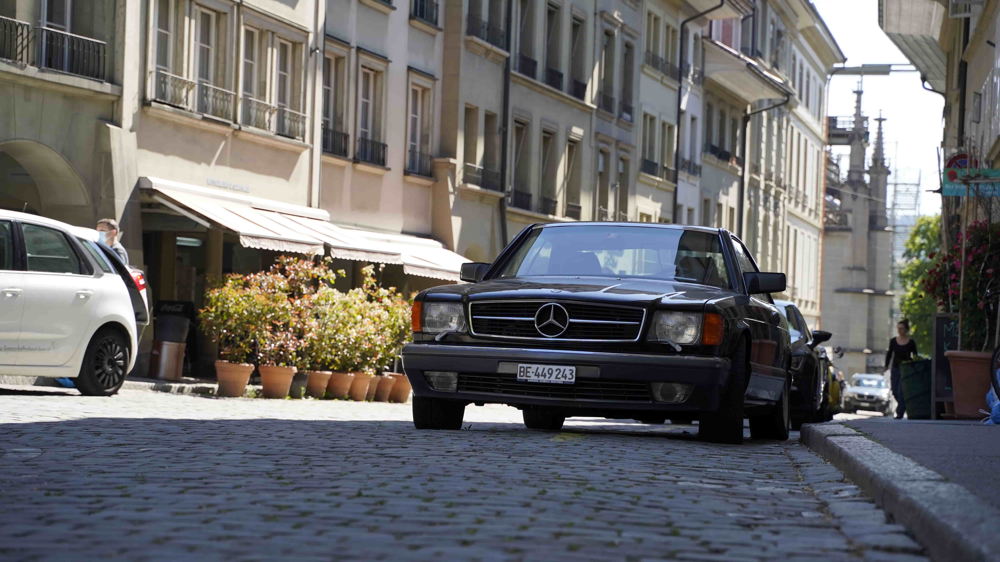

+++
title = "Mein Projekt Berner Gebäude"
date = "2021-03-25"
draft = false
pinned = false
image = "1.jpg"
description = "In diesem Blog schreibe ich darüber wie ich die Fotos für mein Projekt geschossen habe."
+++
In meinem Neuen Projekt habe ich drei Gebäude in Bern unter die Lupe genommen. Dabei stand die Geschichte der Gebäude im Vordergrund. Zu jedem dieser Projekte wird also ein Blogeintrag erscheinen. Um diese Blogs spannender zu gestalten und zudem in einem neuen Bereich etwas zu lernen hatte ich die Idee diese Gebäude zu fotografieren. Ich habe mir eine Kamera ausgeliehen und mich ein wenig mit dem Thema auseinandergesetzt. Auch habe ich mir Tipps von erfahrenen Fotografen geholt. Ich bin dann diese Gebäude fotografieren gegangen. Hier seht ihr wie die Fotos gekommen sind welche Erfahrungen ich gemacht habe und was ich gelernt habe.

### Brunnen

Ich habe mir drei Brunnen ausgewählt. Die Kriterien dafür waren, dass die Brunnen erstens an einen coolen Platz stehen zweitens habe ich natürlich auch die Brunnen gewählt die mir gefallen. Ein weiteres Kriterium auf das ich leider zu wenig geachtet habe ist der Sonnenstand, denn ein Bild sieht in den meisten Fällen besser aus wenn das Objekt in der Sonne steht. Ein Problem, das in Verbindung mit der Sonne steht, ist das Gegenlicht.

Da die Brunnen und auch die zwei anderen Gebäude ja so oder so schon oft fotografiert worden sind, was ich im Nachhinein auch ein wenig bereue, habe ich es mir vorgenommen sie aus unterschiedlichen Richtungen und in ungewöhnlichen Winkel zu fotografieren.

Gerechtigkeitsbrunnen

In diesem Bild bin Ich weg gegangen und habe gezoomt

Dann bin ich näher gegangen und habe nicht gezoomt, man sieht so viel mehr im Hintergrund.

 Auf dem Bild habe ich den Vennerbrunnen durch das Geländer vom Rathaus fotografiert.

### Zytglogge

Die Zytglogge ist natürlich auch ein Ort der immer wieder fotografiert wird und darum habe ich auch dort versucht Bilder zu machen die man so noch nicht so oft gesehen hat was mir im Nachhinein gesehen nicht so gut gelungen ist. Es gibt in Bern immer wieder Metallseile die gespant wurden. Wie man auf dem Bild sehen kann habe ich versucht damit ein cooles Bild zu machen. 

Ich habe die Erfahrung gemacht, dass man den Himmel mit hoher Belichtung viel weniger gut sehen kann.

Und mit einer tiefen Belichtung erkennt man den Himmel mehr, dafür ist das Gebäude im Vordergrund auch dunkler.

### Münster

Um coole Bilder vom Münster zu machen, hatte ich die Idee das ich vielleicht eine gute Sicht auf das Gebäude haben könnte, wenn ich auf die Kirchenfeldbrücke gehe, was ich jetzt auch gemacht habe. Um Bilder von näher zu machen bin ich nach fünf Minuten also näher ans Münster herangegangen und habe in einer Seitenstrasse ein alter Mercedes gesehen, der, weil der mir so gefallen hat, mein Bildschirmhintergrund ziert. Ich habe immer wieder versucht mit dem Zoom und mit den so entstandenen Unterschieden zu arbeiten wie man auch am Beispiel mit dem Auto sehen kann.

Auch in diesem Bild bin ich zuerst näher dran und habe nicht gezoomt.

Und im zweiten Bild bin ich ein wenig weiter weg gegangen und habe gezoomt.