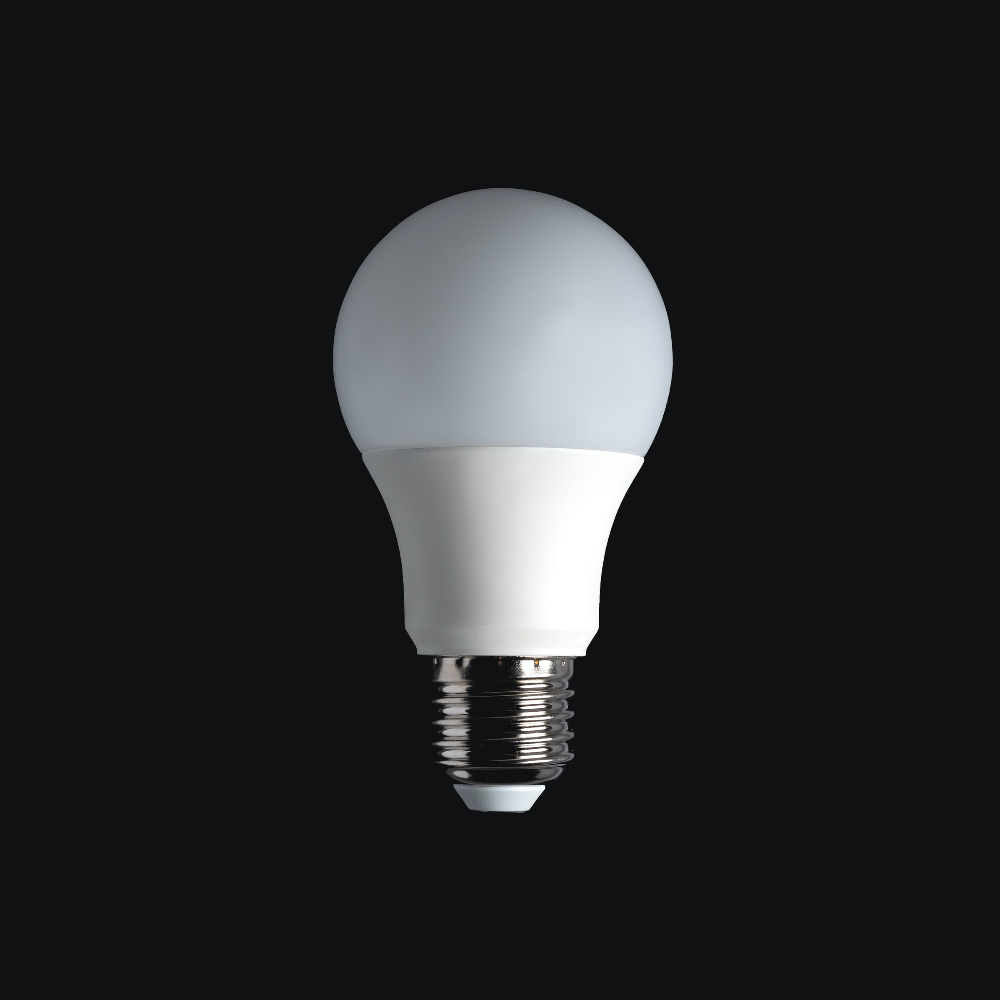

+++
title = "Mein neues Projekt"
date = "2021-02-15"
draft = false
pinned = false
tags = ["Projekt"]
image = "idee.jpg"
description = "Ich schreibe darüber wie ich ein neues Projekt wähle."
+++
In diesem kurzen Blog schreibe ich darüber, wie ich ein neues Projekt wähle.

Ich habe mir überlegt was mich gerade interessiert und mit was ich mich befasse. Zum einen ist es immer noch das Filmen was mich interessiert aber auch Biking macht mir Spass.

Dann habe ich mir überlegt, was ich lernen möchte. In Sache Filmen würde ich gerne mehr über die Farbbearbeitung lernen. Ich interessiere mich aber auch für das Reparieren von Velos. Etwas was ich eigentlich auch gerne mal machen würde ist Programmieren.

Dann habe ich einmal alle meine Ideen aufgeschrieben.

1. Bei einer Velogarage schnuppern gehen und dokumentieren.
2. Einen Kurzfilm über Effinger, Bern oder Biking machen. 
3. Eine Serie starten zu Themen wie Gebäude, Berufe oder Hobbys.

Ich werde mir noch Gedanken mit meinem Host machen und dann auswählen.