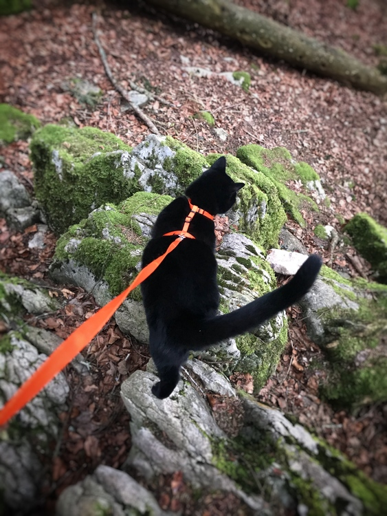

+++
title = "Katze an der Leine"
date = "2021-03-08"
draft = true
pinned = false
image = "figaro-im-wald-1.jpg"
+++
Am Wochenende waren wir zwei Nächte im Jura,, genauer gesagt in les Cerneux. Wir haben ein Bungalow gemietet. Etwas was wir zu ersten mal gemacht haben, war, dass wir unsere Katze mitgenommen haben. Das ging eigentlich super. Mit Figaro unserer Katze sind wir manchmal mit einer Leine raus gegangen, weil es in der Nähe sehr viele Hunde gab. Es war irgendwie ein komisches gefühl eine Katze an der leine zu haben bei einem Hund kennt man das ja aber bei einer Katze ist es schon etwas anderes. Von einem Hund wirt man manchmal eher geführt aber mit einer Katze kommt man eigentlich so gut wie garnicht weiter.

Wir haben das Wetter genau getroffen und es hat nie Geregnet oder Geschneit was natürlich super war. Am ersten Tag sind wir einfach ein wenig auf dem Gelende gewesen und waren im Wald. Am abend gab es Buritos. Am nechsten Tag sind wir zu einem Kleinen Dorf gefahren. Dort waren wir Wandern und haten das dorf besichtigt. Am abent hatten wir Fondeu. Am lezten Tag in Les Cerneux haben wir zusammenn gepakt und sind nachhause gegangen. Figaro hatten wir diesmal zum Test nicht in seiner Box sonder zwischen mir und meinem Bruder auf dem Sitz. Am anfang hatte er noch das Auto inspiziert doch dann ist er zwischen uns eingeschlafen.