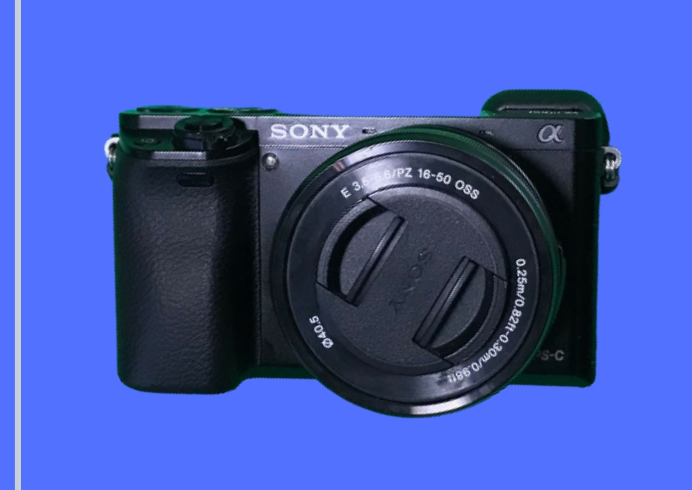
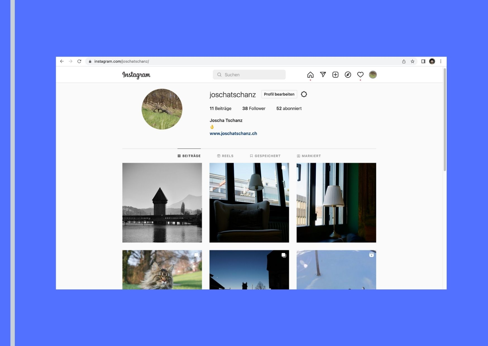
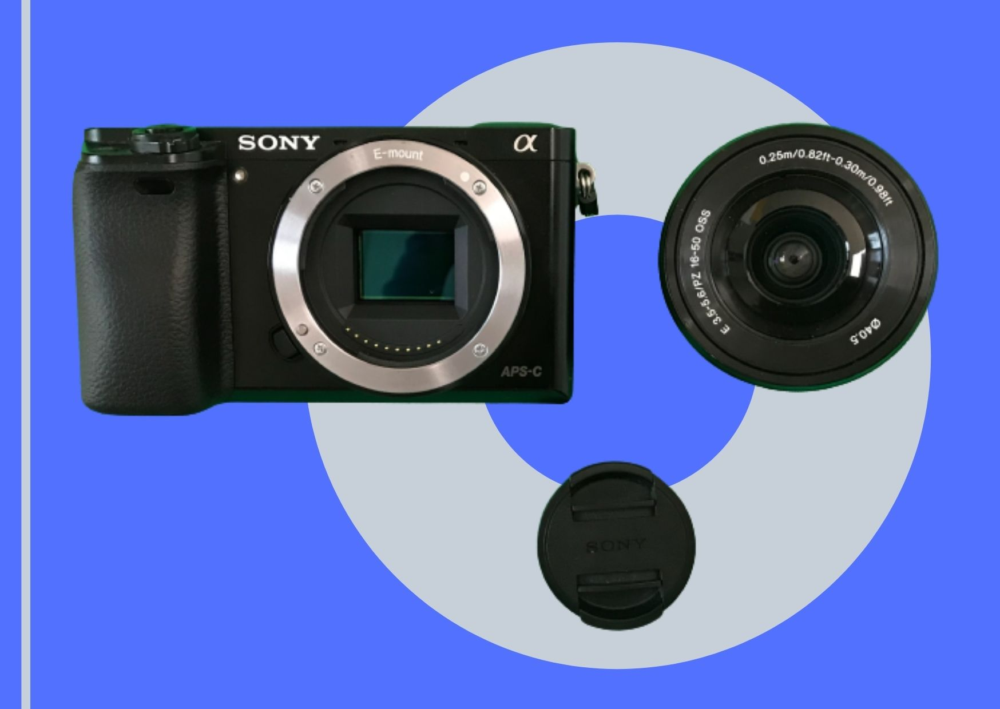
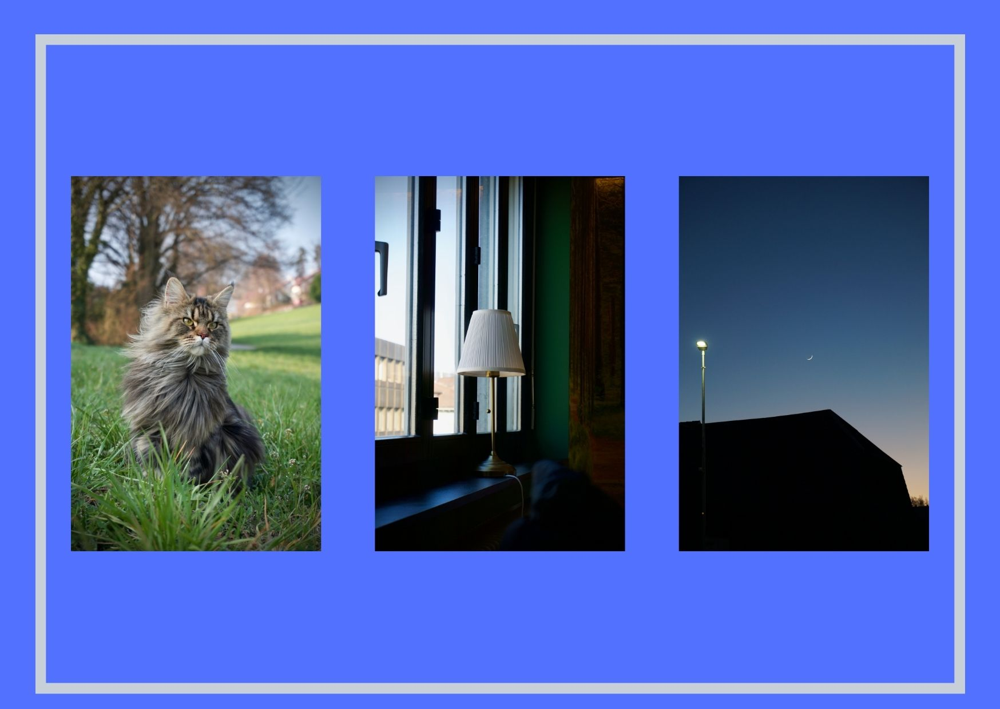

+++
title = "Meine neue Kamera"
date = "2022-03-28"
draft = false
pinned = false
tags = ["Video", "Fotografie"]
image = "meine-neue-kamera.jpg"
description = "Ich habe vor einiger Zeit eine Kamera gesteigert. Das sind meine Erfahrungen"
footnotes = ""
+++
Ich habe vor einiger Zeit eine Kamera gesteigert (Sony a6000). Das ist zwar nicht mehr die neuste, aber für den Anfang ist sie ok.

Wie man es sich denken kann, habe ich seit dem einiges ausprobiert und auch einiges gelernt. Ich konnte früher mit den Begriffen *Shuter speed*, Belichtungszeit, Iso etc. nichts anfangen. Das kann ich jetzt.

Seit dem habe ich auch eine Challenge mit selbst. Ich möchte jeden Tag ein Bild auf [Instagram](https://www.instagram.com/joschatschanz/) posten. Dabei erhoffe ich mir, dass ich Instagram und Fotografie besser kennen lerne.  Das Wissen kann ich dann auch in der Pilzfarm anwenden.

Auch im Videobereich durfte ich mit der Kamera meine Erfahrungen machen. Ich konnte zum Beispiel bei einem Werbefilm mithelfe. Ich habe auch selber einiges ausprobiert. Dabei ist mir aufgefallen, dass es ganz etwas anderes ist mit einer solchen Kamera anstatt mit einer Actioncam zu filmen. Die Aufnahmen aus der Hand sehen bei mir manchmal etwas wackelig aus. Da braucht es wohl noch Übung.

Ich habe mir auch schon überlegt, in ein besseres Objektiv zu investieren. Meines ist ein kit Objektiv. Die haben nicht den besten Ruf. Das hat aber noch Zeit.  

**Fazit:** 

Ich mache meine Videoprojekte meistens mit Actioncams. Die Kamera, die ich jetzt besitze, ist nicht damit zu vergleichen. Beide haben Vor- und Nachteile und sind für andere Bereiche geeignet. Actioncams sind super da sie unkomplizierter zum Einstellen sind. Sie sind somit, wie es der Name schon sagt, für Actionaufnahmen gemacht. Einbussen gibt es dafür in der Videoqualität und die Tiefenschärfe ist nicht vorhanden. Die Kameras haben mehr Anschlüsse und meistens bessere Videoqualität. Über Fotografie müssen wir gar nicht erst sprechen. Das ist einfach ein riesiger Unterschied. Vor allem bei Fotos im Dunkeln ist sie, verglichen mit einem Handy, viel besser. 

Es war also kein Fehlkauf:)

