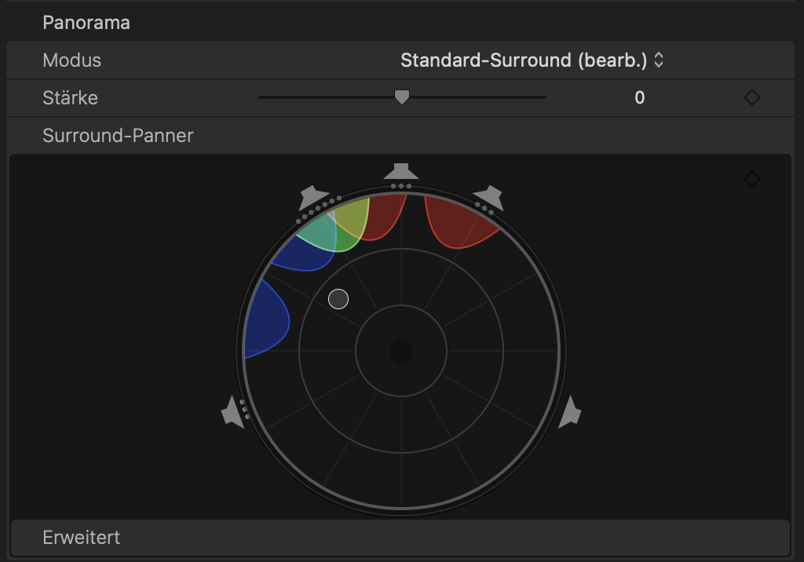

+++
title = "Mit Youtube Geld verdienen?"
date = "2022-12-26"
draft = false
pinned = false
image = "bildschirm_foto-2022-12-26-um-23.41.48.jpeg"
description = "Ich habe mich in letzter Zeit mit Youtube beschäftigt. Was ich gelernt und erfahren habe, schreibe ich hier auf."
+++
Die Platform Youtube hat wahrscheinlich jede und jeder, der diesen Blog liest, schon mal benützt. Youtube ist unglaublich vielfältig. Es gibt fast zu jedem Thema Videos, mit denen man auch super neue Dinge lernen kann. Mit Youtube haben sich auch mehrere neue Berufe entwickelt: Youtuber und Youtuberinnen. Denn mit Youtube kann auch Geld verdient werden. Youtube zahlt, ab einer gewissen Reichweite, einen kleinen Betrag pro Klick und schaltet Werbung auf solche bezahlten Videos. Doch viele Creators verdienen den grössten Teil ihres Lohnes mit externen Werbepartnern. Das heisst, dass zum Beispiel eine Firma, die Gaming Laptops verkauft, einen Creator der Gaming Videos macht, anfragt, ob er einen Laptop in einem Video erwähnen kann. In Youtube Deutschland gehört es aber zum Ehrenkodex, dass man nur Werbung für eine Sache oder ein Produkt macht, hinter dem man stehen kann. Was natürlich nicht heisst, dass sich jeder und jede da dran hält. Wenn ein grösserer Youtuber zum Beispiel Werbung für Glücksspiel oder andere fragwürdige Produkte macht, wird das meistens kritisiert.

Wie gesagt, mit Youtube lässt sich Geld verdienen. Das können aber natürlich nur diejenigen, die auch wirklich erfolgreich werden. Doch oft gibt es auf grösseren Kanälen auch Menschen, die hinter der Kamera arbeiten und filmen oder ein Video schneiden. Das interessiert mich. Cutter und CutterInnen werden auch meistens öffentlich gesucht. Max, ein Youtuber, der Food Videos in Köln macht, hat vor einigen Monaten in einem Video einen Link für die Rohdaten eines anderen Videos veröffentlicht. Ich habe mir gedacht, ich schneide daraus auch ein kleines Video und schaue mal, wie das ist, ein Video einer anderen Person zu schneiden. Natürlich nicht um mich zu bewerben, sondern eher um zu Lernen und Erfahrungen zu sammeln.\
\
In dem Youtubevideo geht es um geheime Food Spots in Köln. Ich habe einer dieser Spots zu einem kleinen Video zusammen geschnitten:\
\
<iframe width="560" height="315" src="https://www.youtube.com/embed/VKy_uZqEtjA" title="YouTube video player" frameborder="0" allow="accelerometer; autoplay; clipboard-write; encrypted-media; gyroscope; picture-in-picture" allowfullscreen></iframe>\\
\
Das Original auf dem Kanal von Max, geschnitten von seinem Cutter:

<iframe width="560" height="315" src="https://www.youtube.com/embed/P8yMaTetkG8?start=31" title="YouTube video player" frameborder="0" allow="accelerometer; autoplay; clipboard-write; encrypted-media; gyroscope; picture-in-picture" allowfullscreen></iframe>\\

\*\*Was habe ich gelernt?\*\*\
Ich habe Einiges aus diesem Projekt gelernt. Zum Einen habe ich Neues zum Thema Sound-Design gelernt. Es gibt in Finalcut, meinem Filmschneideprogramm, ein Souroundsound Funktion, die man in einem Projekt aktivieren kann. Mit der man, mit Hilfe des unten gezeigten Tool, recht einfach einstellen kann, von wo genau der Ton kommt. 

Andererseits habe ich auch gemerkt, dass das Schneiden solcher Videos, recht viel Spass macht. Meine Idee für den Abschluss wäre, dass ich die von mir geschnittene Version, des Videos von Max, maile und auf eine Rückmeldung hoffe.