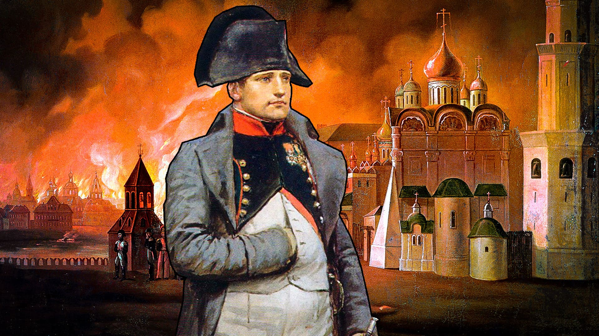

+++
title = "Der Russlandfeldzug "
date = "2021-05-07"
draft = false
pinned = false
image = "2-grande-arme-.jpg"
description = "In diesem Blog geht es um den Russlandfeldzug"
+++
\
Napoleons Russlandfeldzug ging als den grössten Fehler Napoleons in die Geschichte ein. 1811 hatte Napoleon fast ganz Europa unter Kontrolle. Abgesehen von England: Durch ihre Position im Meer hatte Napoleon keine Chance das Land anzugreifen. Also widersetze sich ihm nur noch der Russische Zahr. Im zweiten Weltkrieg wollte auch Adolph Hitler dieses riesige Land unter seine Kontrolle bringen.

Napoleon stellte eine riesige Arme auf, unter denen sich Soldaten aus allen Ländern von Europa befanden. Auch Schweizer waren unter ihnen. Insgesamt waren es 600.000 Männer: Die Grand Armée. Es ging ihm hauptsächlich um die Hauptstadt Moskau die sich 420 Km von der Grenze Russlands befindet.

Die Grand Armée machte sich auf den Weg nach Litauen. Am 24. Juni 1812 überschritt die französische Armee mit rund 600.000 Mann die Memel, ein Fluss in Litauen. Doch der tagelange Regen machte das Land sumpfig und daher kamen sie sehr langsam voran. Die Versorgungsladungen kamen nicht nach und in dem dünnbesiedelten Land ist es schwierig an andere Nahrung zu gelangen.

\
Viele verhungerten oder erkrankten. Die Russen zogen sich wider Erwarten zurück und wandten die Taktik der verbrannten Erde an. Dabei handelte es sich darum, dass man alles, was dem Feind in die Finger fallen und ihm einen Nutzen bringen könnte einfach vernichtet. Häuser, Essensvorräte und sogar ganze Städte wurden angezündet. Die unterlegenen Russen hatten Erfolg mit dieser Taktik. Der Feind wurde also ausgehungert. 

Etwas was mir immer wieder aufgefallen ist, ist dass in der Geschichte Napoleons immer wieder Parallelen zu Hitler zu finden sind. Denn auch im zweiten Weltkrieg versuchte Hitler Russland einzunehmen aber die Russische Armee zog sich auch hier zurück.

\
Da Napoleon damit gerechnet hat, viel schneller voran zu kommen zog unverhofft der Winter ein. An manchen Tagen wurde es -30°C und ein grosser Teil der schon geschwächten Truppe erfror. Am 14. September nahmen die Franzosen Moskau ein. Aber die Stadt wurde niedergebrannt und war daher nutzlos. Der Brand von Moskau dauerte fünf Tage.

Russland ging auf keine Verhandlung ein und daher war ein Friedensschluss ausgeschlossen. Am 18. September 1812 zog Napoleon seine Truppen zurück. Von den 600.000 Männer wurden 200.000 gefangengenommen und 275.000 mussten ihr Leben lassen. Den Winter hätten die verbleibenden Soldaten nicht überstanden, wenn sie nicht die Flucht gewählt hätten.

Der Weg auf Frankreich war nicht weniger kräftezehrend als der Hinweg. Die Russische Arme verfolgte sie und startete immer wieder Angriffe, welche die Truppe stark schwächte. Am Ende war von der Grand Armée nur noch eine Petit Armée übrig. Napoleon kam im Dezember in Frankreich an. Er konnte nur knapp einen Putschversuch verhindern. Das ist der Versuch, die Regierung mit Gewalt zu stürzen. In den darauffolgenden Befreiungskriegen wurde Napoleon gestürzt.

