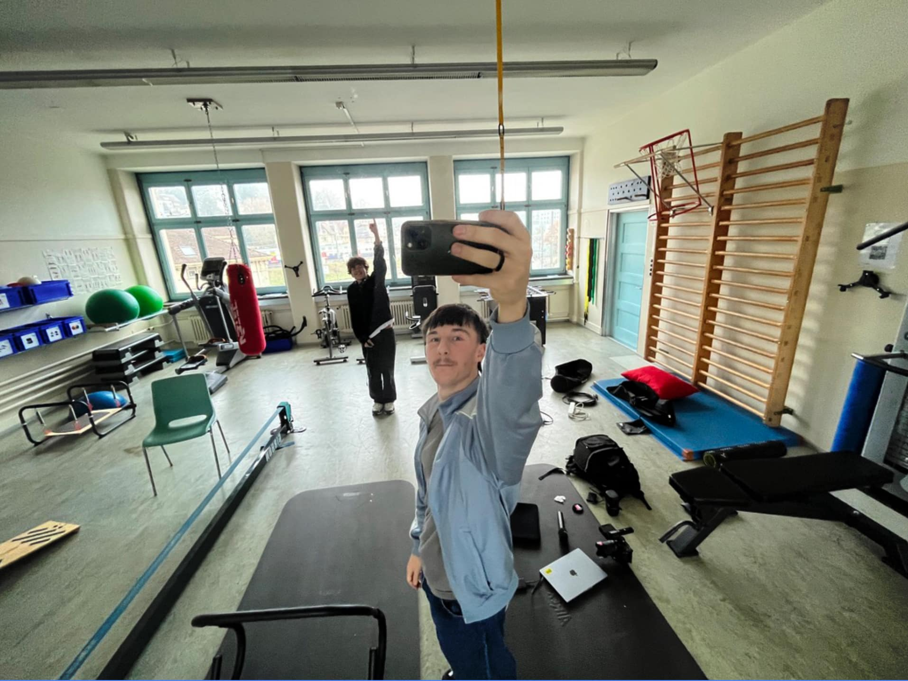

+++
title = "Neues Projekt: kurz Doku in Schaffhausen"
date = "2024-12-03"
draft = false
pinned = false
image = "screenshot-2024-12-03-at-14.55.06.jpg"
description = "Wenn ich von unserer LERNE bei YOLU erzähle, bekomme ich die meisten Fragen zu den eigenständigen Projekten, die Mael und ich hier machen können. Genau an so einem Projekt arbeiten wir gerade. Fühlt sich nach einer guten Gelegenheit an zu zeigen, wie es bei uns laufen könnte, wie wir bei diesem konkreten Projekt vorgegangen sind und was wir dabei gelernt haben."
+++
Wenn ich von unserer LERNE bei YOLU erzähle, bekomme ich die meisten Fragen zu den eigenständigen Projekten, die Mael und ich hier machen können. Genau an so einem Projekt arbeiten wir gerade. Fühlt sich nach einer guten Gelegenheit an zu zeigen, wie es bei uns laufen könnte, wie wir bei diesem konkreten Projekt vorgegangen sind und was wir dabei gelernt haben.

Wie fast immer haben wir nach der Anfrage zuerst besprochen, ob wir überhaupt Kapazität und Lust auf das Projekt haben. Beides konnten wir mit einem mehr oder weniger klaren „Ja“ beantworten. Also haben wir uns mit demKunden in einem Video-Call ausgetauscht. Aus vergangenen Projekten habe ich gelernt, wie wichtig klare Kommunikation ist. Deshalb klären wir in diesen ersten Meetings grundlegende Fragen wie: Deadline, Umfang, Vorstellungen – und natürlich das Thema Geld. Gerade beim letzten Punkt merke ich oft, wie ungern darüber gesprochen wird, obwohl es so wichtig ist. Nach dem Gespräch haben wir eine Offerte erstellt und verschickt.

- - -

**Auftrag:**

* 2x Reels
* 1x kurzes Video

Die Videos sollen die Schule vorstellen, Lehrer*innen zur Bewerbung motivieren und Eltern informieren. Wir planen Interviews mit Schüler*innen sowie Lehrer*innen*.

- - -

Die Offerte wurde angenommen...

**Preproduktion:** Vorgehen besprechen, Verbindungen nach Schaffhausen checken und am Abend vor dem Dreh das Equipment packen. Alles zusammenzukramen dauert immer etwas: Von der Kamera über Mikrofone, Tape, Lichter bis hin zur Kabelrolle – alles muss dabei sein. Akkus müssen geladen, SD-Karten formatiert werden.

**Produktion:** Der Dreh selbst lief eigentlich gut, auch wenn es einiges zu improvisieren gab. Es gab Missverständnisse, die dazu führten, dass wir z. B. keinen wirklich guten Raum für die Interviews hatten und die Räume leer filmen mussten. Andererseits haben wir sicher genug Interview-Aufnahmen, um im Schnitt etwas daraus zu basteln.

Drehs sind für mich immer spannend, aber auch stressig. Vieles von dem, was am Ende im Video zu sehen ist, entscheidet sich genau in diesen Momenten: Läuft die Kamera? Passt das Licht? Funktioniert das Mikrofon? Erzählen die Interviewpartner*innen* etwas Brauchbares? Haben wir wirklich alle Aufnahmen, die wir brauchen? Diese Fragen fliegen mir während des Drehs durch den Kopf. Aber gerade weil diese Situation so echt ist, lerne ich dabei jedes Mal sehr viel. Der Druck ist real – und irgendwie leichter zu handhaben als zum Beispiel ein Test in der Schule, bei dem mir der Realitätsbezug völlig fehlt.

**Postproduktion:** Im Zug nach Bern haben wir die Daten gesichert. Das ist mir sehr wichtig: Daten müssen auf mindestens zwei SSDs sein, bevor ich entspannen kann. Danach kommt der Schnitt. Eigentlich mache ich das wirklich gern, aber es ist nicht immer einfach, gerade wenn beim Dreh nicht alles perfekt lief. Dann sind Improvisation und Lösungen finden gefragt. Zum Glück gibt es KI-Tools, die genau da sehr helfen können.

Trotzdem ist es manchmal schwierig, in den Flow zu kommen. Ich setze das Projekt auf, sortiere die Daten – und dann sitze ich vor 50 Minuten Interviews und muss daraus drei kurze Videos schneiden. In solchen Momenten hilft es mir, mit etwas Leichtem zu starten, zum Beispiel die Musik auszuwählen. Das baut etwas Momentum auf. Ein wichtiger Punkt für mich: Einfach mal anfangen, schnelle Entscheidungen treffen, nicht überdenken. Man kann im Nachhinein immer noch Dinge ändern. Wichtig ist, in den Flow zu kommen. Ich erinnere mich da an etwas, das ich mal gehört habe: Bei einer Schreibblockade kann man nicht "nichts" schreiben, man kann einfach nichts Gutes schreiben. Wenn man aber lang genug "schlecht" schreibt, kommt man wieder in den Flow. So ähnlich ist es beim Schnitt auch. Heisst für mich: Den Anspruch zurückschrauben, ans Pareto-Prinzip denken und anfangen. 🚀

Ich habe auch gelernt, dass ich ab jetzt immer etwas mehr Zeit für den Schnitt einplanen sollte, als ich denke. Erstens ist Schneiden einfach sehr zeitintensiv, und zweitens klappt oft nicht alles wie geplant. Bei diesem Projekt hatte ich zum Beispiel Probleme mit der falschen Version von DaVinci und einem Serverengpass, weil wahrscheinlich viele die neueste Version heruntergeladen haben. Auch die SSDs haben mich Zeit gekostet, weil generierte Proxy-Files auf meinem Mac und nicht auf der SSD gespeichert wurden. Das musste ich dann alles rumschieben und Platz freiräumen.

Aber genau da kann ich viel lernen: Ich habe praktische neue Shortcuts gelernt, weiss jetzt, wie DaVinci Cache-Files speichert und wo ich die Einstellungen finde – und noch einiges mehr.

**Zusammenfassung meiner Learnings:**

* Kommunikation mit Kund*innen ist wahrscheinlich fast wichtiger als das Produkt selbst.
* Es ist wichtig, klare Abmachungen zu treffen, Vorstellungen abzugleichen und Aufgaben zwischen Kund*innen und Auftraggeber*innen zu verteilen und klar eine Linie zu setzen, was unser Part ist und was nicht dazugehört.
* Gute Vorbereitung ist essenziell, da Drehs sowieso stressig genug sind.
* Bei Interviews muss sich die Person wohlfühlen, sonst kommen keine guten Antworten.
* Datensicherung ist sehr wichtig – doppelt und dreifach.
* Die Datenstruktur und das Backup-System müssen klar organisiert sein.

