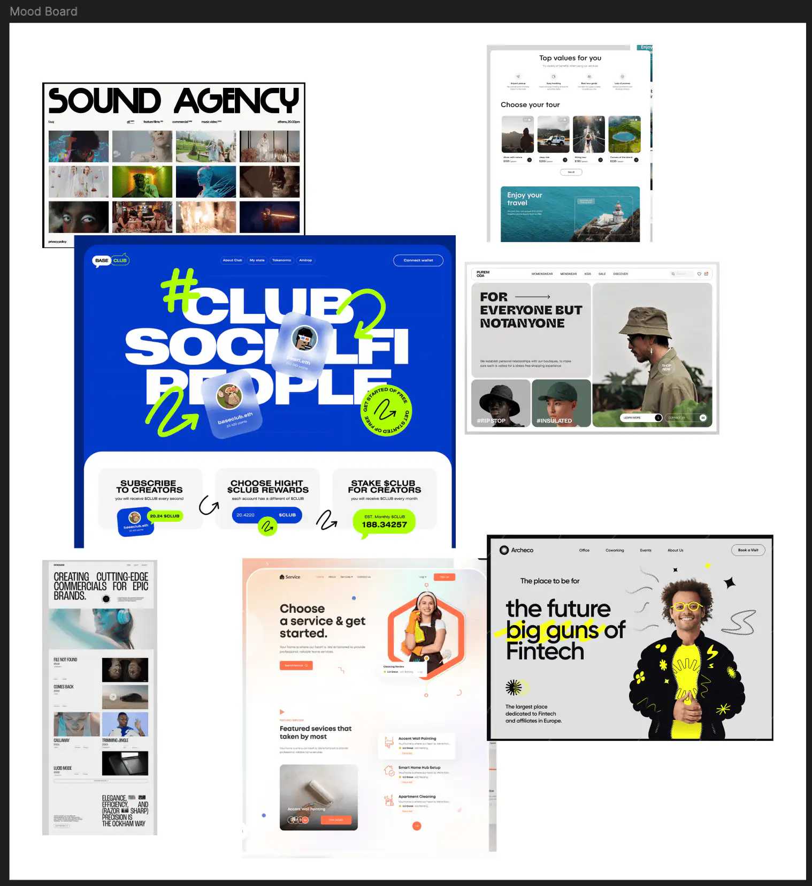

+++
title = "Neues Projekt: YOLU Website"
date = "2024-09-03"
draft = false
pinned = false
image = "dall-e-2024-09-03-14.56.37-a-creative-and-inspiring-workspace-scene-featuring-a-laptop-on-a-desk.-the-laptop-screen-shows-a-mix-of-code-and-web-design-elements-like-tailwind-css.jpg"
description = "Über ein neues Projekt und was ich gelernt habe. "
+++
Zu Beginn des neuen Lehrjahres haben Joris und ich uns für ein Mentoring zusammengesetzt, um über die laufenden Projekte und mögliche Lernprojekte zu sprechen. Dabei haben wir uns die Fragen gestellt: Was kann ich schon gut? Wo fehlt mir noch Erfahrung? Und worauf habe ich besonders Lust?

Die Antwort auf die letzten Fragen war schnell klar: Webdesign. Joris hatte dazu auch gleich eine Idee für ein Projekt: Die YOLU-Website braucht ein Update. Es ist Zeit die Seite auf den neuesten Stand zu bringen.

Hier sind die Herausforderungen, die auf mich warten:

* [Tailwind](https://tailwindcss.com/) lernen und anwenden: Ein CSS-Framework, mit dem man eine Website schnell designen kann.
* JavaScript für Animationen einsetzen: Eine Programmiersprache, die ich schon länger lernen wollte.
* Kompletter Website-Relaunch: Design, Struktur, Texte, Farben, Fonts – alles wird überarbeitet.

Gestartet habe ich damit, einen Plan zu erstellen, wo welche Inhalte platziert werden und wie ich die Website strukturieren möchte. Das nennt man Site Map (wie ist die Website mit Unterseiten organisiert?) und Wireframe (eine grobe Skizze, wie ich Bilder, Texte, Icons etc. layouten kann). Um diese Pläne auch optisch ansprechend zu gestalten, erstelle ich ein Moodboard, auf dem ich Inspirationen sammle, die mir gefallen, sowie einen Style Guide (Plan mit Fonts und Farben, die auf der Website gebraucht werden).

Eine echte Herausforderung war es, die Farben auszuwählen. Es fiel mir schwer, mich zu entscheiden und sie so zu ordnen, dass sie aufgeräumt und interessant wirken. Am Ende habe ich einen Workflow gefunden, der für mich passt: Zuerst überlege ich mir, welche Wirkung die Farben haben sollen. Für YOLU habe ich frische, kreative und auffällige Farben gesucht. Mit Adobe Color habe ich mit Farbharmonien und Triaden experimentiert und mich für drei Farben entschieden. Schlussendlich ordne ich die Farben nach dem 60-30-10-Prinzip an: Dunkelblau (60%), Weiss (30%) und ein kräftiges Orange (10%). Dabei habe ich etwas Wichtiges gelernt: Weiss ist extrem wichtig. Durch die 30% Weiss wirkt das Design viel ruhiger und aufgeräumter, als wenn ich noch eine weitere „richtige“ Farbe genommen hätte.

Jetzt bin ich bereit zum Coden.

Zufällig bin ich dann grad noch auf „[Herr Bürli](https://herrbuerli.ch/)“ gestossen, und seine Tipps haben mein Konzept etwas auf den Kopf gestellt. Ich habe dabei etwas Wichtiges gelernt: „Story Comes First“. Das kenne ich auch aus der Filmtheorie – alles muss sich der Story unterordnen. Genau das gilt auch für Websites. Jede Designentscheidung, sei es Schrift, Farbe oder Bild, sollte die Hauptbotschaft der Seite unterstützen. Dadurch habe ich mein Hero Element – also das, was man zuerst auf einer Website sieht – komplett überdenken müssen. Es muss wie ein „Hook“ im Video sofort klarmachen, dass die Besucher hier richtig sind. Wenn man darauf achtet, stellt man automatisch die richtigen Fragen: Was will die Website erreichen? Wer ist die Zielgruppe? Wie erzählen wir unsere Geschichte?