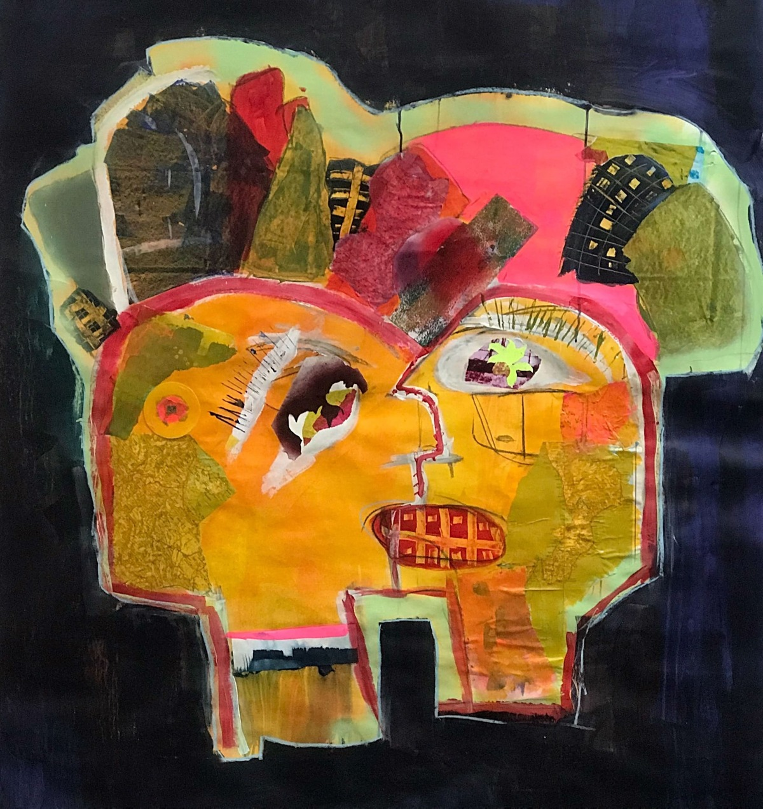

+++
title = "Portfolio"
date = "2020-02-01"
draft = false
pinned = false
image = "robert-wiedemann-d9yog5zp-oq-unsplash.jpg"
description = "Mein Portfolio"
+++
## Filme

#### Härdöpfälä uf em Belpberg

<iframe width="560" height="315" src="https://www.youtube.com/embed/rzYk3tqgPZs" title="YouTube video player" frameborder="0" allow="accelerometer; autoplay; clipboard-write; encrypted-media; gyroscope; picture-in-picture" allowfullscreen></iframe>

#### Drohnenaufnahmen über Stettlen

<iframe width="560" height="315" src="https://www.youtube.com/embed/5hIINfb6kXs" title="YouTube video player" frameborder="0" allow="accelerometer; autoplay; clipboard-write; encrypted-media; gyroscope; picture-in-picture" allowfullscreen></iframe>

#### Grotte de Malatiere

<iframe width="560" height="315" src="https://www.youtube.com/embed/pfnFVzjzNXw" title="YouTube video player" frameborder="0" allow="accelerometer; autoplay; clipboard-write; encrypted-media; gyroscope; picture-in-picture" allowfullscreen></iframe>

## Bilder

#### für Velomech Instagram

[Bild1](https://www.instagram.com/p/CRwIm6hlaqI/?utm_source=ig_web_copy_link)\
[Bild2](https://www.instagram.com/p/COLJ3YKHX3h/?utm_source=ig_web_copy_link)\
[Bild3](https://www.instagram.com/p/CNsWEBRBCTC/?utm_source=ig_web_copy_link)

#### Berner Gebäude

[Blog zu den Berner Gebäuden](https://www.joschatschanz.ch/mein-kurzprojekt-berner-gebaude/)

## Zeichnungen

Bild:

