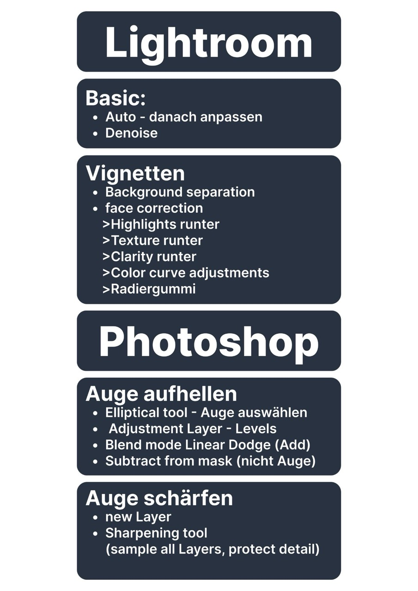
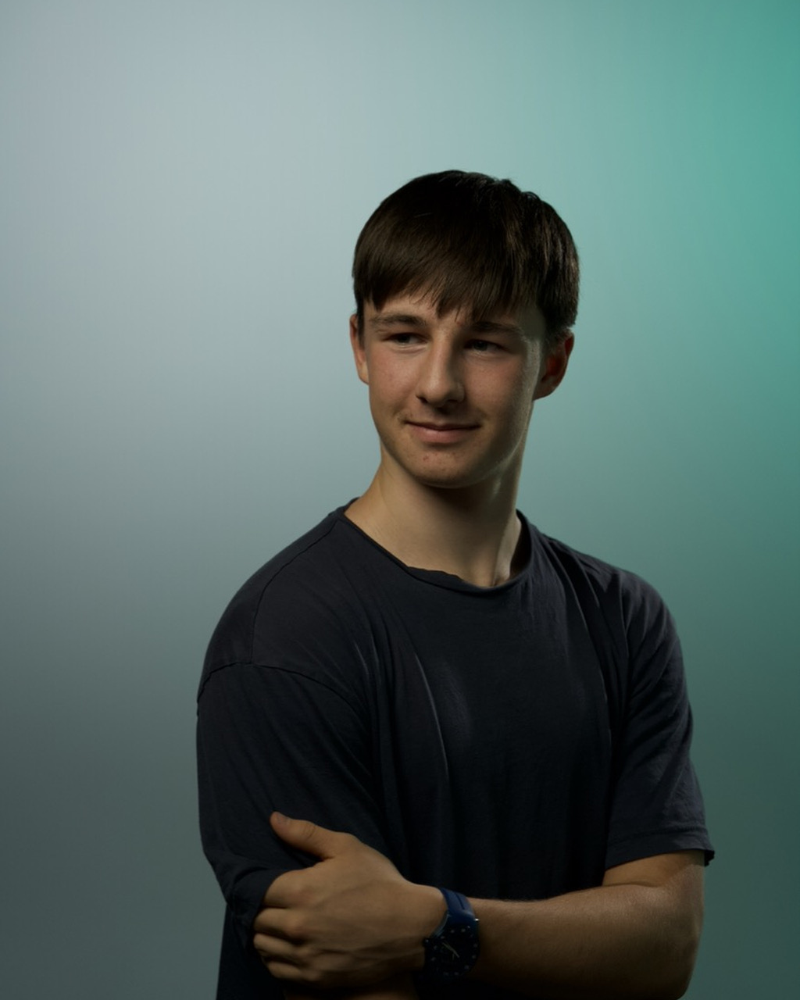
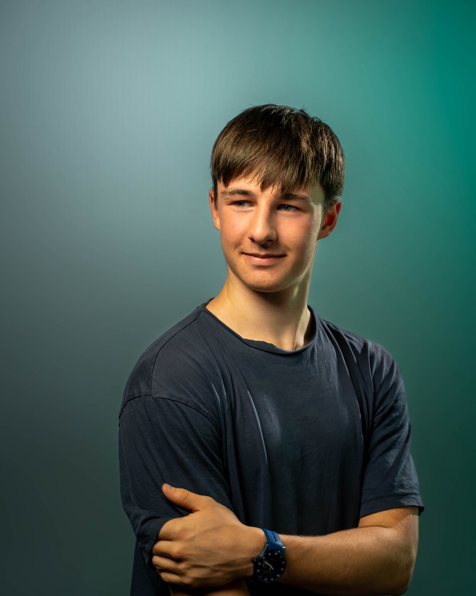

+++
title = "Portraitfotografie > mein Ablauf "
date = "2023-10-25"
draft = false
pinned = false
image = "screenshot-2023-10-25-at-21.39.12.jpeg"
+++

\

<link href="https://unpkg.com/image-compare-viewer/dist/image-compare-viewer.min.css" rel="stylesheet" type="text/css" />

ChatGPT