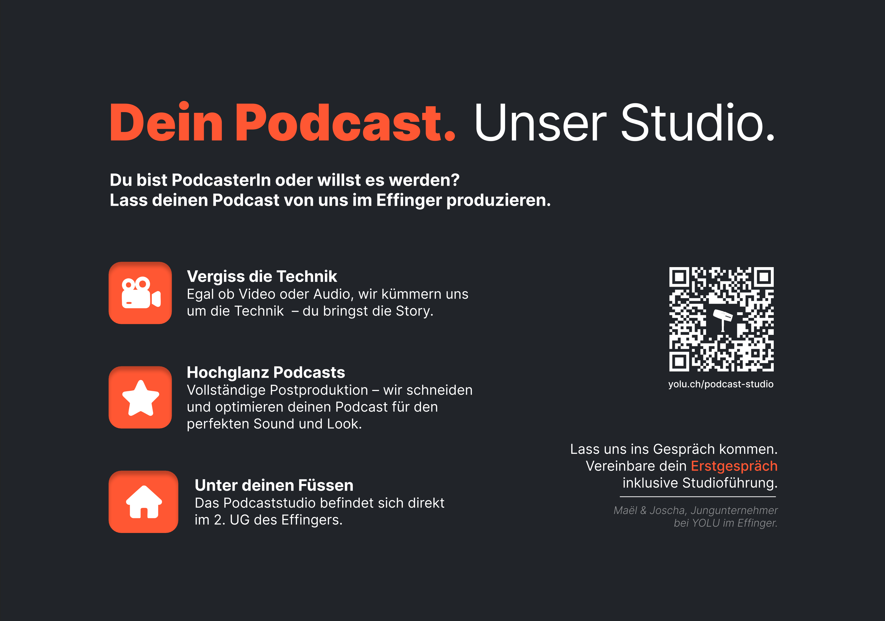

+++
title = "Printwerbung für das Podcaststudio"
date = "2025-01-15"
draft = false
pinned = false
tags = ["Podcaststudio"]
image = "blog-bild-1.png"
description = "Schon der zweite Blog in einer Woche und noch dazu zum gleichen Thema..."
+++
Wir stecken mitten im Marketing für unser Podcaststudio. Die letzte Woche haben wir damit verbracht, unzählige Mails zu schreiben, einige Absagen zu lesen, vereinzelte Gespräche mit potentiellen Kunden zu führen und Marketingstrategien auszuhecken.

Eine dieser Massnahmen habe ich heute umgesetzt. Wir wollen nämlich die Leute im Effinger gezielt auf unser Podcaststudio ansprechen. Dies wollen wir in erster Linie persönlich in Gesprächen tun oder bei Host-Führungen durch den Effinger einen kleinen Abstecher ins Studio machen. Ausserdem wollen wir Flyer verteilen. Genau damit habe ich mich heute beschäftigt.

**Was ist das Ziel des Flyers?**
Kurz und kompakt erklären, was unser Podcast-Studio-Angebot ist. Die wichtigsten Keypoints aufzeigen und mit einem klaren Call to Action – wir wollen, dass sich Leute mit uns in Verbindung setzen, uns anschreiben.

**So bin ich vorgegangen**
Zuerst habe ich mich an den Inhalt gesetzt – also den gesamten Text geschrieben. Dafür habe ich ChatGPT verwendet. Der Prompt dazu sah ungefähr so aus:

„Du bist ein erfahrener UX- und UI-Designer mit Fokus auf Inhalte. Hilf mir, unser Business auf die wesentlichen Punkte zu reduzieren, die auf einem Flyer platziert werden. Spiegel diesen Prompt und erkläre deine Rolle in eigenen Worten.“

Nachdem ChatGPT meine Anfrage gespiegelt und verstanden hatte, habe ich diesen Prompt verwendet:

„Jetzt überlege, welche Informationen du von mir brauchst: Was ist für einen Flyer wichtig und warum?“

Daraufhin habe ich eine Liste mit Fragen zu unserem Angebot, Zielen, Kommunikations Still etc. erhalten, die ich dann beantwortet habe. Am Ende hatte ich einen groben Entwurf für den Textinhalt des Flyers.

Als Grundstruktur konnte ich das dann schon verwenden, aber den Hauptteil des Textes musste ich noch einmal komplett überarbeiten. Nach einigen Formulierungsanpassungen, Farbkonzepten und Designexperimenten in Figma sowie Feedbackrunden und wichtigen Inputs von Maël, Joris und Joni habe ich nun einen optimierten Flyer für Laufkunden im Effinger erstellt. 

Drucken war dann aber noch einmal eine andere Sache. Ich habe bestimmt eine Stunde lang mit dem Drucker gekämpft – falsch exportierte PDFs, falsche Einstellungen, falsche Blattformate und einiges mehr haben mir dabei das Leben schwer gemacht. Ich weiss jetzt, warum ich InDesign und Print nicht so gerne mag. (;

**Hier das finale Resultat:**

