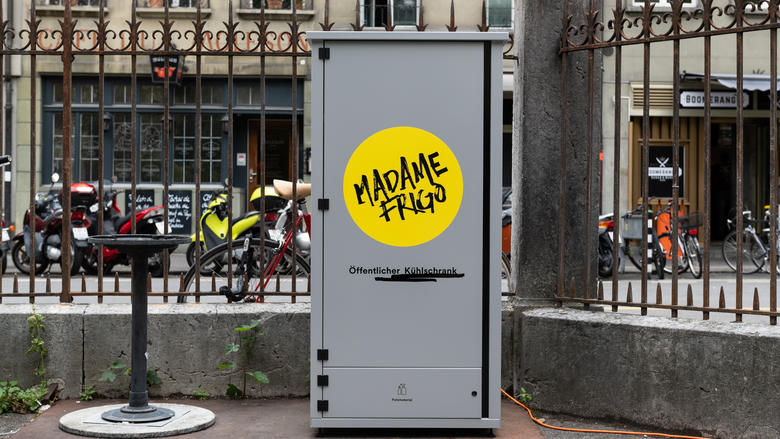

+++
title = "Projekt Food waste "
date = "2020-11-20"
draft = false
pinned = false
tags = ["Madamefrigo", "Foodwaste"]
image = "kuehlschrank-progr_0.jpg"
description = "Der offene Kühlschrank vor dem Effinger"
+++
Food waste ist ein wichtiges Thema und es gibt auch schon verschiedene Lösungen. Zum Beispiel die offnen Kühlschränke von Madam frigo. So einer befindet sich auch vor dem Effinger.

Ich habe mir gedacht das ich einfach mal teste was wan drin ist. Darum werde ich immer wen ich hier bin einmahl reinschauen und alles in eine Liste schreiben. Ich bin gespannt, was da rauskommt. Heute war noch nichts drin, aber ich bin gespannt. Vor allem wann was und wie lange die Lebensmitell reinkommen.

