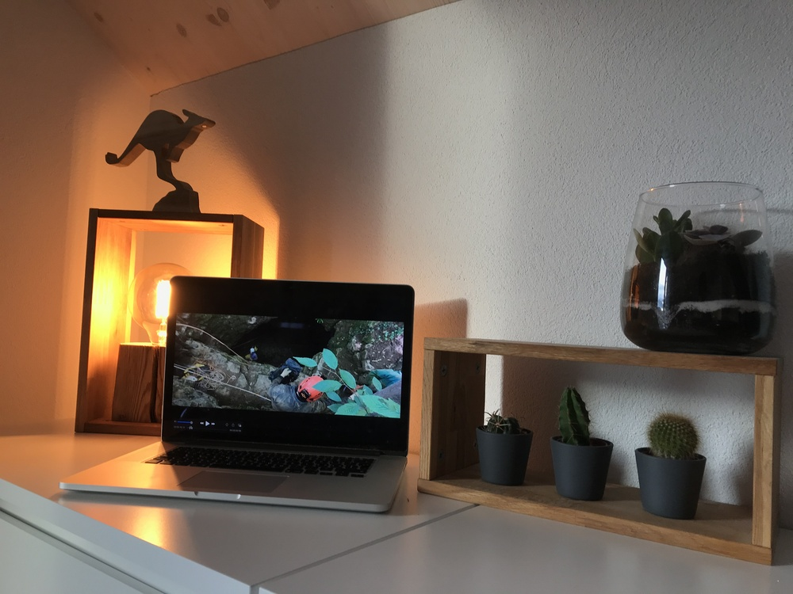

+++
title = "Reflexion zu meinem Projekt"
date = "2021-02-04"
draft = false
pinned = false
image = "tempimagesvoujd.jpg"
description = "In diesem Blog schreibe ich darüber wie es mir mit der Erstellung meines Filmes gegangen ist."
+++
Ich habe in der lezten Zeit an einem Film zu Thema Höhle gearbeitet. In diesem Blog will ich über diese Dinge reden:

Was habe ich beim Projekt für mich gelernt?
Was war meine grösste Herausforderung? 
Was waren die Überraschungsmomente? 
Bin ich mit dem Film zufrieden so wie er jetzt ist?\
Was würde ich im Rückblick anders machen oder angehen? 

Was habe ich beim Projekt für mich gelernt?

Das war mein erstes Projekt, das ich im Colearnig gemacht habe. Darum habe ich viel gelernt darüber wie ich vorgehen kann und was die Schwierigkeiten sind. Natürlich habe ich auch im Schnitt viel gelernt. Ich habe zum Beispiel am Anfang einen Text geschrieben, den ich dann im Film eingebaut habe. So habe ich zum Beispiel gelernt wie man einen Text in einen Film einbringen kann. 

Was war meine grösste Herausforderung? 

Da ich ein sehr neugieriger Mensch bin, habe ich immer wieder neue Ideen und andere Dinge, die mich faszinieren. Darum ist es mir manchmahl auch schwierig gefallen immer mit gleich viel Motivation am Film zu arbeiten, da ich manchmal einfach andere Ideen und Pläne hatte.  

Was waren die Überraschungsmomente? 

Wirkliche Überraschungsmomente gab es wahrscheinlich nicht. Was mir aber sehr schnell positiv aufgefallen ist, ist das ich an dem Projekt eigentlich so lange Zeit habe wie ich brauche und nicht alles in einem bestimmten Zeitfeld machen musste. So bin ich jetzt an einem Punkt, wo ich selber sage, dass mir der Film so wie er ist gefällt. Passend dazu jetzt die Frage:

Bin ich mit dem Film zufrieden so wie er jetzt ist?

Ich würde sagen Ja da ich, wie vorhin angesprochen, so viel Zeit gehabt habe wie ich brauche, konnte ich das Projekt so abschließen, dass ich mit dem Endprodukt zufrieden bin.

Was würde ich im Rückblick anders machen oder angehen? 

Als mein nächstes Projekt würde ich gerne etwas bestimmen wo ich mehrere Ziele und Wege angehen kann und das Endprodukt ganz unterschiedlich sein kann. Ob das wieder ein Film ist oder etwas anderes, ist mir eigentlich soweit egal. Ich würde auch gerne ein wenig mehr mit den Leuten im Effinger ins Gespräch kommen und den Kontakt mehr nützen.

Mein Endergebnis folgt demnächst.