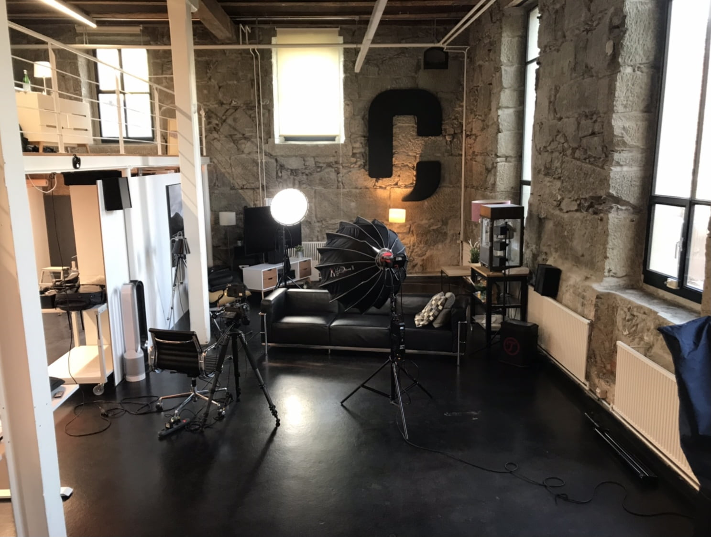

+++
title = "Schnuppern bei Crunch "
date = "2021-11-24"
draft = true
pinned = false
image = "img_4601-1-.jpg"
description = "Ich durfte zwei Tage bei Crunch schnuppern gehen  "
+++
Ich bin in der letzten zeit, wie man in meinem letzten Blog lesen kann, einige mahle schnuppern gewesen. Aber immer Mediamatiker. Durch de Effinger bin ich auf Crunch gestossen. Crunch ist eine Filmproduktion die auch einige connection in den Effinger hat. Durch ein Mail durfte ich bei ihnen Schnuppern gehen.

Ich durfte also zwei Tage bei Crunch schnuppern gehen. Am Donnerstag bin ich mit dem Zug auf Ittigen gefahren, was nur drei Haltestellen von Stettlen entfernt ist. Nachdem ich eine Führung durch das Büro erhalten habe, was echt nicht so langweilig ansieht wie viele die ich schon gesehen habe, wurde klar was meine Aufgabe für die zwei Tage sein sollte. Ich soll mir einige Fragen überlegen dann Interview machen und am enden ein kurzer Film zusammen schneiden.

\
Am erste Tag habe ich ein Filmset aufgebaut und die Interviews und das b roll Material Gedreht. Es war eine spannende neue Erfahrung ein Interview zu drehen. Ich habe aber auch viel zur Film Theorie gelernt. Wie baut man Lichter richtig auf wohin muss der Interviewpartner schauen in oder neben die Kamera? solche dinge weiss ich jetzt.\
\
Am nächsten Tag habe ich das ganze schneiden sollen. Eine Herausforderung war auf jeden fall das ich mit dem Program (Davinci resolve studio) noch nie gearbeitet habe. Einige dinge sind aber auch gleich oder endlich. Das Resultat sieht jetzt so aus:\
<iframe width="560" height="315" src="https://www.youtube.com/embed/LCbvTdlnss0" title="YouTube video player" frameborder="0" allow="accelerometer; autoplay; clipboard-write; encrypted-media; gyroscope; picture-in-picture" allowfullscreen></iframe>