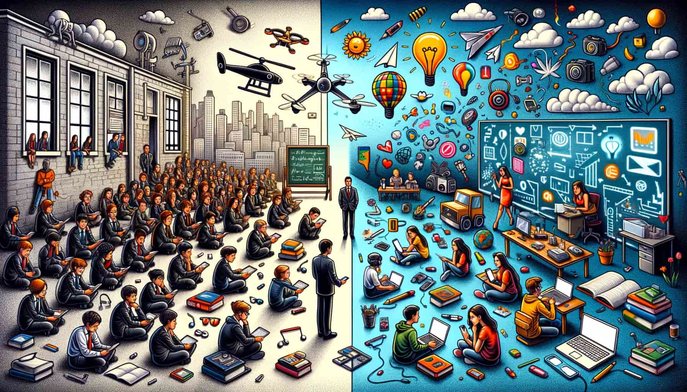

+++
title = "Sidequest: Berufsschule"
date = "2024-03-06"
draft = false
pinned = false
tags = []
image = "dall-e-2024-03-06-14.48.59-create-a-16_9-format-illustration-that-encapsulates-the-essence-of-a-blog-discussing-the-contrast-between-traditional-schooling-and-the-digital-revolu.jpg"
+++
Wir leben in einer Zeit, in der die digitale Revolution alles um uns herum auf den Kopf stellt, in der ChatGPT einen Grossteil der Arbeit revolutioniert und soziale Medien die Spielregeln neu schreiben.\
\
Doch die Schule hat das irgendwie noch nicht mitgekriegt.  

\
Ich bin mittendrin, als Mediamatiker-Lehrling erlebe ich zweimal pro Woche das, was in unserem Beruf, angeblich Bildung sein soll. Die Schule kommt mir vor wie ein Relikt aus vergangenen Zeiten. Wo ist der Anschluss an die digitale Welt, die, wie wir alle merken, alles verändert? Wo sind die Diskussionen darüber, wie wir damit umgehen sollen?\
\
In meiner Grundschulzeit bedeutete Schule für mich oft vor allem Stress: ständige Tests, Themen, die mich überhaupt nicht interessierten, und kein Raum für echte Kreativität. Bei mir funktioniert das plötzlich nicht mehr. Meine Eltern und ich haben beschlossen, dass ich die letzten drei Jahre der Sekundarschule im Homeschooling und somit im Co-Learning Bern abschliessen werde. Eine Zeit, in der ich endlich meinen eigenen Interessen nachgehen konnte. Durch die Möglichkeit, bei YOLU zu arbeiten, konnte ich direkt in der echten Arbeitswelt lernen.

\
Nach meinem Schulabschluss began ich die “Lerne” als Mediamatiker bei YOLU. Dazu gehören drei Praxistage in der Woche, wo ich viel lernen, umsetzen und experimentieren kann. Dazu kommen auch zwei Tage Berufsschule.\
\
In der Berufsschule finde ich mich in einem System wieder, das in der Zeit stehen geblieben zu sein scheint: Frontalunterricht, genervte Lehrpersonen und SchüleInnen, die kaum Interesse zeigen.\
\
Schule fühlt sich für mich wie ein schlechtes Spiel an. Das Ziel ist, so wenig Aufmerksamkeit wie möglich zu erregen, mit minimalem Einsatz durchzukommen, den Humor nicht zu verlieren und mit der Klasse ein bisschen zu rebellieren. Im Unterricht lenken sich die meisten mit Games oder eigenen Projekten ab. Wir bereiten uns auf Tests vor, indem wir Zusammenfassungen mit ChatGPT vor dem Test erstellen und sie kurz anschauen. Nach dem Test vergessen wir das Gelernte so schnell wie möglich.\
\
Ich habe nicht nichts gelernt; ich kann sehr schnell Zusammenfassungen für Tests mit ChatGPT erstellen und wir wissen, was unsere Klasse tun muss, um eine offizielle Verschiebung der Tests durch die Schulleitung zu bekommen. Ausserdem habe ich ein paar Marketingformeln auswendig gelernt und bin etwas routinierter darin, mit Gamma.app AI-Präsentationen für verschiedenste Fächer zu erstellen.\
\
Das Frustrierendste für mich ist, dass ich mich für Themen wie Marketing, Coden, Storytelling etc. interessiere. Ich habe Ideen, ich will mitdiskutieren, ich will Projekte umsetzen, aber stattdessen sitze ich in einem langweiligen Klassenzimmer und höre 45 Min. einer Marketinglehrerin zu, die es nicht schafft, ihr Wissen so zu vermitteln, dass es uns auch nur annähernd interessiert.

\
Das Problem bei diesem System sind nicht die schlecht gestalteten PowerPoint-Präsentationen, die zu kurzen Pausen oder die unbequemen Stühle, es ist die falsche Einstellung zum Lernen.\
\
Durch Gespräche mit meinen MitschülerInnen und Aussagen meiner Lehrpersonen merke ich, dass die meisten keine Vorstellung davon haben, wie Lernen aussehen könnte. Unter "Revolution der Schule" höre ich immer wieder Vorschläge wie "Wir brauchen das Fach ..." oder "Wir wollen keine Hausaufgaben". Die ganz Mutigen denken vielleicht sogar darüber nach, Noten abzuschaffen. Doch das Denken ausserhalb der Box "Schule" gelingt fast niemandem. Für die meisten bedeutet Lernen, sich hinzusetzen und 30 Minuten lang gelangweilt Vokabeln zu büffeln, in denen sie keinen Sinn sehen. Das ist schade.\
\
Ironischerweise zeigt sich oft in der Ablenkung vom Unterricht, womit sich meine MitschülerInnen wirklich beschäftigen möchten. Manchmal sind es irgendwelche Spiele, die wir sogar als Klasse zusammen spielen. Aber manchmal sieht man auch andere Dinge: Einer entwirft ein Kleidungsstück für seine eigene Marke, die er gründen möchte, eine andere programmiert einen Online-Shop, und ein weiterer erstellt Instagram-Posts für bekanntere Personen - all das ganz ohne Noten, ohne Unterrichtsstunden, ganz natürlich.\
\
Es fällt mir schwer zu glauben, dass die Leute, die vor wahrscheinlich langer Zeit unseren Lehrplan geschrieben haben, wirklich wissen, was ich heute zu lernen brauche. Genau so funktioniert Schule und dadurch habe ich das Vertrauen in diese verloren.\
\
Warum halten wir so sehr an der Vorstellung fest, dass Bildung bedeutet, dass “ausgebildete Menschen” uns Wissen vermitteln müssen? Warum muss unser Lernen immer bewertet werden? Warum schaffen wir es nicht, die Schule zu einem Ort des Experimentierens zu machen? Ein Ort, an dem wir einfach ausprobieren und scheitern dürfen?