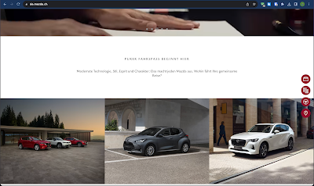
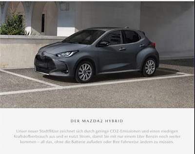
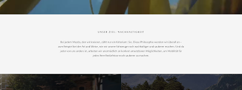

+++
title = "Textarten (Mazda) "
date = "2023-08-22"
draft = true
pinned = false
tags = ["BBZblog"]
+++
Dieser Blog ist ein Auftrag der Berufsschule.

**Werbetext**\
In der heutigen Zeit ist Autofahren nicht nur zweckmässig, sondern auch etwas, das Spass machen soll. Durch diesen einfachen Satz ("Purer Fahrspass beginnt hier") werden genau die Leute angesprochen. Ich denke der Slogan spricht eine grosse Gruppe von Menschen an und ist nicht aufdringlich. 

\
**Produkttext**\
Gründe, ein Elektro beziehungsweise Hybridauto zu kaufen, gibt es einige. Mazda ist dafür bekannt, auf den CO2-Ausstoß zu achten. Daher ist die Chance gross, dass ihre Kundschaft auch darauf achtet. Dieser Text beschreibt kurz und verständlich, warum dieses Auto perfekt in einen ressourcenschonend Lebensstil passt. Mir gefällt der Text.

\
**Imagetext**\
Wie zuvor erwähnt, setzt sich MAZDA für Nachhaltigkeit in der Autobranche ein. Das stellen sie mit diesem Text auch nochmals klar. Mir gefällt der Text. Berechtigter Weisse ist Nachhaltigkeit in der heutigen Zeit ein wichtiges Thema. Wen sich eine Firma für das ausspricht wirkt sich das sicherlich auch positiv auf das Image aus.

